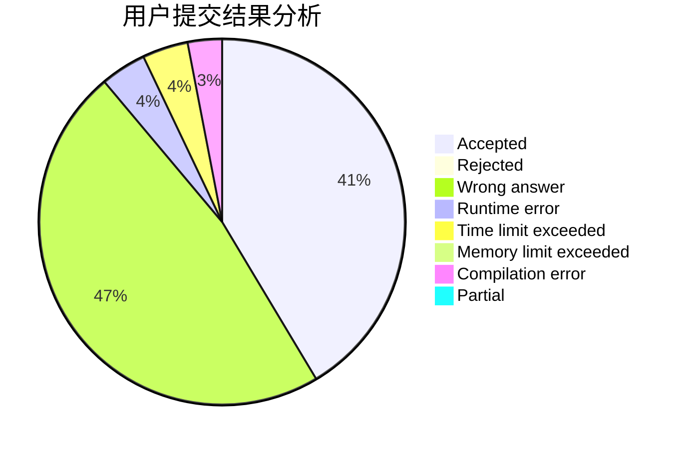
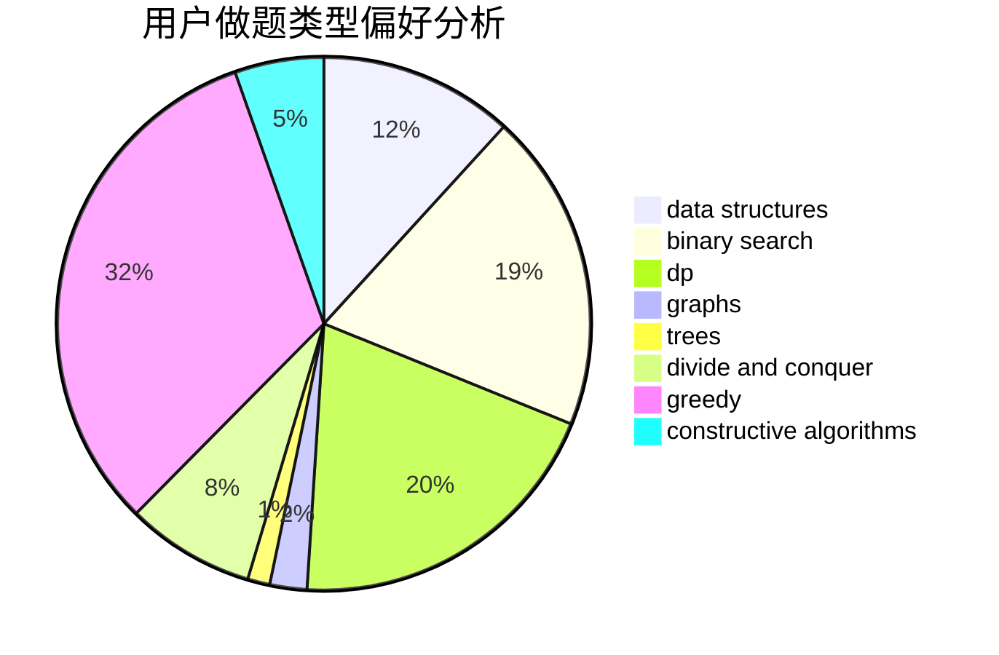
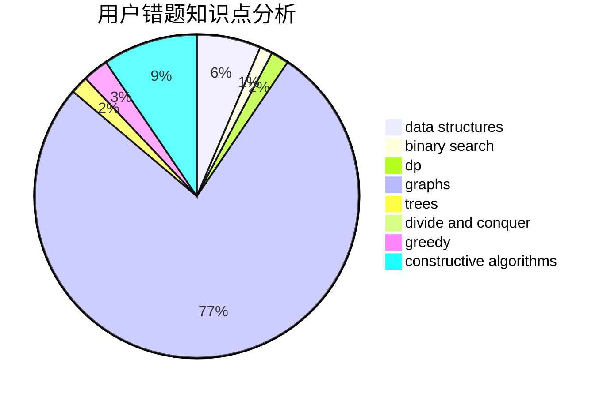

# caidx
<!-- tabs:start -->
#### **用户提交结果分析**

#### **用户做题类型偏好分析**

#### **用户错题知识点分析**

<!-- tabs:end -->
# 推荐题目
[Ball in Berland](http://codeforces.com/problemset/problem/1475/C)		combinatorics,
                        graphs,
                        math		  
[Martian Strings](http://codeforces.com/problemset/problem/149/E)		string suffix structures,
                        strings		  
[Karen and Game](https://codeforces.com/contest/816/problem/C)		brute force,
                        greedy,
                        implementation		  
[Run For Your Prize](http://codeforces.com/problemset/problem/938/B)		brute force,
                        greedy		  
[Riding in a Lift](http://codeforces.com/problemset/problem/479/E)		combinatorics,
                        dp		  
[Binary Numbers AND Sum](http://codeforces.com/problemset/problem/1066/E)		data structures,
                        implementation,
                        math		  
[Game with string](http://codeforces.com/problemset/problem/1104/B)		data structures,
                        implementation,
                        math		  
[Did you mean...](http://codeforces.com/problemset/problem/858/C)		dp,
                        greedy,
                        implementation		  
[Coffee and Coursework (Easy version)](http://codeforces.com/problemset/problem/1118/D1)		brute force,
                        greedy		  
[An unavoidable detour for home](http://codeforces.com/problemset/problem/814/E)		combinatorics,
                        dp,
                        graphs,
                        shortest paths		  
<!-- tabs:start -->
#### **data structures**
[Ball in Berland](http://codeforces.com/problemset/problem/1066/E)		data structures,
                        implementation,
                        math		  
[Martian Strings](http://codeforces.com/problemset/problem/1104/B)		data structures,
                        implementation,
                        math		  
[Karen and Game](http://codeforces.com/problemset/problem/1070/B)		data structures,
                        greedy		  
[Run For Your Prize](http://codeforces.com/problemset/problem/1277/D)		data structures,
                        hashing,
                        implementation,
                        math		  
[Riding in a Lift](http://codeforces.com/problemset/problem/414/D)		binary search,
                        data structures,
                        greedy,
                        trees,
                        two pointers		  
[Binary Numbers AND Sum](http://codeforces.com/problemset/problem/733/D)		data structures,
                        hashing		  
[Game with string](http://codeforces.com/problemset/problem/204/E)		data structures,
                        implementation,
                        string suffix structures,
                        two pointers		  
[Did you mean...](https://codeforces.com/contest/1248/problem/E)		data structures,
                        greedy,
                        implementation		  
[Coffee and Coursework (Easy version)](http://codeforces.com/problemset/problem/776/C)		binary search,
                        brute force,
                        data structures,
                        implementation,
                        math		  
[An unavoidable detour for home](http://codeforces.com/problemset/problem/1151/E)		combinatorics,
                        data structures,
                        dp,
                        math		  
#### **binary search**
[Ball in Berland](http://codeforces.com/problemset/problem/1249/C2)		binary search,
                        greedy,
                        math,
                        meet-in-the-middle		  
[Martian Strings](http://codeforces.com/problemset/problem/414/D)		binary search,
                        data structures,
                        greedy,
                        trees,
                        two pointers		  
[Karen and Game](http://codeforces.com/problemset/problem/1279/F)		binary search,
                        dp		  
[Run For Your Prize](http://codeforces.com/problemset/problem/1370/D)		binary search,
                        dp,
                        dsu,
                        greedy,
                        implementation		  
[Riding in a Lift](http://codeforces.com/problemset/problem/776/C)		binary search,
                        brute force,
                        data structures,
                        implementation,
                        math		  
[Binary Numbers AND Sum](http://codeforces.com/problemset/problem/460/C)		binary search,
                        data structures,
                        greedy		  
[Game with string](http://codeforces.com/problemset/problem/767/D)		binary search,
                        data structures,
                        greedy,
                        sortings,
                        two pointers		  
[Did you mean...](http://codeforces.com/problemset/problem/1492/C)		binary search,
                        data structures,
                        dp,
                        greedy,
                        two pointers		  
[Coffee and Coursework (Easy version)](http://codeforces.com/problemset/problem/1463/D)		binary search,
                        constructive algorithms,
                        greedy,
                        two pointers		  
[An unavoidable detour for home](http://codeforces.com/problemset/problem/1490/G)		binary search,
                        data structures,
                        math		  
#### **dp**
[Ball in Berland](http://codeforces.com/problemset/problem/479/E)		combinatorics,
                        dp		  
[Martian Strings](http://codeforces.com/problemset/problem/858/C)		dp,
                        greedy,
                        implementation		  
[Karen and Game](http://codeforces.com/problemset/problem/814/E)		combinatorics,
                        dp,
                        graphs,
                        shortest paths		  
[Run For Your Prize](http://codeforces.com/problemset/problem/1279/F)		binary search,
                        dp		  
[Riding in a Lift](http://codeforces.com/problemset/problem/1370/D)		binary search,
                        dp,
                        dsu,
                        greedy,
                        implementation		  
[Binary Numbers AND Sum](http://codeforces.com/problemset/problem/1151/E)		combinatorics,
                        data structures,
                        dp,
                        math		  
[Game with string](http://codeforces.com/problemset/problem/773/D)		dp,
                        graphs,
                        shortest paths		  
[Did you mean...](http://codeforces.com/problemset/problem/1492/C)		binary search,
                        data structures,
                        dp,
                        greedy,
                        two pointers		  
[Coffee and Coursework (Easy version)](https://codeforces.com/contest/1457/problem/C)		brute force,
                        dp,
                        implementation		  
[An unavoidable detour for home](http://codeforces.com/problemset/problem/1491/C)		brute force,
                        data structures,
                        dp,
                        greedy,
                        implementation		  
#### **graph**
[Ball in Berland](http://codeforces.com/problemset/problem/1475/C)		combinatorics,
                        graphs,
                        math		  
[Martian Strings](http://codeforces.com/problemset/problem/814/E)		combinatorics,
                        dp,
                        graphs,
                        shortest paths		  
[Karen and Game](http://codeforces.com/problemset/problem/802/J)		dfs and similar,
                        graphs,
                        trees		  
[Run For Your Prize](https://codeforces.com/contest/1011/problem/F)		dfs and similar,
                        graphs,
                        implementation,
                        trees		  
[Riding in a Lift](https://codeforces.com/contest/602/problem/C)		graphs,
                        shortest paths		  
[Binary Numbers AND Sum](http://codeforces.com/problemset/problem/521/E)		dfs and similar,
                        graphs		  
[Game with string](http://codeforces.com/problemset/problem/1006/E)		dfs and similar,
                        graphs,
                        trees		  
[Did you mean...](http://codeforces.com/problemset/problem/773/D)		dp,
                        graphs,
                        shortest paths		  
[Coffee and Coursework (Easy version)](https://codeforces.com/contest/1440/problem/D)		constructive algorithms,
                        data structures,
                        graphs		  
[An unavoidable detour for home](http://codeforces.com/problemset/problem/1487/C)		brute force,
                        constructive algorithms,
                        dfs and similar,
                        graphs,
                        greedy,
                        implementation,
                        math		  
#### **trees**
[Ball in Berland](http://codeforces.com/problemset/problem/802/J)		dfs and similar,
                        graphs,
                        trees		  
[Martian Strings](http://codeforces.com/problemset/problem/901/A)		constructive algorithms,
                        trees		  
[Karen and Game](https://codeforces.com/contest/1011/problem/F)		dfs and similar,
                        graphs,
                        implementation,
                        trees		  
[Run For Your Prize](http://codeforces.com/problemset/problem/414/D)		binary search,
                        data structures,
                        greedy,
                        trees,
                        two pointers		  
[Riding in a Lift](http://codeforces.com/problemset/problem/1006/E)		dfs and similar,
                        graphs,
                        trees		  
[Binary Numbers AND Sum](http://codeforces.com/problemset/problem/1479/D)		binary search,
                        bitmasks,
                        brute force,
                        data structures,
                        probabilities,
                        trees		  
[Game with string](http://codeforces.com/problemset/problem/1511/C)		brute force,
                        data structures,
                        implementation,
                        trees		  
[Did you mean...](http://codeforces.com/problemset/problem/1499/F)		combinatorics,
                        dfs and similar,
                        dp,
                        trees		  
[Coffee and Coursework (Easy version)](http://codeforces.com/problemset/problem/1491/E)		brute force,
                        dfs and similar,
                        divide and conquer,
                        number theory,
                        trees		  
[An unavoidable detour for home](http://codeforces.com/problemset/problem/1466/D)		data structures,
                        greedy,
                        sortings,
                        trees		  
#### **divide and conquer**
[Ball in Berland](http://codeforces.com/problemset/problem/1375/H)		constructive algorithms,
                        divide and conquer		  
[Martian Strings](http://codeforces.com/problemset/problem/1461/D)		binary search,
                        brute force,
                        data structures,
                        divide and conquer,
                        implementation,
                        sortings		  
[Karen and Game](http://codeforces.com/problemset/problem/1466/G)		combinatorics,
                        divide and conquer,
                        hashing,
                        math,
                        string suffix structures,
                        strings		  
[Run For Your Prize](http://codeforces.com/problemset/problem/1490/D)		dfs and similar,
                        divide and conquer,
                        implementation		  
[Riding in a Lift](https://codeforces.com/contest/1483/problem/C)		data structures,
                        divide and conquer,
                        dp		  
[Binary Numbers AND Sum](http://codeforces.com/problemset/problem/1491/E)		brute force,
                        dfs and similar,
                        divide and conquer,
                        number theory,
                        trees		  
[Game with string](http://codeforces.com/problemset/problem/1303/G)		data structures,
                        divide and conquer,
                        geometry,
                        trees		  
[Did you mean...](http://codeforces.com/problemset/problem/1494/D)		constructive algorithms,
                        data structures,
                        dfs and similar,
                        divide and conquer,
                        dsu,
                        greedy,
                        sortings,
                        trees		  
[Coffee and Coursework (Easy version)](http://codeforces.com/problemset/problem/1482/E)		data structures,
                        divide and conquer,
                        dp		  
[An unavoidable detour for home](http://codeforces.com/problemset/problem/566/C)		dfs and similar,
                        divide and conquer,
                        trees		  
#### **greedy**
[Ball in Berland](https://codeforces.com/contest/816/problem/C)		brute force,
                        greedy,
                        implementation		  
[Martian Strings](http://codeforces.com/problemset/problem/938/B)		brute force,
                        greedy		  
[Karen and Game](http://codeforces.com/problemset/problem/858/C)		dp,
                        greedy,
                        implementation		  
[Run For Your Prize](http://codeforces.com/problemset/problem/1118/D1)		brute force,
                        greedy		  
[Riding in a Lift](http://codeforces.com/problemset/problem/1249/C2)		binary search,
                        greedy,
                        math,
                        meet-in-the-middle		  
[Binary Numbers AND Sum](http://codeforces.com/problemset/problem/1070/B)		data structures,
                        greedy		  
[Game with string](http://codeforces.com/problemset/problem/1092/D1)		greedy,
                        implementation,
                        math		  
[Did you mean...](http://codeforces.com/problemset/problem/414/D)		binary search,
                        data structures,
                        greedy,
                        trees,
                        two pointers		  
[Coffee and Coursework (Easy version)](http://codeforces.com/problemset/problem/1250/B)		brute force,
                        constructive algorithms,
                        greedy,
                        math		  
[An unavoidable detour for home](https://codeforces.com/contest/1248/problem/E)		data structures,
                        greedy,
                        implementation		  
#### **constructive algorithms**
[Ball in Berland](http://codeforces.com/problemset/problem/901/A)		constructive algorithms,
                        trees		  
[Martian Strings](http://codeforces.com/problemset/problem/1100/D)		constructive algorithms,
                        games,
                        interactive		  
[Karen and Game](http://codeforces.com/problemset/problem/1250/B)		brute force,
                        constructive algorithms,
                        greedy,
                        math		  
[Run For Your Prize](http://codeforces.com/problemset/problem/1372/A)		constructive algorithms,
                        implementation		  
[Riding in a Lift](https://codeforces.com/contest/1113/problem/D)		constructive algorithms,
                        hashing,
                        strings		  
[Binary Numbers AND Sum](http://codeforces.com/problemset/problem/1375/H)		constructive algorithms,
                        divide and conquer		  
[Game with string](http://codeforces.com/problemset/problem/805/B)		constructive algorithms		  
[Did you mean...](http://codeforces.com/problemset/problem/40/A)		constructive algorithms,
                        geometry,
                        implementation,
                        math		  
[Coffee and Coursework (Easy version)](https://codeforces.com/contest/1440/problem/D)		constructive algorithms,
                        data structures,
                        graphs		  
[An unavoidable detour for home](http://codeforces.com/problemset/problem/1148/F)		bitmasks,
                        constructive algorithms		  
#### **sortings**
[Ball in Berland](http://codeforces.com/problemset/problem/767/D)		binary search,
                        data structures,
                        greedy,
                        sortings,
                        two pointers		  
[Martian Strings](https://codeforces.com/contest/1496/problem/C)		geometry,
                        greedy,
                        math,
                        sortings		  
[Karen and Game](http://codeforces.com/problemset/problem/1495/A)		geometry,
                        greedy,
                        math,
                        sortings		  
[Run For Your Prize](http://codeforces.com/problemset/problem/1497/A)		brute force,
                        data structures,
                        greedy,
                        sortings		  
[Riding in a Lift](http://codeforces.com/problemset/problem/1427/A)		math,
                        sortings		  
[Binary Numbers AND Sum](http://codeforces.com/problemset/problem/1461/D)		binary search,
                        brute force,
                        data structures,
                        divide and conquer,
                        implementation,
                        sortings		  
[Game with string](http://codeforces.com/problemset/problem/1437/C)		dp,
                        flows,
                        graph matchings,
                        greedy,
                        math,
                        sortings		  
[Did you mean...](http://codeforces.com/problemset/problem/1473/A)		greedy,
                        implementation,
                        math,
                        sortings		  
[Coffee and Coursework (Easy version)](http://codeforces.com/problemset/problem/1486/B)		binary search,
                        geometry,
                        shortest paths,
                        sortings		  
[An unavoidable detour for home](http://codeforces.com/problemset/problem/1480/B)		greedy,
                        implementation,
                        sortings		  
<!-- tabs:end -->
