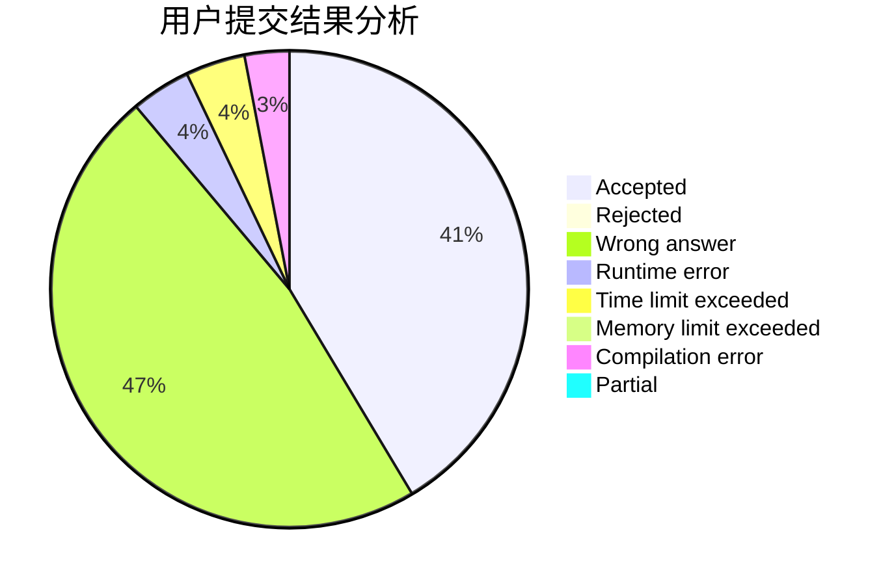
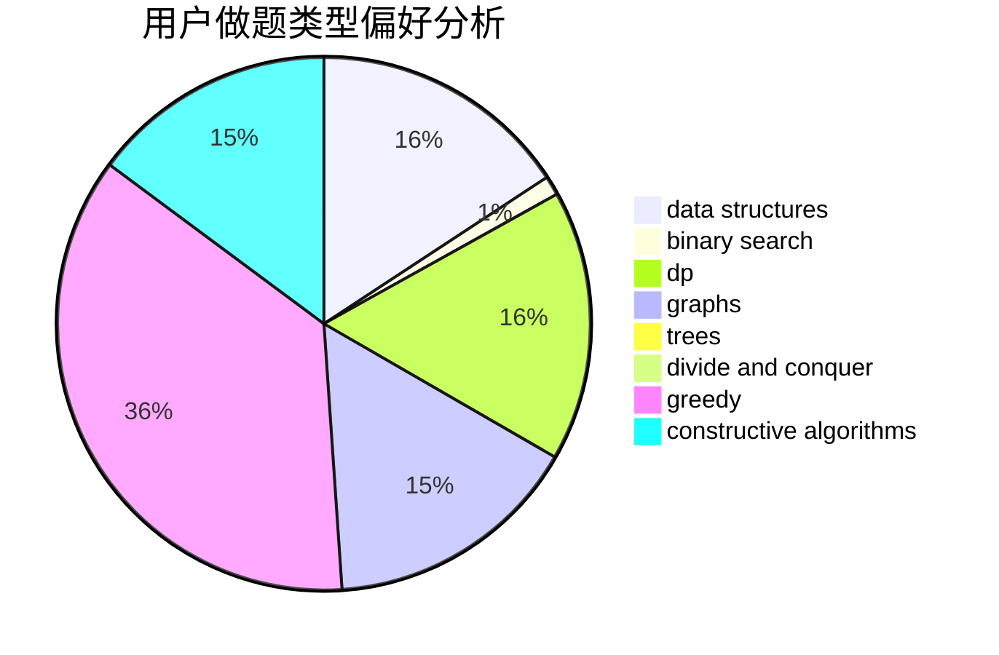
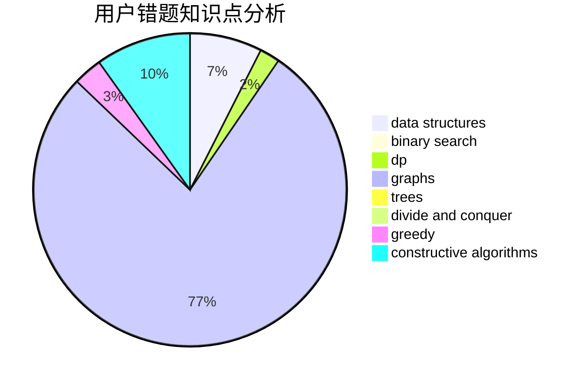

# caidx

<!-- tabs:start -->

#### **用户提交结果分析**

#### **用户做题类型偏好分析**

#### **用户错题知识点分析**

<!-- tabs:end -->
# 推荐题目
[1422B](https://codeforces.com/contest/1422/problem/B)		greedy,
                        implementation,
                        math		  
[1483F](https://codeforces.com/contest/1483/problem/F)		dsu,graphs,sortings,trees		  
[12861](https://codeforces.com/contest/1286/problem/1)		dsu,graphs,sortings,trees		  
[1510A](https://codeforces.com/contest/1510/problem/A)		nan		  
[1067B](https://codeforces.com/contest/1067/problem/B)		dfs and similar,
                        graphs,
                        shortest paths		  
[95A](https://codeforces.com/contest/95/problem/A)		implementation,
                        strings		  
[833C](https://codeforces.com/contest/833/problem/C)		brute force,
                        combinatorics,
                        greedy,
                        math		  
[1380F](https://codeforces.com/contest/1380/problem/F)		data structures,
                        dp,
                        matrices		  
[12542](https://codeforces.com/contest/1254/problem/2)		dsu,graphs,sortings,trees		  
[956C](https://codeforces.com/contest/956/problem/C)		dsu,graphs,sortings,trees		  
