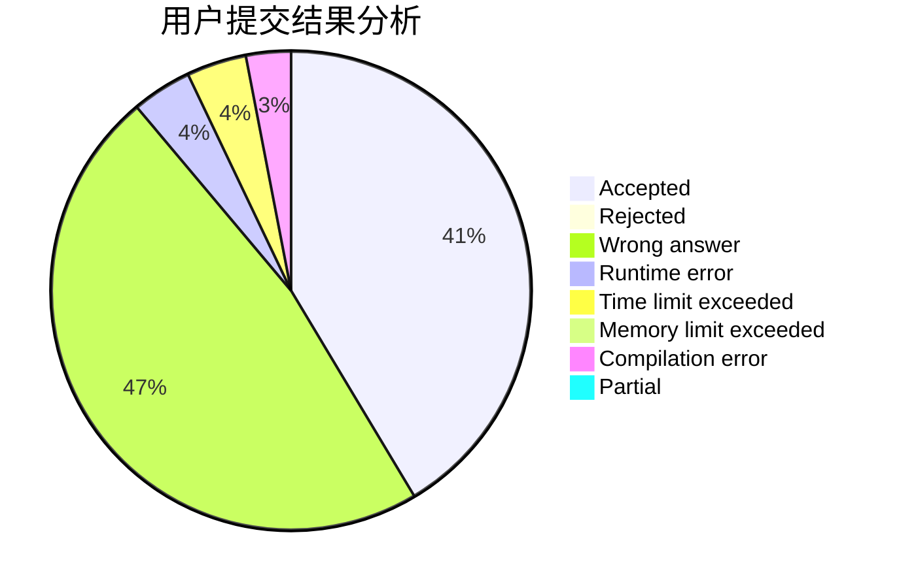
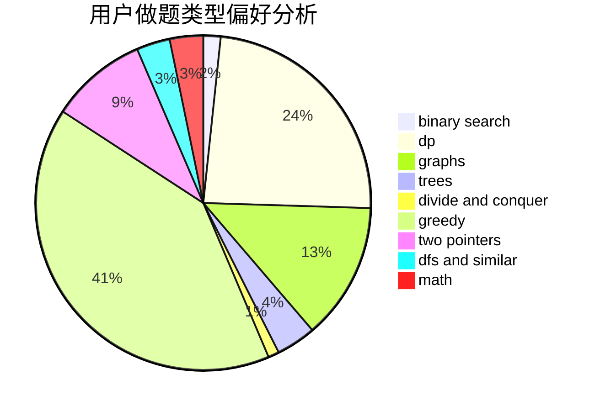

# caidx

<!-- tabs:start -->

#### **用户提交结果分析**

#### **用户做题类型偏好分析**

<!-- tabs:end -->
# 推荐题目
[1422B](https://codeforces.com/contest/1422/problem/B)
[1483F](https://codeforces.com/contest/1483/problem/F)
[12861](https://codeforces.com/contest/1286/problem/1)
[1510A](https://codeforces.com/contest/1510/problem/A)
[1067B](https://codeforces.com/contest/1067/problem/B)
[95A](https://codeforces.com/contest/95/problem/A)
[833C](https://codeforces.com/contest/833/problem/C)
[1380F](https://codeforces.com/contest/1380/problem/F)
[12542](https://codeforces.com/contest/1254/problem/2)
[956C](https://codeforces.com/contest/956/problem/C)
