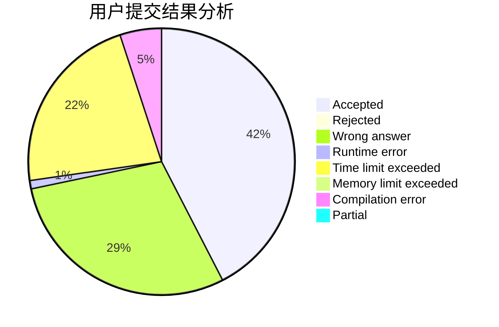
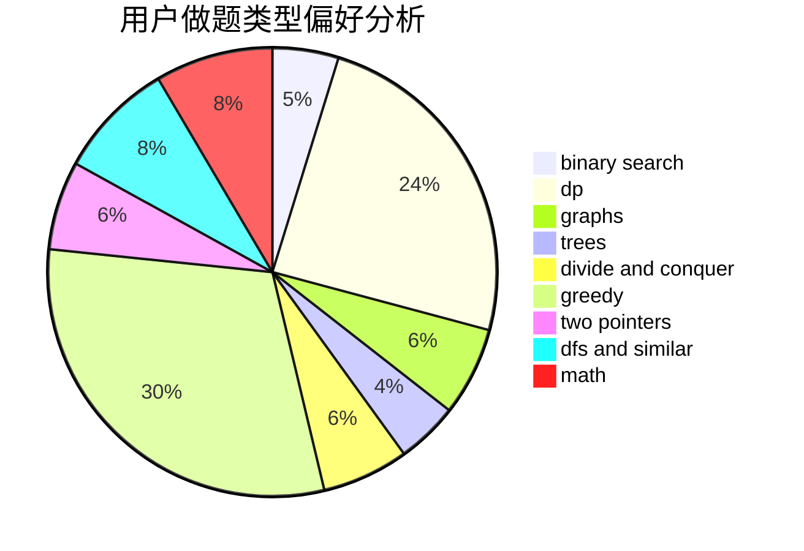

# caidzh

<!-- tabs:start -->

#### **用户提交结果分析**

#### **用户做题类型偏好分析**

<!-- tabs:end -->
# 推荐题目
[1153C](https://codeforces.com/contest/1153/problem/C)
[707B](https://codeforces.com/contest/707/problem/B)
[782A](https://codeforces.com/contest/782/problem/A)
[572A](https://codeforces.com/contest/572/problem/A)
[1106B](https://codeforces.com/contest/1106/problem/B)
[1210E](https://codeforces.com/contest/1210/problem/E)
[1157B](https://codeforces.com/contest/1157/problem/B)
[714B](https://codeforces.com/contest/714/problem/B)
[434B](https://codeforces.com/contest/434/problem/B)
[947C](https://codeforces.com/contest/947/problem/C)
