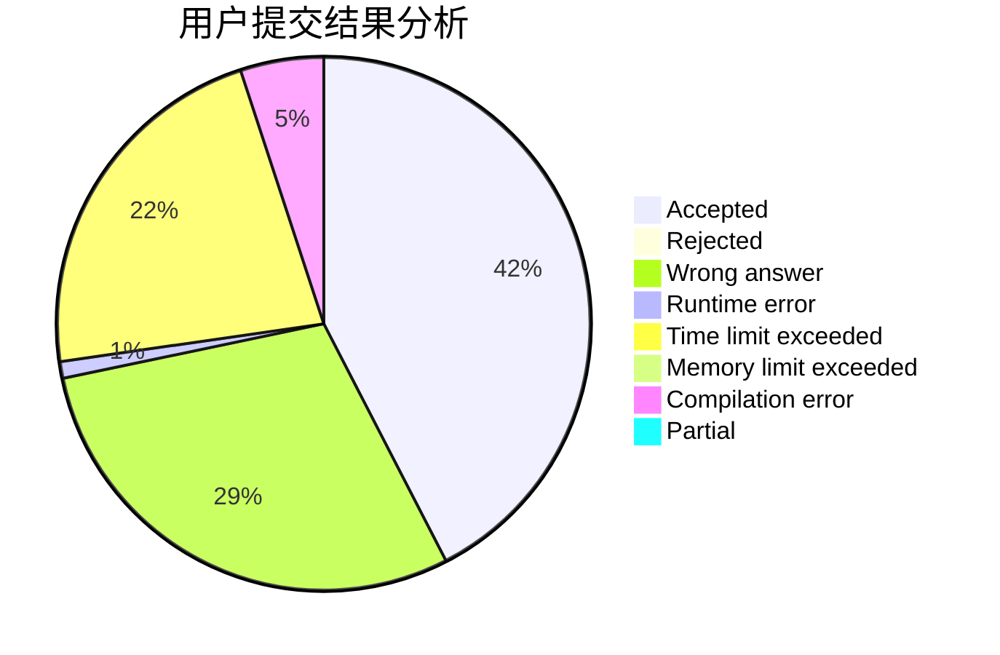
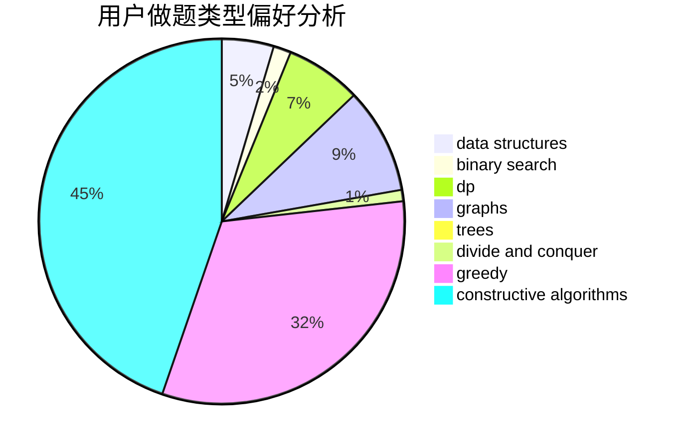

# caidzh

<!-- tabs:start -->

#### **用户提交结果分析**

#### **用户做题类型偏好分析**

#### **用户错题知识点分析**

<!-- tabs:end -->
# 推荐题目
[1151C](https://codeforces.com/contest/1151/problem/C)		constructive algorithms,
                        math		  
[683A](https://codeforces.com/contest/683/problem/A)		*special problem,
                        geometry		  
[763C](https://codeforces.com/contest/763/problem/C)		brute force,
                        implementation,
                        math,
                        number theory		  
[547D](https://codeforces.com/contest/547/problem/D)		constructive algorithms,
                        dfs and similar,
                        graphs		  
[1105D](https://codeforces.com/contest/1105/problem/D)		dfs and similar,
                        graphs,
                        implementation,
                        shortest paths		  
[1206D](https://codeforces.com/contest/1206/problem/D)		dsu,graphs,sortings,trees		  
[1155D](https://codeforces.com/contest/1155/problem/D)		brute force,
                        data structures,
                        divide and conquer,
                        dp,
                        greedy		  
[698A](https://codeforces.com/contest/698/problem/A)		dp		  
[405B](https://codeforces.com/contest/405/problem/B)		nan		  
[923E](https://codeforces.com/contest/923/problem/E)		fft,
                        math,
                        matrices		  
