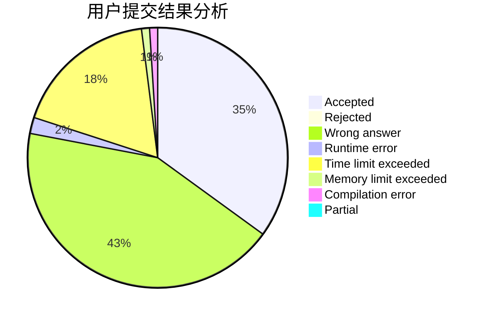
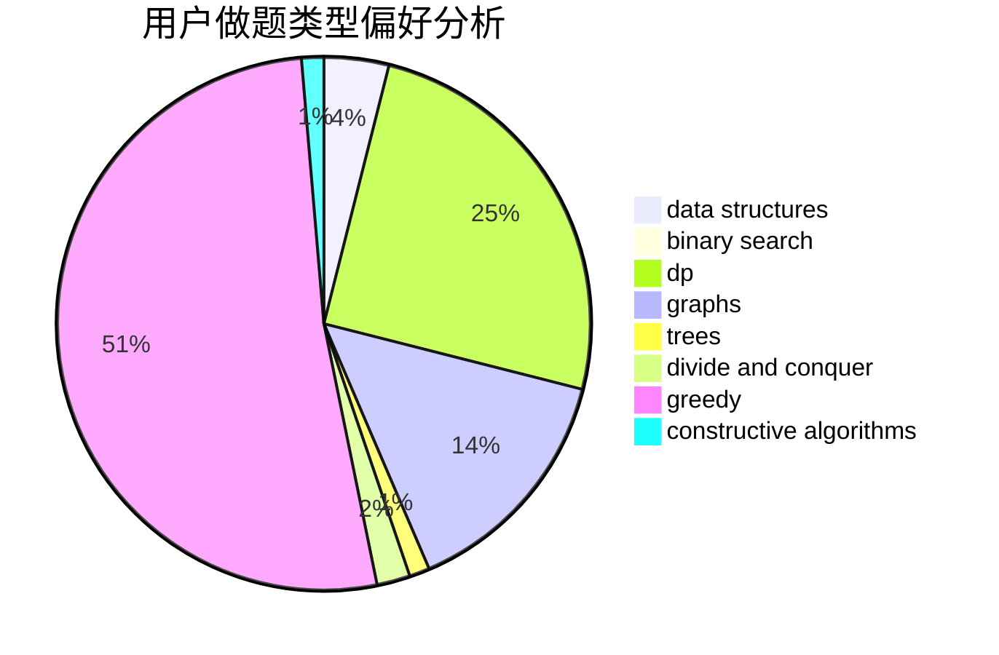
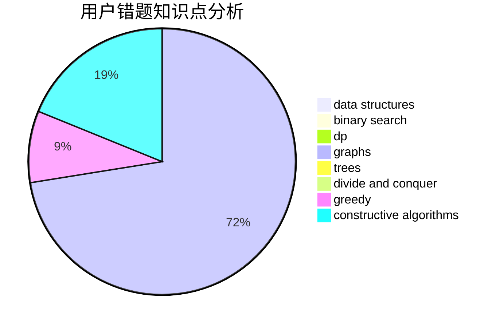

# canye666
<!-- tabs:start -->
#### **用户提交结果分析**

#### **用户做题类型偏好分析**

#### **用户错题知识点分析**

<!-- tabs:end -->
# 推荐题目
[Creating a Character](http://codeforces.com/problemset/problem/1217/A)		binary search,
                        math		  
[AND, OR and square sum](http://codeforces.com/problemset/problem/1368/D)		bitmasks,
                        greedy,
                        math		  
[Gerald and Giant Chess](http://codeforces.com/problemset/problem/559/C)		combinatorics,
                        dp,
                        math,
                        number theory		  
[Lineland Mail](http://codeforces.com/problemset/problem/567/A)		greedy,
                        implementation		  
[Anadi and Domino](https://codeforces.com/contest/1230/problem/C)		brute force,
                        graphs		  
[Book Reading](http://codeforces.com/problemset/problem/1213/C)		math		  
[Array K-Coloring](http://codeforces.com/problemset/problem/1102/B)		greedy,
                        sortings		  
[New Year Transportation](http://codeforces.com/problemset/problem/500/A)		dfs and similar,
                        graphs,
                        implementation		  
[Queue](http://codeforces.com/problemset/problem/545/D)		greedy,
                        implementation,
                        sortings		  
[Do you want a date?](https://codeforces.com/contest/810/problem/C)		implementation,
                        math,
                        sortings		  
<!-- tabs:start -->
#### **data structures**
[Creating a Character](http://codeforces.com/problemset/problem/900/C)		brute force,
                        data structures,
                        math		  
[AND, OR and square sum](http://codeforces.com/problemset/problem/702/F)		data structures		  
[Gerald and Giant Chess](https://codeforces.com/contest/1261/problem/B2)		data structures,
                        greedy		  
[Lineland Mail](http://codeforces.com/problemset/problem/924/C)		data structures,
                        dp,
                        greedy		  
[Anadi and Domino](http://codeforces.com/problemset/problem/475/D)		brute force,
                        data structures,
                        math		  
[Book Reading](http://codeforces.com/problemset/problem/1213/B)		data structures,
                        implementation		  
[Array K-Coloring](http://codeforces.com/problemset/problem/1476/E)		bitmasks,
                        data structures,
                        dfs and similar,
                        graphs,
                        hashing,
                        sortings,
                        strings		  
[New Year Transportation](http://codeforces.com/problemset/problem/193/D)		data structures		  
[Queue](http://codeforces.com/problemset/problem/519/D)		data structures,
                        dp,
                        two pointers		  
[Do you want a date?](http://codeforces.com/problemset/problem/862/E)		binary search,
                        data structures,
                        sortings		  
#### **binary search**
[Creating a Character](http://codeforces.com/problemset/problem/1217/A)		binary search,
                        math		  
[AND, OR and square sum](https://codeforces.com/contest/759/problem/B)		binary search,
                        dp		  
[Gerald and Giant Chess](https://codeforces.com/contest/1471/problem/C)		binary search,
                        dp,
                        greedy,
                        sortings,
                        two pointers		  
[Lineland Mail](http://codeforces.com/problemset/problem/862/E)		binary search,
                        data structures,
                        sortings		  
[Anadi and Domino](http://codeforces.com/problemset/problem/1492/C)		binary search,
                        data structures,
                        dp,
                        greedy,
                        two pointers		  
[Book Reading](http://codeforces.com/problemset/problem/1463/D)		binary search,
                        constructive algorithms,
                        greedy,
                        two pointers		  
[Array K-Coloring](http://codeforces.com/problemset/problem/1490/G)		binary search,
                        data structures,
                        math		  
[New Year Transportation](http://codeforces.com/problemset/problem/1479/D)		binary search,
                        bitmasks,
                        brute force,
                        data structures,
                        probabilities,
                        trees		  
[Queue](http://codeforces.com/problemset/problem/1436/E)		binary search,
                        data structures,
                        two pointers		  
[Do you want a date?](http://codeforces.com/problemset/problem/1461/D)		binary search,
                        brute force,
                        data structures,
                        divide and conquer,
                        implementation,
                        sortings		  
#### **dp**
[Creating a Character](http://codeforces.com/problemset/problem/559/C)		combinatorics,
                        dp,
                        math,
                        number theory		  
[AND, OR and square sum](https://codeforces.com/contest/759/problem/B)		binary search,
                        dp		  
[Gerald and Giant Chess](http://codeforces.com/problemset/problem/762/D)		dp,
                        greedy,
                        implementation		  
[Lineland Mail](http://codeforces.com/problemset/problem/924/C)		data structures,
                        dp,
                        greedy		  
[Anadi and Domino](http://codeforces.com/problemset/problem/1264/D1)		combinatorics,
                        dp,
                        probabilities		  
[Book Reading](http://codeforces.com/problemset/problem/431/C)		dp,
                        implementation,
                        trees		  
[Array K-Coloring](http://codeforces.com/problemset/problem/1146/G)		dp,
                        flows,
                        graphs		  
[New Year Transportation](https://codeforces.com/contest/1471/problem/C)		binary search,
                        dp,
                        greedy,
                        sortings,
                        two pointers		  
[Queue](http://codeforces.com/problemset/problem/519/D)		data structures,
                        dp,
                        two pointers		  
[Do you want a date?](http://codeforces.com/problemset/problem/1452/E)		brute force,
                        dp,
                        greedy,
                        sortings,
                        two pointers		  
#### **graph**
[Creating a Character](https://codeforces.com/contest/1230/problem/C)		brute force,
                        graphs		  
[AND, OR and square sum](http://codeforces.com/problemset/problem/500/A)		dfs and similar,
                        graphs,
                        implementation		  
[Gerald and Giant Chess](http://codeforces.com/problemset/problem/225/D)		bitmasks,
                        dfs and similar,
                        graphs,
                        implementation		  
[Lineland Mail](http://codeforces.com/problemset/problem/1146/G)		dp,
                        flows,
                        graphs		  
[Anadi and Domino](http://codeforces.com/problemset/problem/1476/E)		bitmasks,
                        data structures,
                        dfs and similar,
                        graphs,
                        hashing,
                        sortings,
                        strings		  
[Book Reading](http://codeforces.com/problemset/problem/1427/G)		flows,
                        graphs		  
[Array K-Coloring](http://codeforces.com/problemset/problem/1239/D)		2-sat,
                        dfs and similar,
                        graph matchings,
                        graphs		  
[New Year Transportation](http://codeforces.com/problemset/problem/1487/C)		brute force,
                        constructive algorithms,
                        dfs and similar,
                        graphs,
                        greedy,
                        implementation,
                        math		  
[Queue](http://codeforces.com/problemset/problem/1437/C)		dp,
                        flows,
                        graph matchings,
                        greedy,
                        math,
                        sortings		  
[Do you want a date?](http://codeforces.com/problemset/problem/1470/D)		constructive algorithms,
                        dfs and similar,
                        graph matchings,
                        graphs,
                        greedy		  
#### **trees**
[Creating a Character](http://codeforces.com/problemset/problem/431/C)		dp,
                        implementation,
                        trees		  
[AND, OR and square sum](http://codeforces.com/problemset/problem/1188/A1)		trees		  
[Gerald and Giant Chess](http://codeforces.com/problemset/problem/741/D)		data structures,
                        dfs and similar,
                        trees		  
[Lineland Mail](http://codeforces.com/problemset/problem/526/G)		greedy,
                        trees		  
[Anadi and Domino](http://codeforces.com/problemset/problem/1479/D)		binary search,
                        bitmasks,
                        brute force,
                        data structures,
                        probabilities,
                        trees		  
[Book Reading](http://codeforces.com/problemset/problem/1511/C)		brute force,
                        data structures,
                        implementation,
                        trees		  
[Array K-Coloring](http://codeforces.com/problemset/problem/1499/F)		combinatorics,
                        dfs and similar,
                        dp,
                        trees		  
[New Year Transportation](http://codeforces.com/problemset/problem/1491/E)		brute force,
                        dfs and similar,
                        divide and conquer,
                        number theory,
                        trees		  
[Queue](http://codeforces.com/problemset/problem/1466/D)		data structures,
                        greedy,
                        sortings,
                        trees		  
[Do you want a date?](http://codeforces.com/problemset/problem/1495/D)		combinatorics,
                        dfs and similar,
                        graphs,
                        math,
                        shortest paths,
                        trees		  
#### **divide and conquer**
[Creating a Character](http://codeforces.com/problemset/problem/1461/D)		binary search,
                        brute force,
                        data structures,
                        divide and conquer,
                        implementation,
                        sortings		  
[AND, OR and square sum](http://codeforces.com/problemset/problem/1466/G)		combinatorics,
                        divide and conquer,
                        hashing,
                        math,
                        string suffix structures,
                        strings		  
[Gerald and Giant Chess](http://codeforces.com/problemset/problem/1490/D)		dfs and similar,
                        divide and conquer,
                        implementation		  
[Lineland Mail](https://codeforces.com/contest/1483/problem/C)		data structures,
                        divide and conquer,
                        dp		  
[Anadi and Domino](http://codeforces.com/problemset/problem/1491/E)		brute force,
                        dfs and similar,
                        divide and conquer,
                        number theory,
                        trees		  
[Book Reading](http://codeforces.com/problemset/problem/1303/G)		data structures,
                        divide and conquer,
                        geometry,
                        trees		  
[Array K-Coloring](http://codeforces.com/problemset/problem/1494/D)		constructive algorithms,
                        data structures,
                        dfs and similar,
                        divide and conquer,
                        dsu,
                        greedy,
                        sortings,
                        trees		  
[New Year Transportation](http://codeforces.com/problemset/problem/1482/E)		data structures,
                        divide and conquer,
                        dp		  
[Queue](http://codeforces.com/problemset/problem/566/C)		dfs and similar,
                        divide and conquer,
                        trees		  
[Do you want a date?](http://codeforces.com/problemset/problem/1428/F)		binary search,
                        data structures,
                        divide and conquer,
                        dp,
                        two pointers		  
#### **greedy**
[Creating a Character](http://codeforces.com/problemset/problem/1368/D)		bitmasks,
                        greedy,
                        math		  
[AND, OR and square sum](http://codeforces.com/problemset/problem/567/A)		greedy,
                        implementation		  
[Gerald and Giant Chess](http://codeforces.com/problemset/problem/1102/B)		greedy,
                        sortings		  
[Lineland Mail](http://codeforces.com/problemset/problem/545/D)		greedy,
                        implementation,
                        sortings		  
[Anadi and Domino](https://codeforces.com/contest/1261/problem/B2)		data structures,
                        greedy		  
[Book Reading](http://codeforces.com/problemset/problem/762/D)		dp,
                        greedy,
                        implementation		  
[Array K-Coloring](http://codeforces.com/problemset/problem/924/C)		data structures,
                        dp,
                        greedy		  
[New Year Transportation](http://codeforces.com/problemset/problem/67/B)		greedy		  
[Queue](http://codeforces.com/problemset/problem/1231/C)		greedy		  
[Do you want a date?](https://codeforces.com/contest/1471/problem/C)		binary search,
                        dp,
                        greedy,
                        sortings,
                        two pointers		  
#### **constructive algorithms**
[Creating a Character](http://codeforces.com/problemset/problem/357/B)		constructive algorithms,
                        implementation		  
[AND, OR and square sum](http://codeforces.com/problemset/problem/1110/C)		constructive algorithms,
                        math,
                        number theory		  
[Gerald and Giant Chess](http://codeforces.com/problemset/problem/1408/B)		constructive algorithms,
                        greedy,
                        math		  
[Lineland Mail](http://codeforces.com/problemset/problem/1493/A)		constructive algorithms,
                        greedy		  
[Anadi and Domino](http://codeforces.com/problemset/problem/1463/D)		binary search,
                        constructive algorithms,
                        greedy,
                        two pointers		  
[Book Reading](https://codeforces.com/contest/1456/problem/B)		bitmasks,
                        brute force,
                        constructive algorithms		  
[Array K-Coloring](http://codeforces.com/problemset/problem/1492/D)		bitmasks,
                        constructive algorithms,
                        greedy,
                        math		  
[New Year Transportation](https://codeforces.com/contest/1504/problem/D)		constructive algorithms,
                        games,
                        interactive		  
[Queue](https://codeforces.com/contest/1483/problem/A)		brute force,
                        constructive algorithms,
                        greedy,
                        implementation		  
[Do you want a date?](https://codeforces.com/contest/1457/problem/D)		bitmasks,
                        brute force,
                        constructive algorithms		  
#### **sortings**
[Creating a Character](http://codeforces.com/problemset/problem/1102/B)		greedy,
                        sortings		  
[AND, OR and square sum](http://codeforces.com/problemset/problem/545/D)		greedy,
                        implementation,
                        sortings		  
[Gerald and Giant Chess](https://codeforces.com/contest/810/problem/C)		implementation,
                        math,
                        sortings		  
[Lineland Mail](http://codeforces.com/problemset/problem/1476/E)		bitmasks,
                        data structures,
                        dfs and similar,
                        graphs,
                        hashing,
                        sortings,
                        strings		  
[Anadi and Domino](https://codeforces.com/contest/1471/problem/C)		binary search,
                        dp,
                        greedy,
                        sortings,
                        two pointers		  
[Book Reading](http://codeforces.com/problemset/problem/862/E)		binary search,
                        data structures,
                        sortings		  
[Array K-Coloring](http://codeforces.com/problemset/problem/1452/E)		brute force,
                        dp,
                        greedy,
                        sortings,
                        two pointers		  
[New Year Transportation](https://codeforces.com/contest/1496/problem/C)		geometry,
                        greedy,
                        math,
                        sortings		  
[Queue](http://codeforces.com/problemset/problem/1495/A)		geometry,
                        greedy,
                        math,
                        sortings		  
[Do you want a date?](http://codeforces.com/problemset/problem/1497/A)		brute force,
                        data structures,
                        greedy,
                        sortings		  
<!-- tabs:end -->
