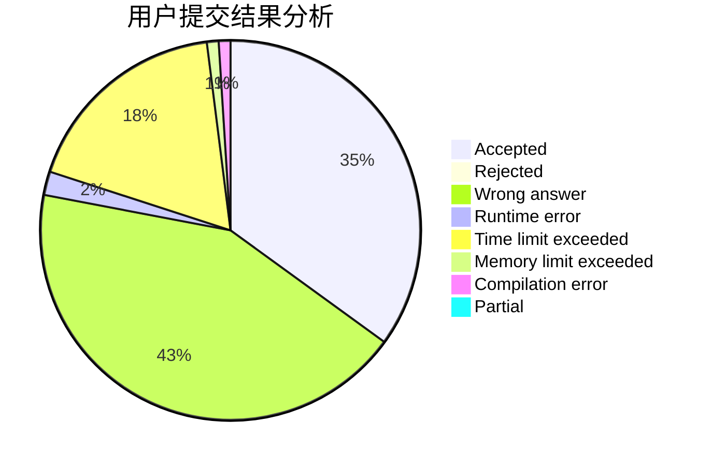
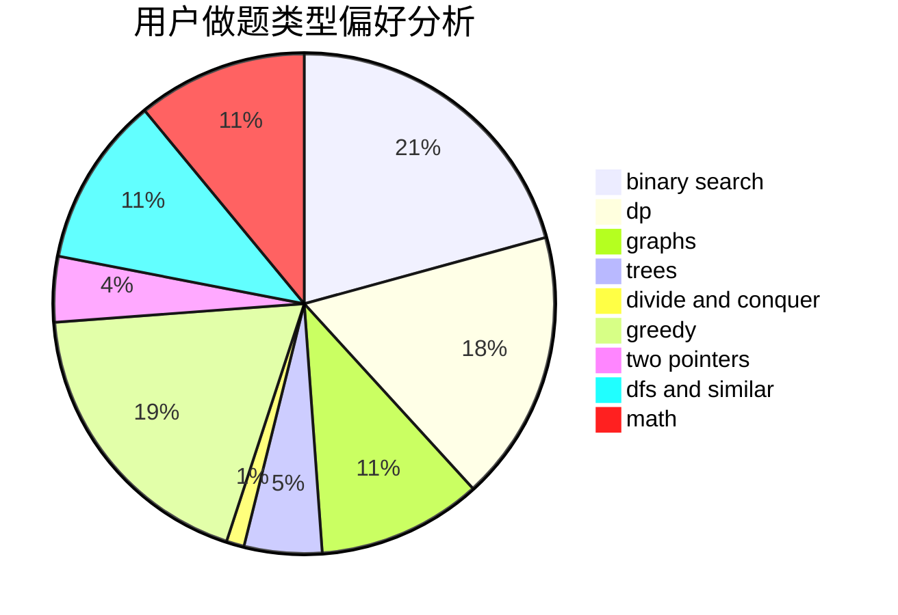

# canye666

<!-- tabs:start -->

#### **用户提交结果分析**

#### **用户做题类型偏好分析**

<!-- tabs:end -->
# 推荐题目
[917A](https://codeforces.com/contest/917/problem/A)
[1375C](https://codeforces.com/contest/1375/problem/C)
[585F](https://codeforces.com/contest/585/problem/F)
[1223E](https://codeforces.com/contest/1223/problem/E)
[582A](https://codeforces.com/contest/582/problem/A)
[1217E](https://codeforces.com/contest/1217/problem/E)
[828C](https://codeforces.com/contest/828/problem/C)
[1238G](https://codeforces.com/contest/1238/problem/G)
[1102E](https://codeforces.com/contest/1102/problem/E)
[482A](https://codeforces.com/contest/482/problem/A)
