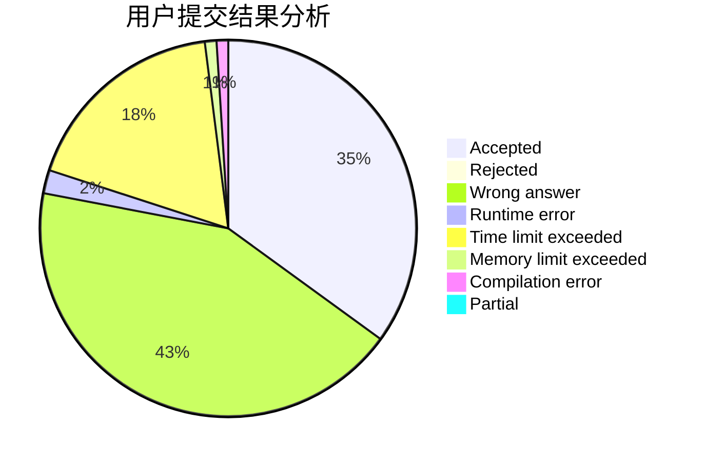
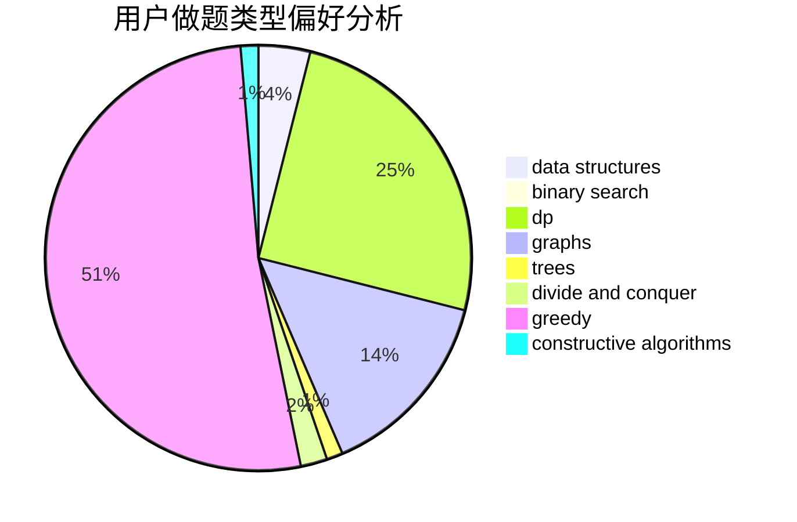
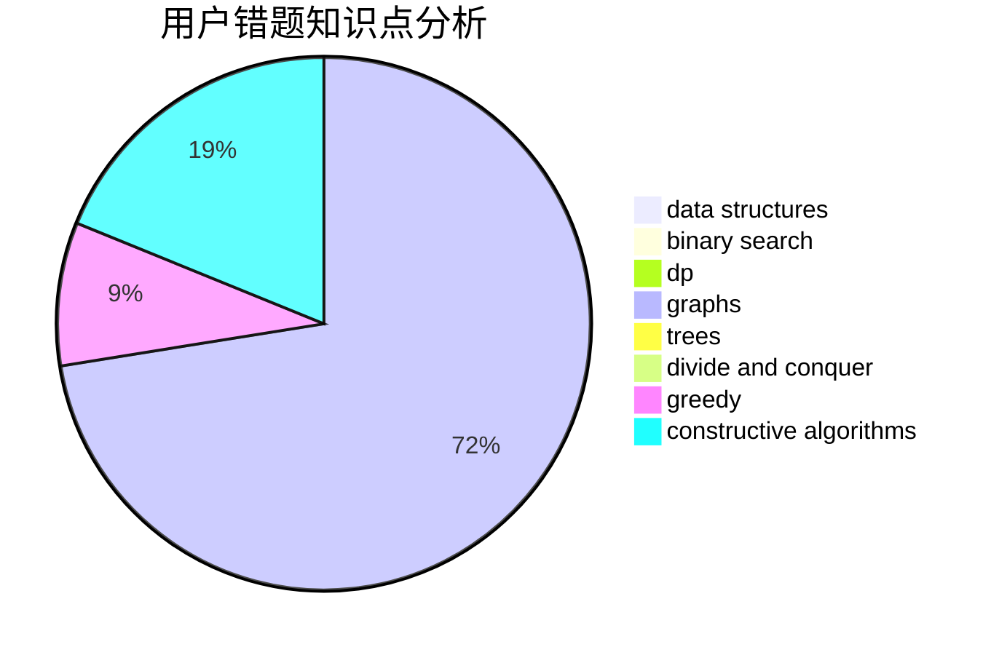

# canye666

<!-- tabs:start -->

#### **用户提交结果分析**

#### **用户做题类型偏好分析**

#### **用户错题知识点分析**

<!-- tabs:end -->
# 推荐题目
[900C](https://codeforces.com/contest/900/problem/C)		brute force,
                        data structures,
                        math		  
[1368D](https://codeforces.com/contest/1368/problem/D)		bitmasks,
                        greedy,
                        math		  
[567A](https://codeforces.com/contest/567/problem/A)		greedy,
                        implementation		  
[1217A](https://codeforces.com/contest/1217/problem/A)		binary search,
                        math		  
[559C](https://codeforces.com/contest/559/problem/C)		combinatorics,
                        dp,
                        math,
                        number theory		  
[1213C](https://codeforces.com/contest/1213/problem/C)		math		  
[810C](https://codeforces.com/contest/810/problem/C)		dsu,graphs,sortings,trees		  
[1230C](https://codeforces.com/contest/1230/problem/C)		dsu,graphs,sortings,trees		  
[1102B](https://codeforces.com/contest/1102/problem/B)		greedy,
                        sortings		  
[462A](https://codeforces.com/contest/462/problem/A)		brute force,
                        implementation		  
