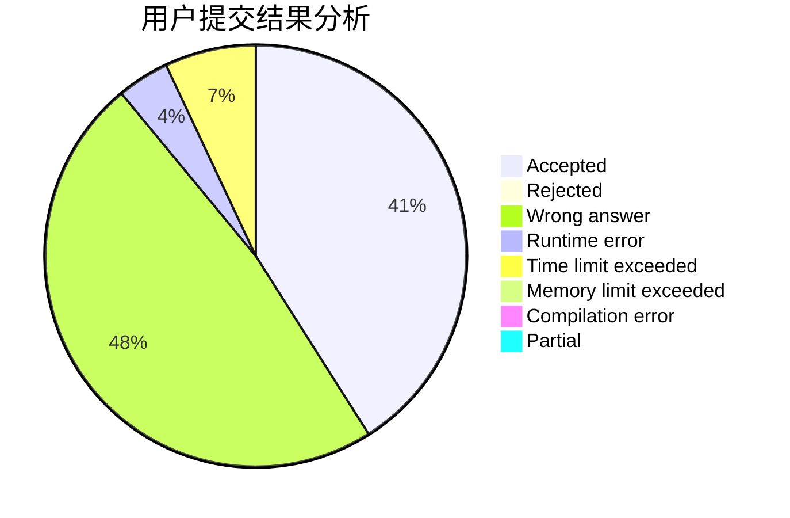
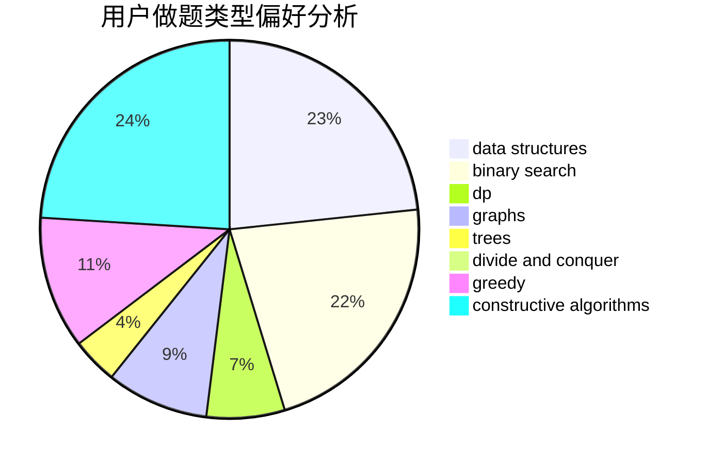
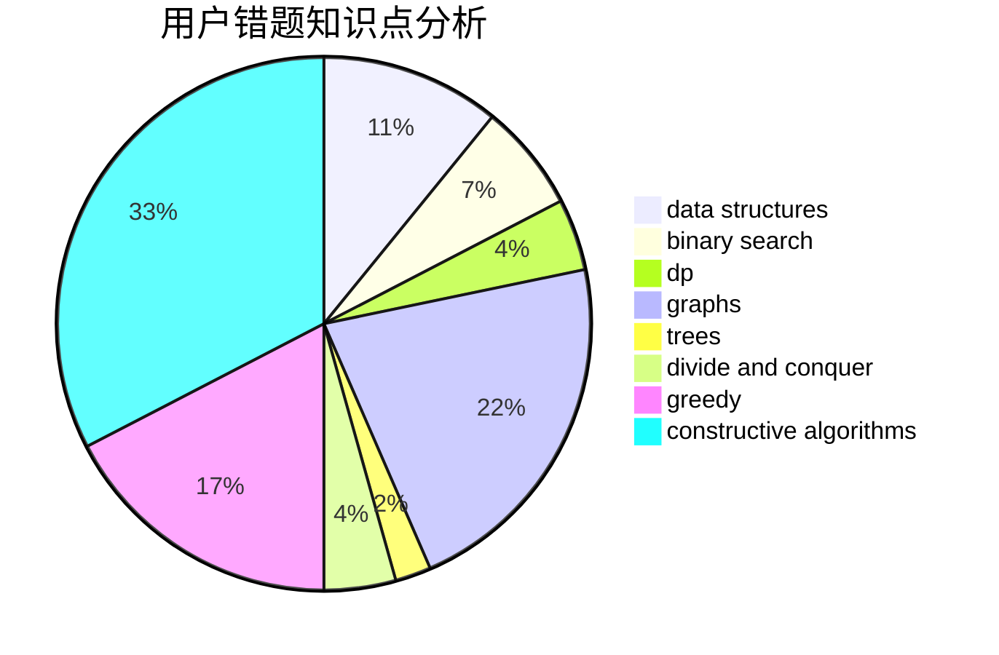

# caooac

<!-- tabs:start -->

#### **用户提交结果分析**

#### **用户做题类型偏好分析**

#### **用户错题知识点分析**

<!-- tabs:end -->
# 推荐题目
[710F](https://codeforces.com/contest/710/problem/F)		brute force,
                        data structures,
                        hashing,
                        interactive,
                        string suffix structures,
                        strings		  
[683A](https://codeforces.com/contest/683/problem/A)		*special problem,
                        geometry		  
[559E](https://codeforces.com/contest/559/problem/E)		dp,
                        sortings		  
[1063E](https://codeforces.com/contest/1063/problem/E)		constructive algorithms,
                        math		  
[1208B](https://codeforces.com/contest/1208/problem/B)		binary search,
                        brute force,
                        implementation,
                        two pointers		  
[508A](https://codeforces.com/contest/508/problem/A)		brute force		  
[290B](https://codeforces.com/contest/290/problem/B)		*special problem,
                        implementation		  
[574C](https://codeforces.com/contest/574/problem/C)		dsu,graphs,sortings,trees		  
[960D](https://codeforces.com/contest/960/problem/D)		brute force,
                        implementation,
                        trees		  
[1240A](https://codeforces.com/contest/1240/problem/A)		dsu,graphs,sortings,trees		  
