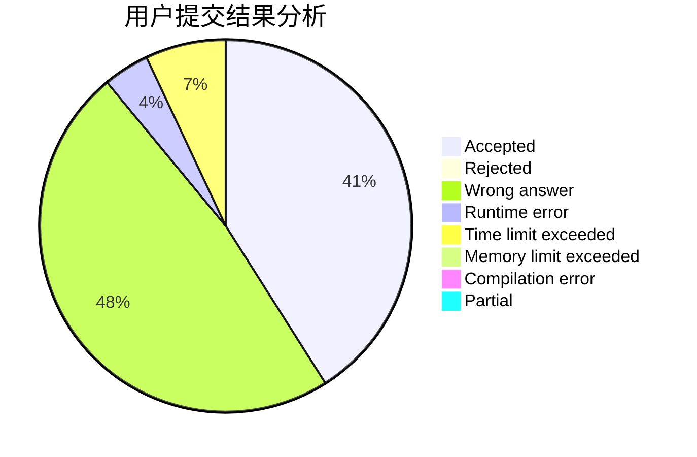
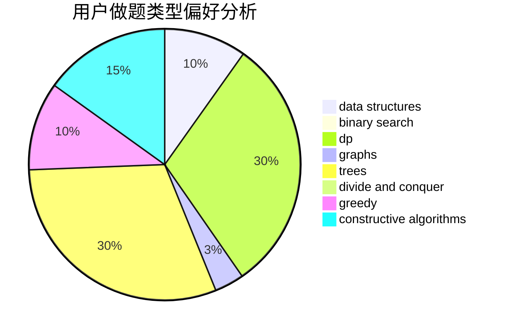
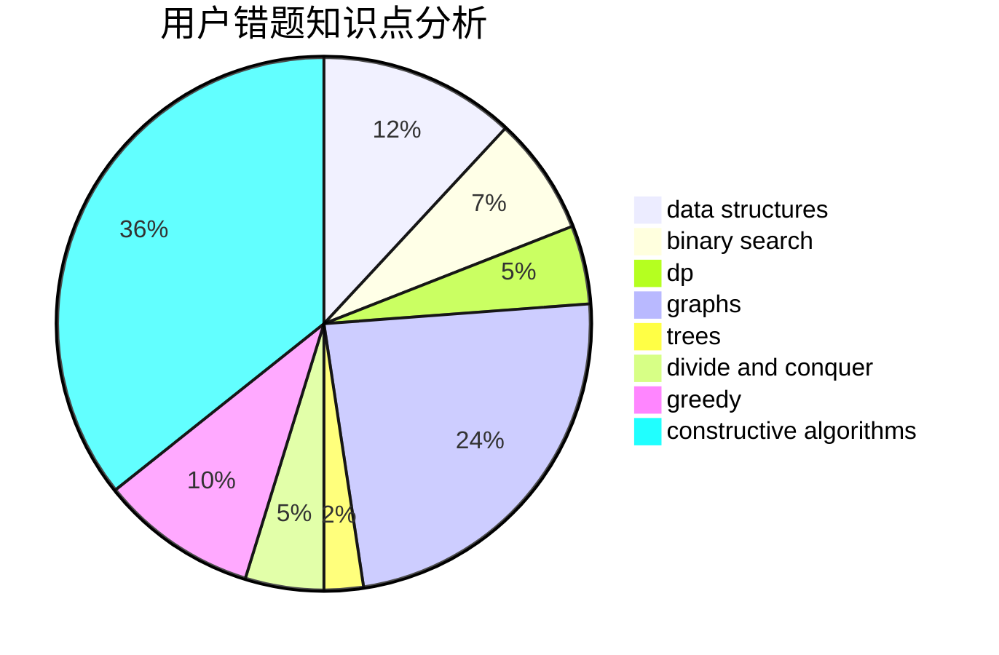

# caooac

<!-- tabs:start -->

#### **用户提交结果分析**

#### **用户做题类型偏好分析**

#### **用户错题知识点分析**

<!-- tabs:end -->
# 推荐题目
[730J](https://codeforces.com/contest/730/problem/J)		dp		  
[707B](https://codeforces.com/contest/707/problem/B)		graphs		  
[582C](https://codeforces.com/contest/582/problem/C)		number theory		  
[1064B](https://codeforces.com/contest/1064/problem/B)		math		  
[1213F](https://codeforces.com/contest/1213/problem/F)		data structures,
                        dfs and similar,
                        dsu,
                        graphs,
                        greedy,
                        implementation,
                        strings		  
[528A](https://codeforces.com/contest/528/problem/A)		dsu,graphs,sortings,trees		  
[305B](https://codeforces.com/contest/305/problem/B)		brute force,
                        implementation,
                        math		  
[594D](https://codeforces.com/contest/594/problem/D)		data structures,
                        number theory		  
[982C](https://codeforces.com/contest/982/problem/C)		dfs and similar,
                        dp,
                        graphs,
                        greedy,
                        trees		  
[1245D](https://codeforces.com/contest/1245/problem/D)		dsu,
                        graphs,
                        greedy,
                        shortest paths,
                        trees		  
