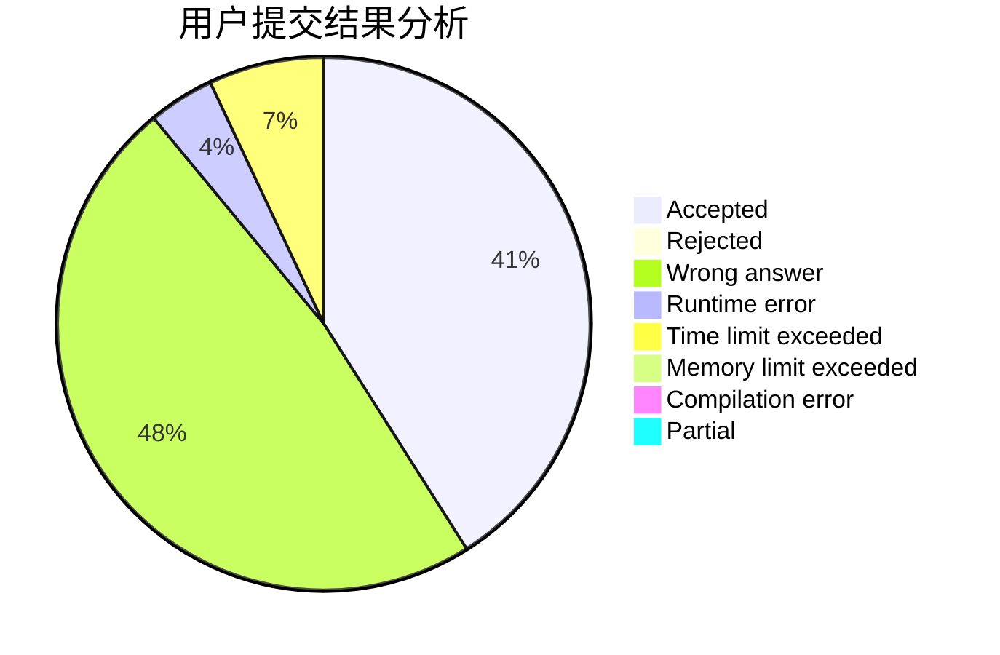
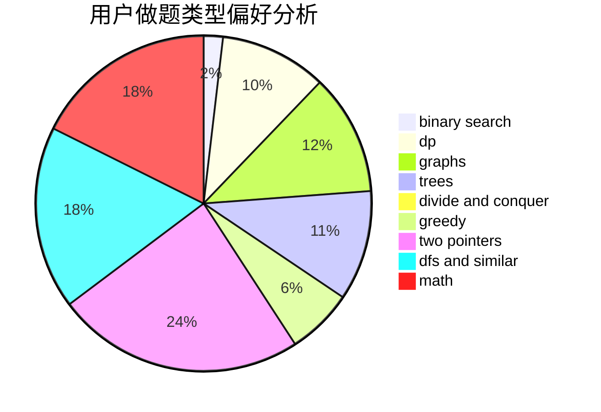

# caooac

<!-- tabs:start -->

#### **用户提交结果分析**

#### **用户做题类型偏好分析**

<!-- tabs:end -->
# 推荐题目
[730J](https://codeforces.com/contest/730/problem/J)
[707B](https://codeforces.com/contest/707/problem/B)
[582C](https://codeforces.com/contest/582/problem/C)
[1064B](https://codeforces.com/contest/1064/problem/B)
[1213F](https://codeforces.com/contest/1213/problem/F)
[528A](https://codeforces.com/contest/528/problem/A)
[305B](https://codeforces.com/contest/305/problem/B)
[594D](https://codeforces.com/contest/594/problem/D)
[982C](https://codeforces.com/contest/982/problem/C)
[1245D](https://codeforces.com/contest/1245/problem/D)
