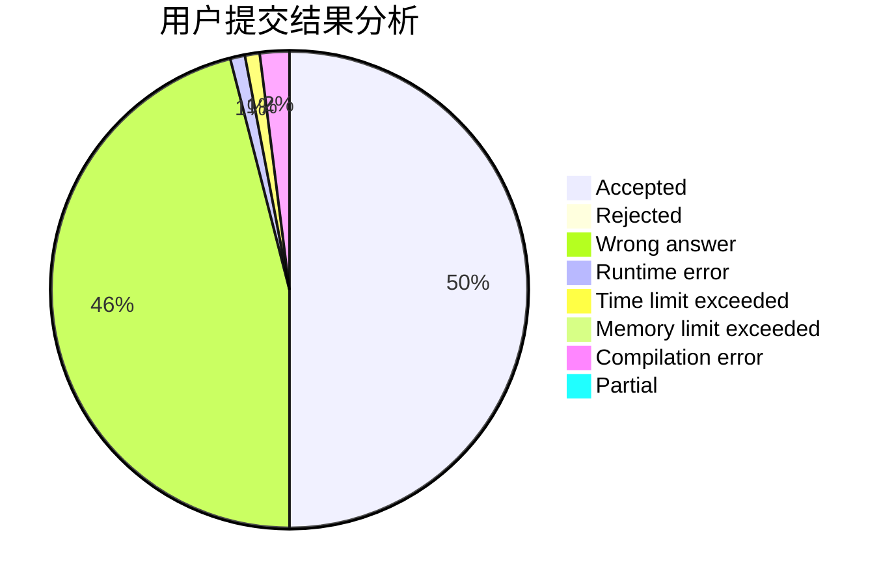
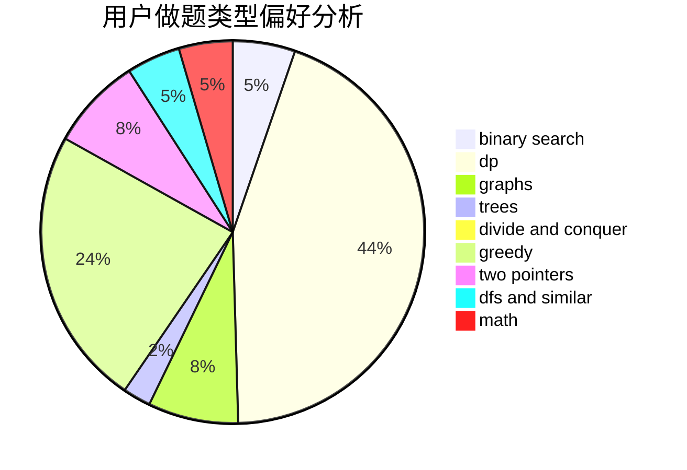

# caozy623

<!-- tabs:start -->

#### **用户提交结果分析**

#### **用户做题类型偏好分析**

<!-- tabs:end -->
# 推荐题目
[96B](https://codeforces.com/contest/96/problem/B)
[717E](https://codeforces.com/contest/717/problem/E)
[922B](https://codeforces.com/contest/922/problem/B)
[1290A](https://codeforces.com/contest/1290/problem/A)
[17C](https://codeforces.com/contest/17/problem/C)
[689A](https://codeforces.com/contest/689/problem/A)
[11302](https://codeforces.com/contest/1130/problem/2)
[602A](https://codeforces.com/contest/602/problem/A)
[574B](https://codeforces.com/contest/574/problem/B)
[721D](https://codeforces.com/contest/721/problem/D)
