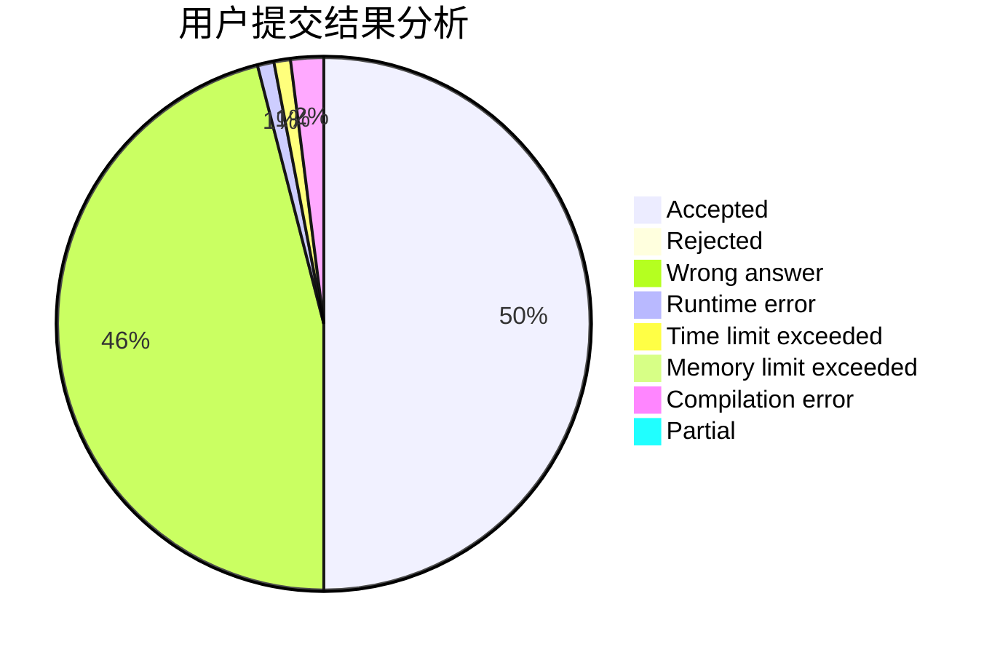
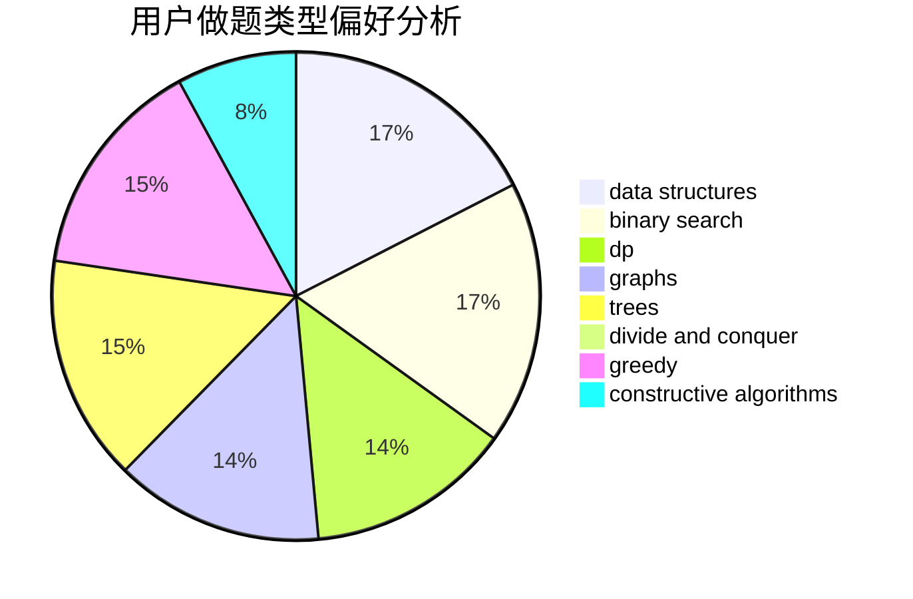

# caozy623

<!-- tabs:start -->

#### **用户提交结果分析**

#### **用户做题类型偏好分析**

#### **用户错题知识点分析**

<!-- tabs:end -->
# 推荐题目
[952A](https://codeforces.com/contest/952/problem/A)		math		  
[6C](https://codeforces.com/contest/6/problem/C)		greedy,
                        two pointers		  
[908A](https://codeforces.com/contest/908/problem/A)		brute force,
                        implementation		  
[1283A](https://codeforces.com/contest/1283/problem/A)		math		  
[158A](https://codeforces.com/contest/158/problem/A)		*special problem,
                        implementation		  
[667A](https://codeforces.com/contest/667/problem/A)		geometry,
                        math		  
[1120F](https://codeforces.com/contest/1120/problem/F)		data structures,
                        dp,
                        greedy		  
[581D](https://codeforces.com/contest/581/problem/D)		bitmasks,
                        brute force,
                        constructive algorithms,
                        geometry,
                        implementation,
                        math		  
[549C](https://codeforces.com/contest/549/problem/C)		games		  
[702F](https://codeforces.com/contest/702/problem/F)		data structures		  
