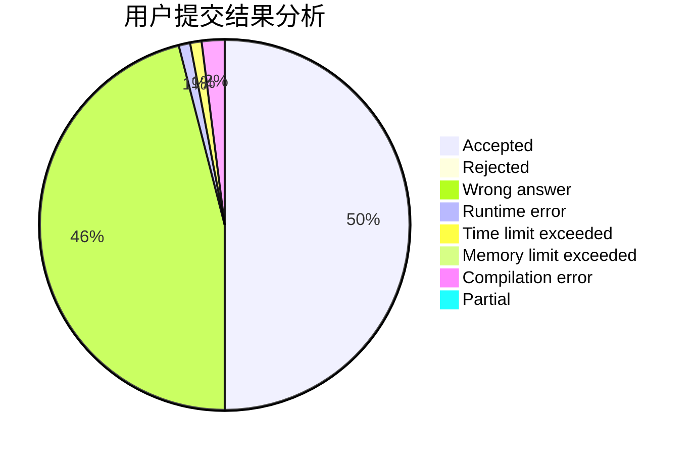
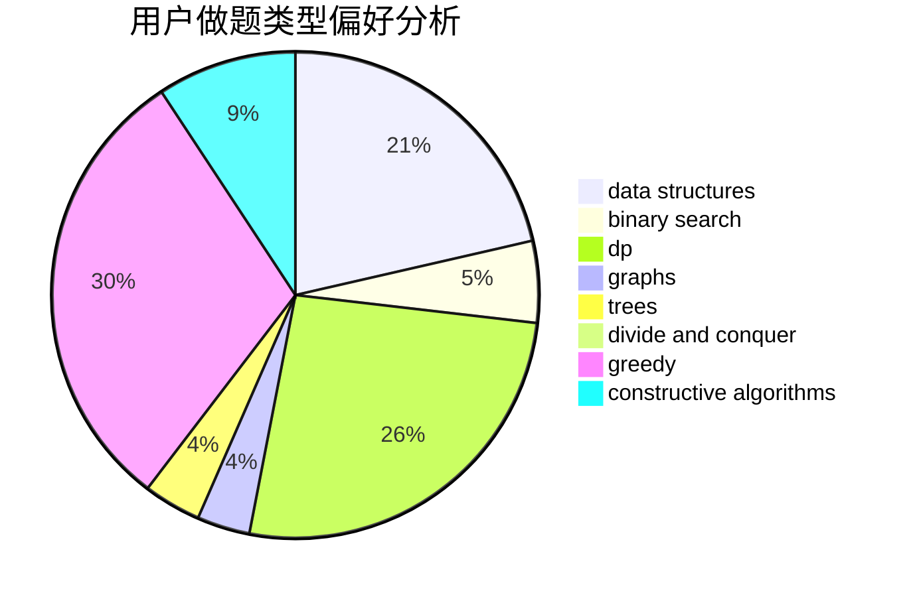
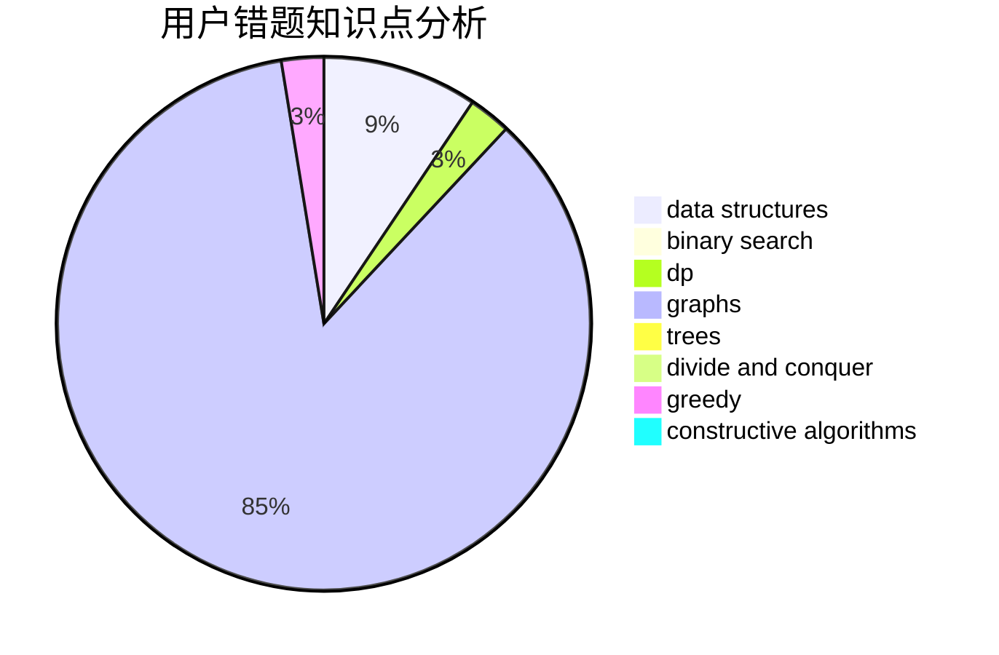

# caozy623

<!-- tabs:start -->

#### **用户提交结果分析**

#### **用户做题类型偏好分析**

#### **用户错题知识点分析**

<!-- tabs:end -->
# 推荐题目
[96B](https://codeforces.com/contest/96/problem/B)		binary search,
                        bitmasks,
                        brute force		  
[717E](https://codeforces.com/contest/717/problem/E)		dfs and similar		  
[922B](https://codeforces.com/contest/922/problem/B)		brute force		  
[1290A](https://codeforces.com/contest/1290/problem/A)		brute force,
                        data structures,
                        implementation		  
[17C](https://codeforces.com/contest/17/problem/C)		dp		  
[689A](https://codeforces.com/contest/689/problem/A)		brute force,
                        constructive algorithms,
                        implementation		  
[11302](https://codeforces.com/contest/1130/problem/2)		dsu,graphs,sortings,trees		  
[602A](https://codeforces.com/contest/602/problem/A)		brute force,
                        implementation		  
[574B](https://codeforces.com/contest/574/problem/B)		brute force,
                        dfs and similar,
                        graphs,
                        hashing		  
[721D](https://codeforces.com/contest/721/problem/D)		constructive algorithms,
                        data structures,
                        greedy,
                        math		  
