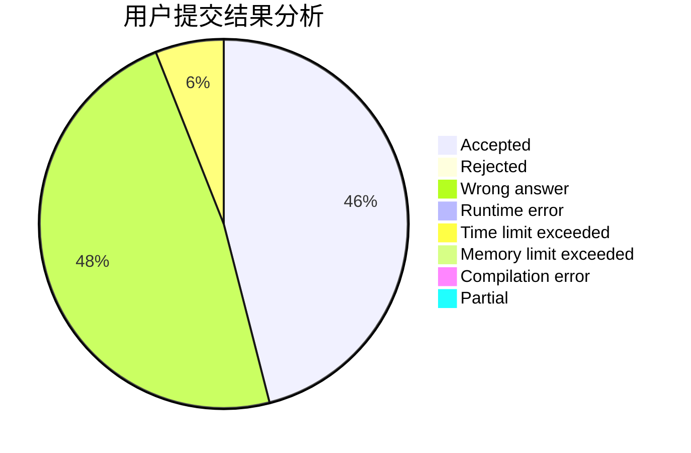
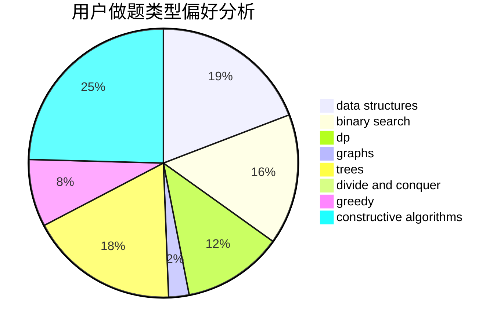
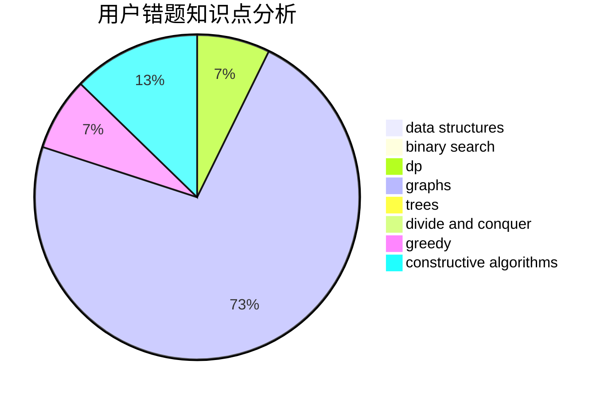

# cbio

<!-- tabs:start -->

#### **用户提交结果分析**

#### **用户做题类型偏好分析**

#### **用户错题知识点分析**

<!-- tabs:end -->
# 推荐题目
[1465C](https://codeforces.com/contest/1465/problem/C)		dsu,graphs,sortings,trees		  
[1771](https://codeforces.com/contest/177/problem/1)		dsu,graphs,sortings,trees		  
[727F](https://codeforces.com/contest/727/problem/F)		binary search,
                        dp,
                        greedy		  
[13764](https://codeforces.com/contest/1376/problem/4)		dsu,graphs,sortings,trees		  
[1119G](https://codeforces.com/contest/1119/problem/G)		constructive algorithms,
                        implementation		  
[183A](https://codeforces.com/contest/183/problem/A)		constructive algorithms,
                        math		  
[587E](https://codeforces.com/contest/587/problem/E)		data structures		  
[248E](https://codeforces.com/contest/248/problem/E)		dp,
                        math,
                        probabilities		  
[1240C](https://codeforces.com/contest/1240/problem/C)		dsu,graphs,sortings,trees		  
[584D](https://codeforces.com/contest/584/problem/D)		brute force,
                        math,
                        number theory		  
