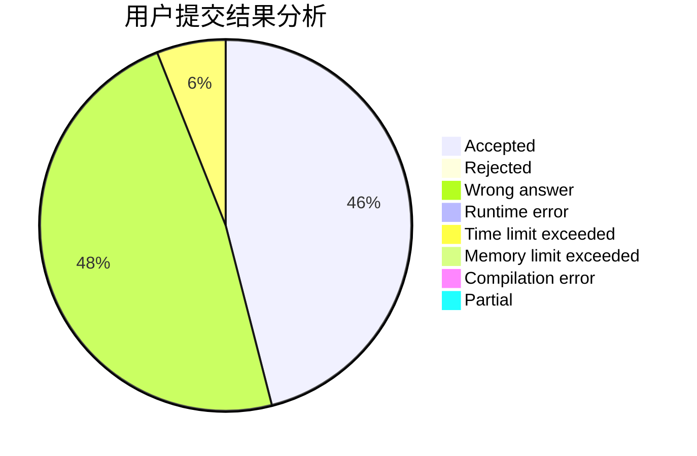
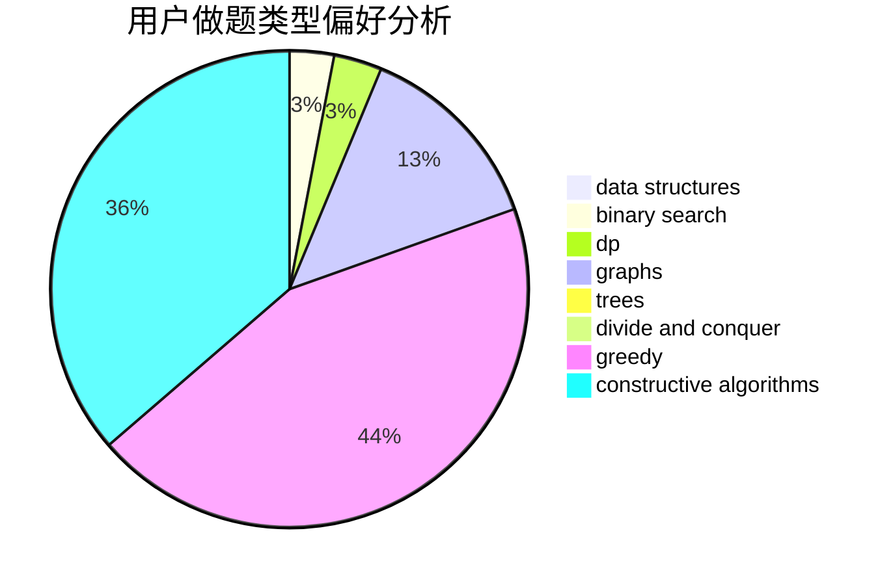
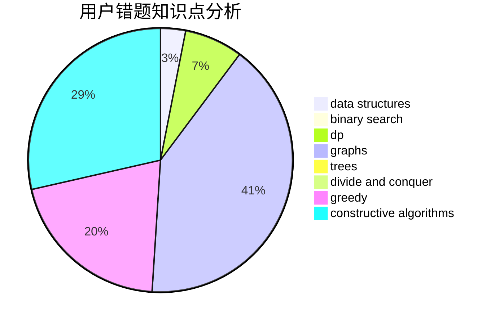

# cbio

<!-- tabs:start -->

#### **用户提交结果分析**

#### **用户做题类型偏好分析**

#### **用户错题知识点分析**

<!-- tabs:end -->
# 推荐题目
[1455F](https://codeforces.com/contest/1455/problem/F)		dp,
                        greedy		  
[156C](https://codeforces.com/contest/156/problem/C)		combinatorics,
                        dp		  
[708D](https://codeforces.com/contest/708/problem/D)		flows		  
[1369E](https://codeforces.com/contest/1369/problem/E)		data structures,
                        dfs and similar,
                        greedy,
                        implementation,
                        sortings		  
[1118B](https://codeforces.com/contest/1118/problem/B)		implementation		  
[15D](https://codeforces.com/contest/15/problem/D)		data structures,
                        implementation,
                        sortings		  
[567F](https://codeforces.com/contest/567/problem/F)		dp		  
[229B](https://codeforces.com/contest/229/problem/B)		binary search,
                        data structures,
                        graphs,
                        shortest paths		  
[1234F](https://codeforces.com/contest/1234/problem/F)		bitmasks,
                        dp		  
[560E](https://codeforces.com/contest/560/problem/E)		dsu,graphs,sortings,trees		  
