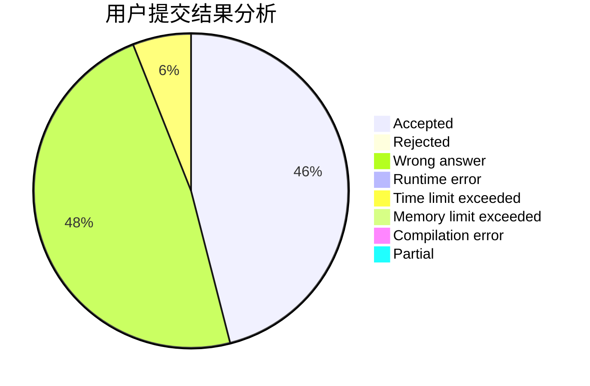
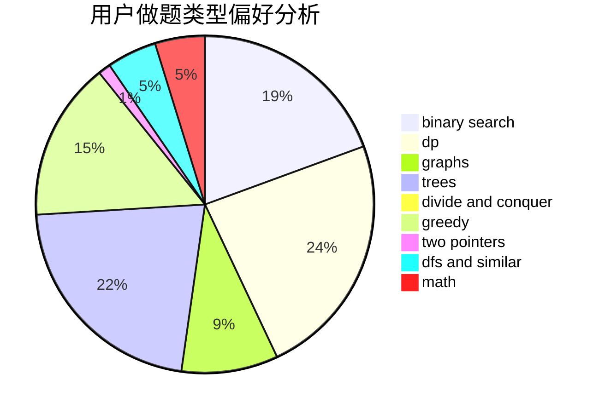

# cbio

<!-- tabs:start -->

#### **用户提交结果分析**

#### **用户做题类型偏好分析**

<!-- tabs:end -->
# 推荐题目
[1465C](https://codeforces.com/contest/1465/problem/C)
[1771](https://codeforces.com/contest/177/problem/1)
[727F](https://codeforces.com/contest/727/problem/F)
[13764](https://codeforces.com/contest/1376/problem/4)
[1119G](https://codeforces.com/contest/1119/problem/G)
[183A](https://codeforces.com/contest/183/problem/A)
[587E](https://codeforces.com/contest/587/problem/E)
[248E](https://codeforces.com/contest/248/problem/E)
[1240C](https://codeforces.com/contest/1240/problem/C)
[584D](https://codeforces.com/contest/584/problem/D)
