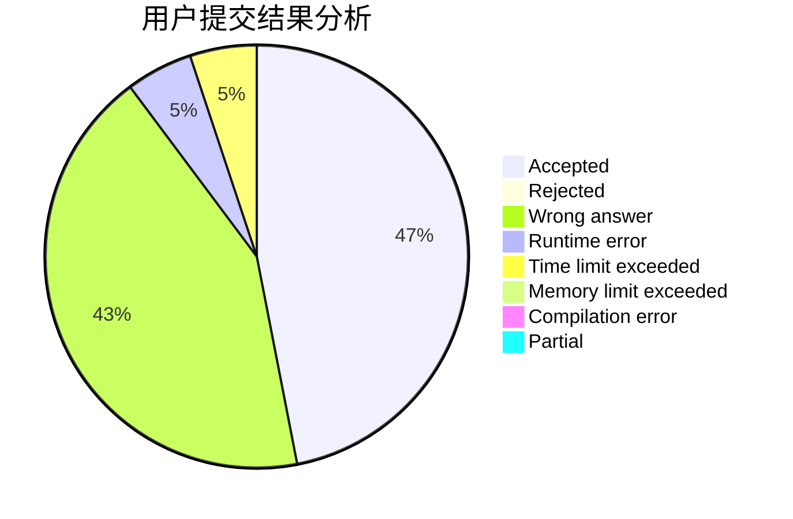
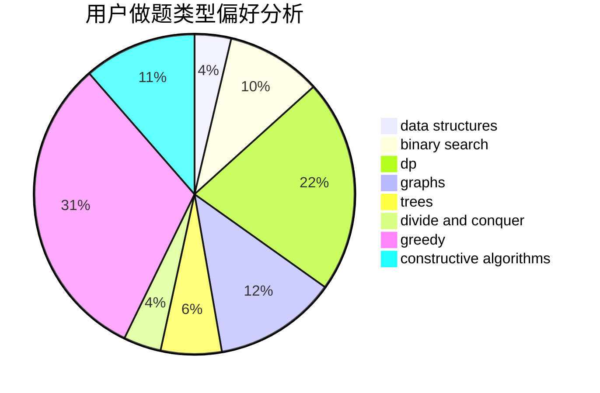
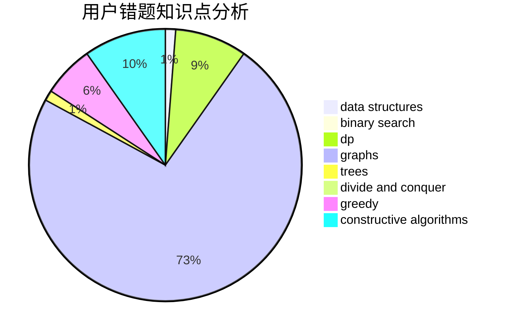

# cboy

<!-- tabs:start -->

#### **用户提交结果分析**

#### **用户做题类型偏好分析**

#### **用户错题知识点分析**

<!-- tabs:end -->
# 推荐题目
[269E](https://codeforces.com/contest/269/problem/E)		nan		  
[1061A](https://codeforces.com/contest/1061/problem/A)		greedy,
                        implementation,
                        math		  
[587D](https://codeforces.com/contest/587/problem/D)		2-sat,
                        binary search		  
[1344A](https://codeforces.com/contest/1344/problem/A)		math,
                        number theory,
                        sortings		  
[1510I](https://codeforces.com/contest/1510/problem/I)		greedy,
                        interactive,
                        math,
                        probabilities		  
[932B](https://codeforces.com/contest/932/problem/B)		binary search,
                        data structures,
                        dfs and similar		  
[1071C](https://codeforces.com/contest/1071/problem/C)		dsu,graphs,sortings,trees		  
[848B](https://codeforces.com/contest/848/problem/B)		constructive algorithms,
                        data structures,
                        geometry,
                        implementation,
                        sortings,
                        two pointers		  
[1120A](https://codeforces.com/contest/1120/problem/A)		greedy,
                        implementation,
                        two pointers		  
[504A](https://codeforces.com/contest/504/problem/A)		dsu,graphs,sortings,trees		  
