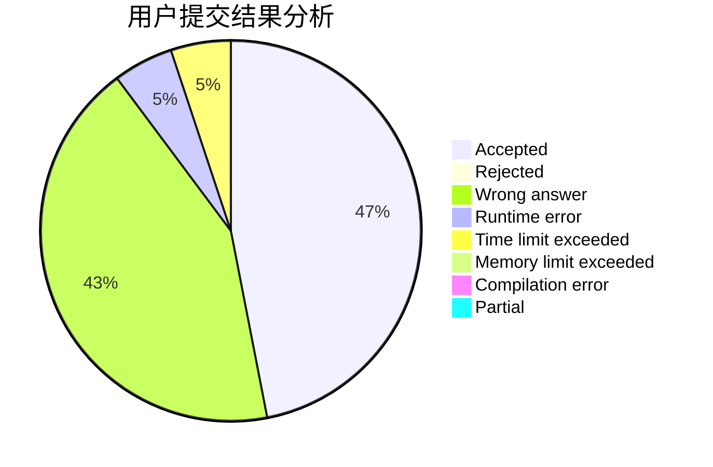
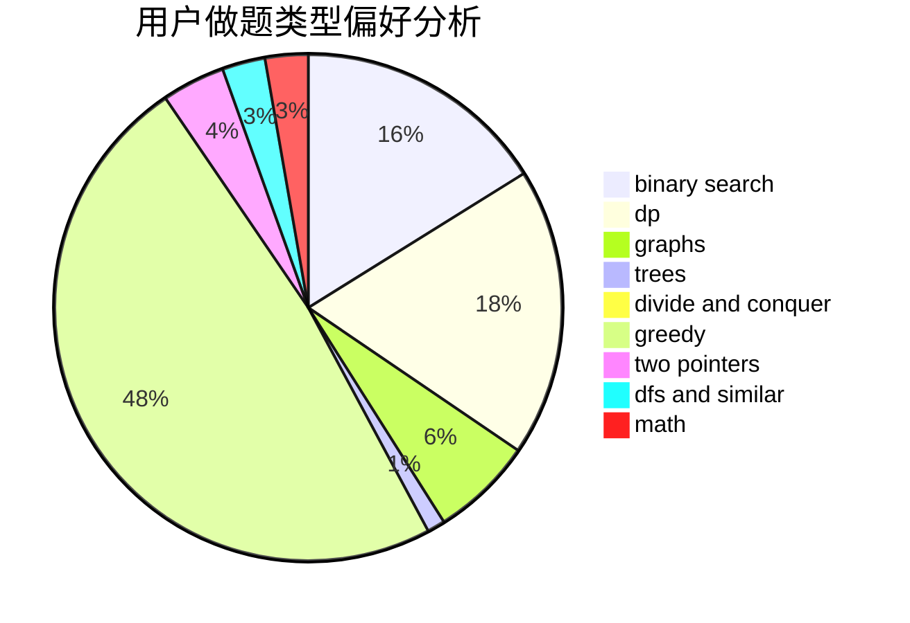

# cboy

<!-- tabs:start -->

#### **用户提交结果分析**

#### **用户做题类型偏好分析**

<!-- tabs:end -->
# 推荐题目
[286A](https://codeforces.com/contest/286/problem/A)
[1061E](https://codeforces.com/contest/1061/problem/E)
[607E](https://codeforces.com/contest/607/problem/E)
[1350E](https://codeforces.com/contest/1350/problem/E)
[166A](https://codeforces.com/contest/166/problem/A)
[954B](https://codeforces.com/contest/954/problem/B)
[1072B](https://codeforces.com/contest/1072/problem/B)
[866E](https://codeforces.com/contest/866/problem/E)
[1129E](https://codeforces.com/contest/1129/problem/E)
[524E](https://codeforces.com/contest/524/problem/E)
