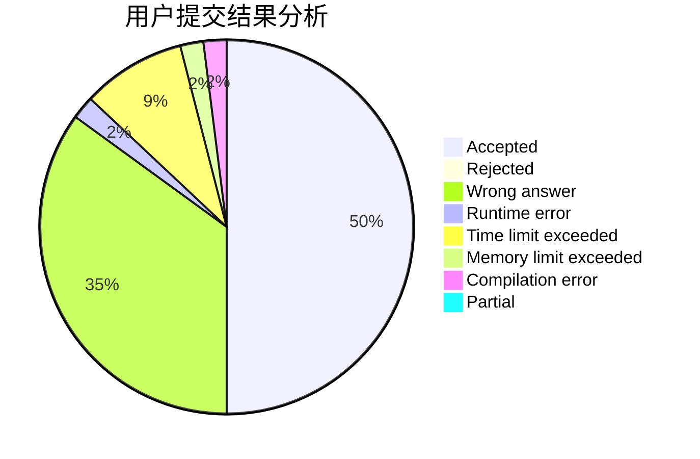
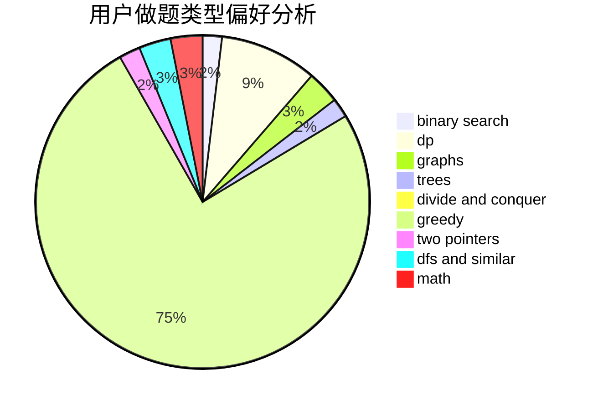

# cc0408

<!-- tabs:start -->

#### **用户提交结果分析**

#### **用户做题类型偏好分析**

<!-- tabs:end -->
# 推荐题目
[1200D](https://codeforces.com/contest/1200/problem/D)
[906C](https://codeforces.com/contest/906/problem/C)
[567A](https://codeforces.com/contest/567/problem/A)
[540B](https://codeforces.com/contest/540/problem/B)
[295B](https://codeforces.com/contest/295/problem/B)
[1133A](https://codeforces.com/contest/1133/problem/A)
[828A](https://codeforces.com/contest/828/problem/A)
[665D](https://codeforces.com/contest/665/problem/D)
[620F](https://codeforces.com/contest/620/problem/F)
[507D](https://codeforces.com/contest/507/problem/D)
