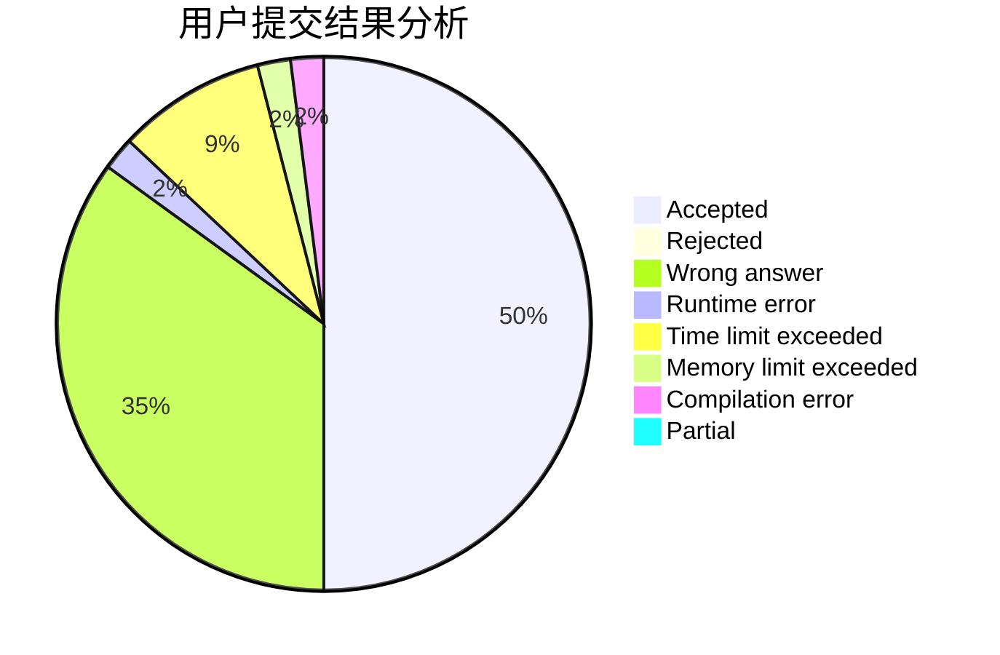
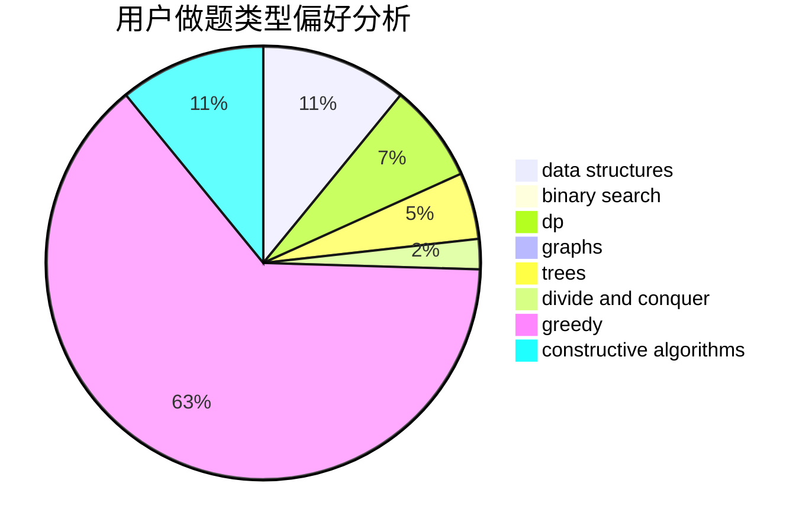
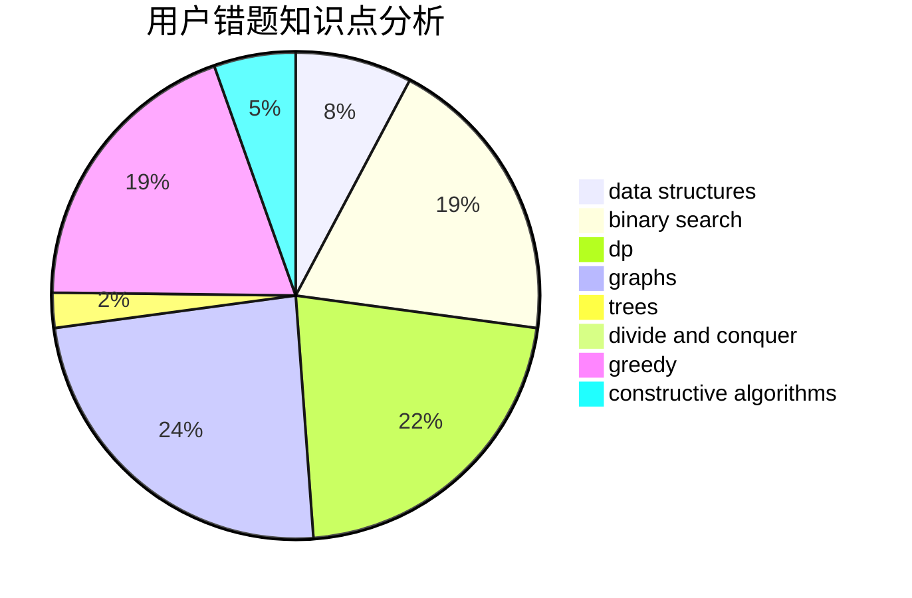

# cc0408

<!-- tabs:start -->

#### **用户提交结果分析**

#### **用户做题类型偏好分析**

#### **用户错题知识点分析**

<!-- tabs:end -->
# 推荐题目
[1197B](https://codeforces.com/contest/1197/problem/B)		greedy,
                        implementation		  
[887B](https://codeforces.com/contest/887/problem/B)		brute force,
                        implementation		  
[542E](https://codeforces.com/contest/542/problem/E)		graphs,
                        shortest paths		  
[514D](https://codeforces.com/contest/514/problem/D)		binary search,
                        data structures,
                        two pointers		  
[27C](https://codeforces.com/contest/27/problem/C)		constructive algorithms,
                        greedy		  
[1131D](https://codeforces.com/contest/1131/problem/D)		dfs and similar,
                        dp,
                        dsu,
                        graphs,
                        greedy		  
[810A](https://codeforces.com/contest/810/problem/A)		implementation,
                        math		  
[633B](https://codeforces.com/contest/633/problem/B)		brute force,
                        constructive algorithms,
                        math,
                        number theory		  
[601D](https://codeforces.com/contest/601/problem/D)		data structures,
                        dfs and similar,
                        dsu,
                        hashing,
                        strings,
                        trees		  
[486D](https://codeforces.com/contest/486/problem/D)		dfs and similar,
                        dp,
                        math,
                        trees		  
