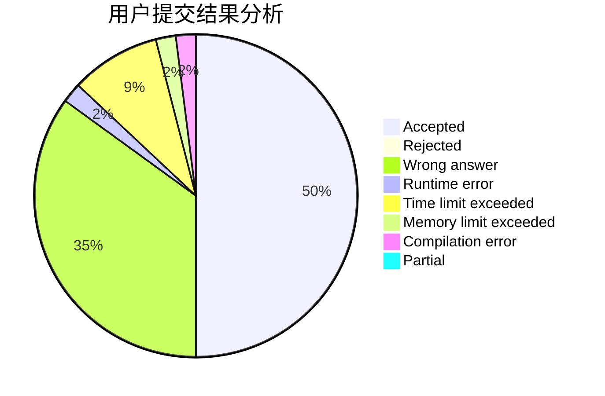
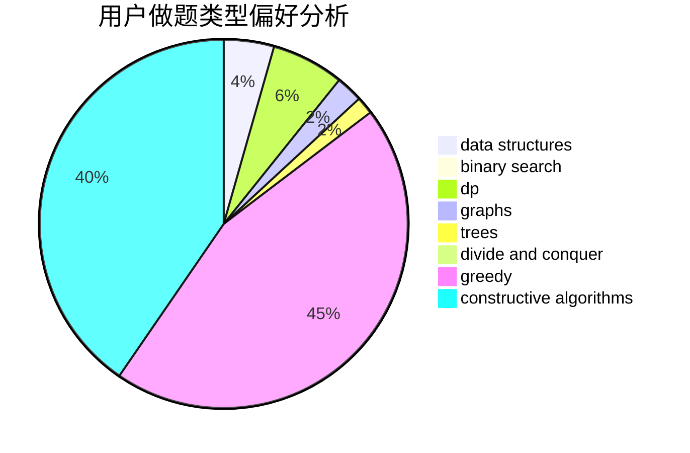
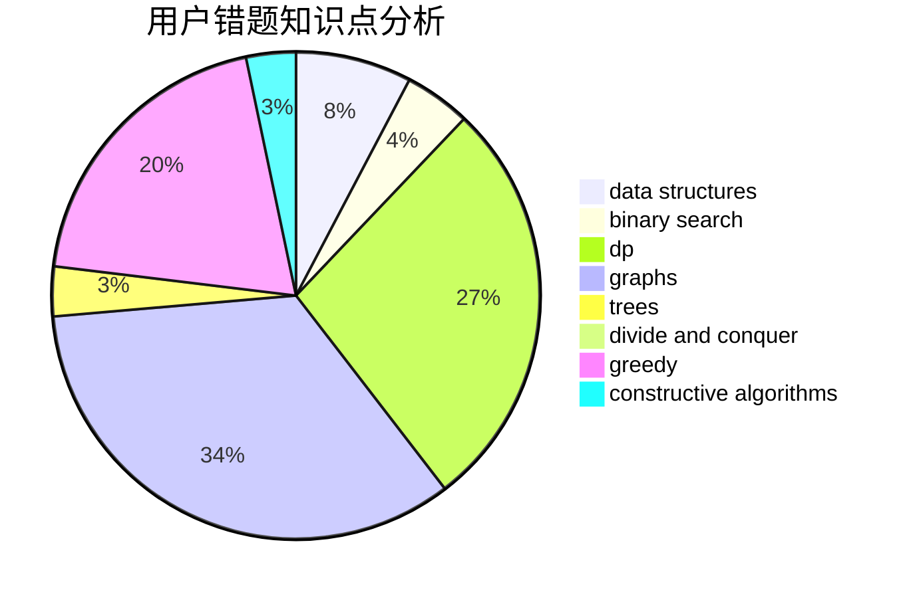

# cc0408

<!-- tabs:start -->

#### **用户提交结果分析**

#### **用户做题类型偏好分析**

#### **用户错题知识点分析**

<!-- tabs:end -->
# 推荐题目
[1200D](https://codeforces.com/contest/1200/problem/D)		brute force,
                        data structures,
                        dp,
                        implementation,
                        two pointers		  
[906C](https://codeforces.com/contest/906/problem/C)		bitmasks,
                        brute force,
                        dp,
                        graphs		  
[567A](https://codeforces.com/contest/567/problem/A)		greedy,
                        implementation		  
[540B](https://codeforces.com/contest/540/problem/B)		greedy,
                        implementation		  
[295B](https://codeforces.com/contest/295/problem/B)		dp,
                        graphs,
                        shortest paths		  
[1133A](https://codeforces.com/contest/1133/problem/A)		implementation		  
[828A](https://codeforces.com/contest/828/problem/A)		implementation		  
[665D](https://codeforces.com/contest/665/problem/D)		constructive algorithms,
                        greedy,
                        number theory		  
[620F](https://codeforces.com/contest/620/problem/F)		data structures,
                        strings,
                        trees		  
[507D](https://codeforces.com/contest/507/problem/D)		dp,
                        implementation		  
