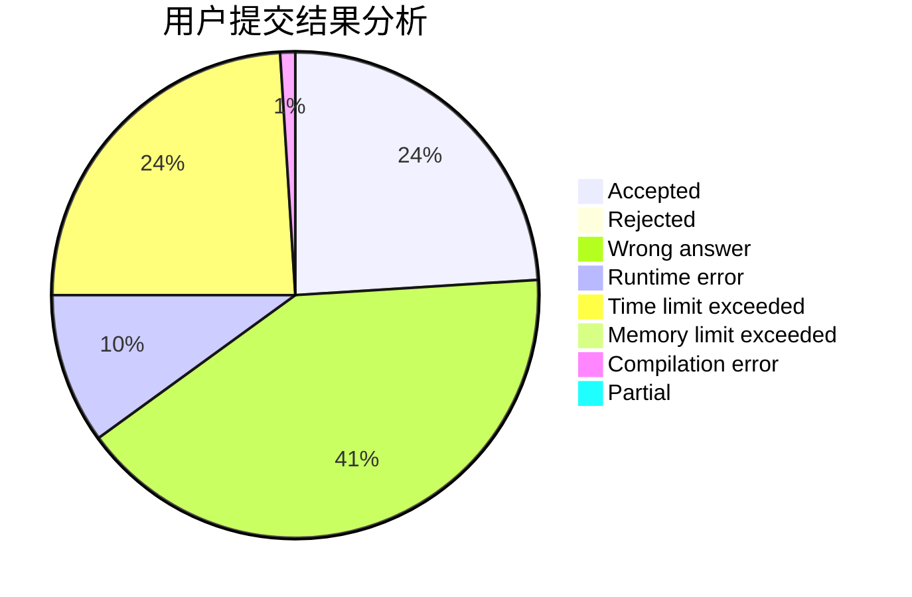
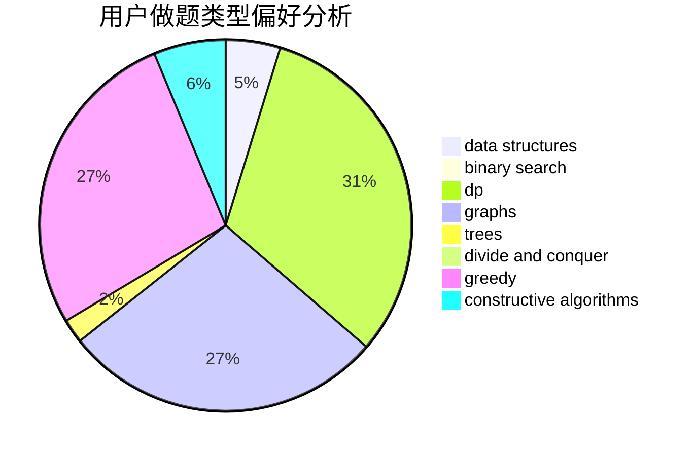
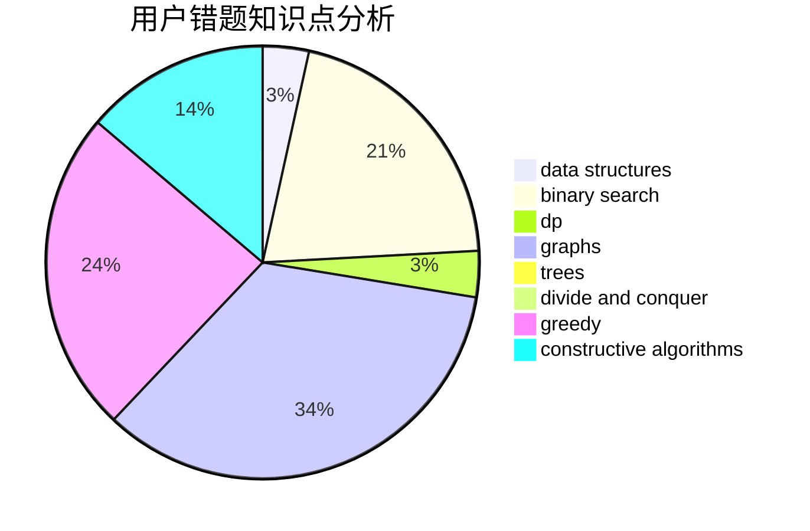

# ccutyear

<!-- tabs:start -->

#### **用户提交结果分析**

#### **用户做题类型偏好分析**

#### **用户错题知识点分析**

<!-- tabs:end -->
# 推荐题目
[1470C](https://codeforces.com/contest/1470/problem/C)		binary search,
                        brute force,
                        constructive algorithms,
                        interactive		  
[1430E](https://codeforces.com/contest/1430/problem/E)		data structures,
                        greedy,
                        strings		  
[1433E](https://codeforces.com/contest/1433/problem/E)		combinatorics,
                        math		  
[568C](https://codeforces.com/contest/568/problem/C)		2-sat,
                        greedy		  
[708D](https://codeforces.com/contest/708/problem/D)		flows		  
[585B](https://codeforces.com/contest/585/problem/B)		dfs and similar,
                        graphs,
                        shortest paths		  
[1179D](https://codeforces.com/contest/1179/problem/D)		data structures,
                        dp,
                        trees		  
[1013B](https://codeforces.com/contest/1013/problem/B)		greedy		  
[455E](https://codeforces.com/contest/455/problem/E)		data structures		  
[588B](https://codeforces.com/contest/588/problem/B)		math		  
