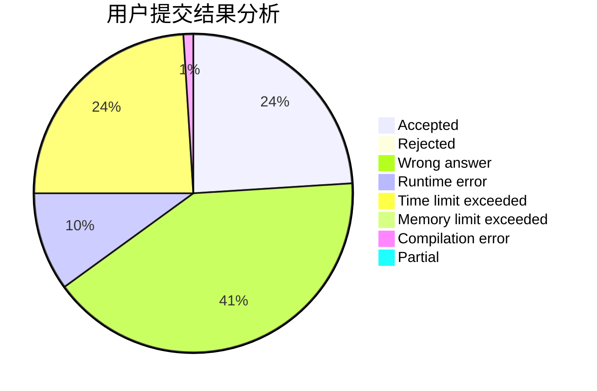
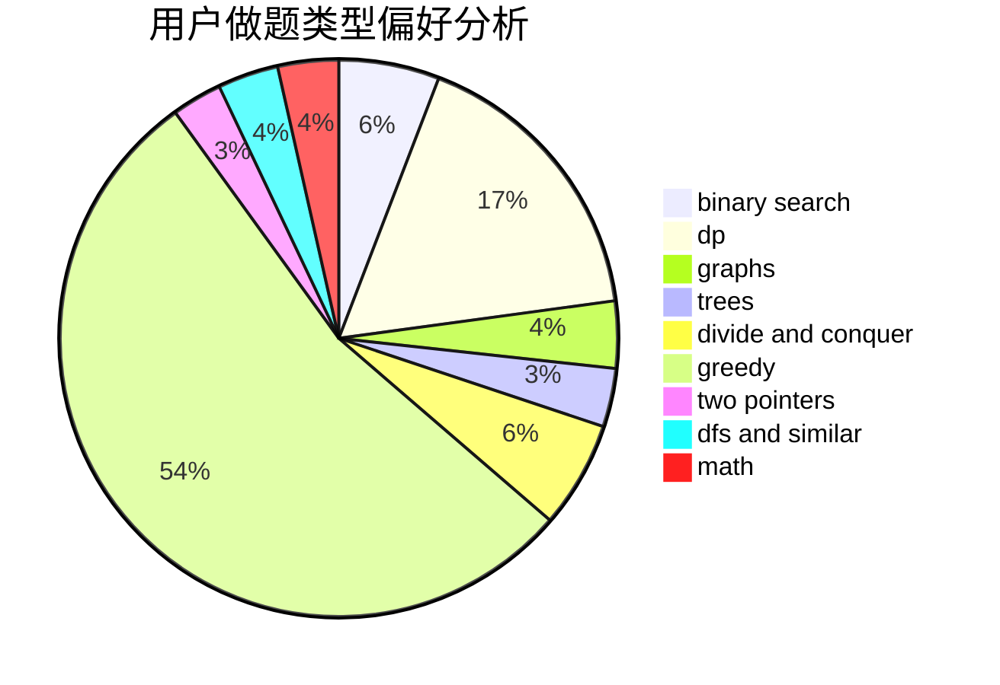

# ccutyear

<!-- tabs:start -->

#### **用户提交结果分析**

#### **用户做题类型偏好分析**

<!-- tabs:end -->
# 推荐题目
[1478F](https://codeforces.com/contest/1478/problem/F)
[1439C](https://codeforces.com/contest/1439/problem/C)
[1443D](https://codeforces.com/contest/1443/problem/D)
[588B](https://codeforces.com/contest/588/problem/B)
[727F](https://codeforces.com/contest/727/problem/F)
[605C](https://codeforces.com/contest/605/problem/C)
[1182C](https://codeforces.com/contest/1182/problem/C)
[1013E](https://codeforces.com/contest/1013/problem/E)
[477A](https://codeforces.com/contest/477/problem/A)
[608D](https://codeforces.com/contest/608/problem/D)
