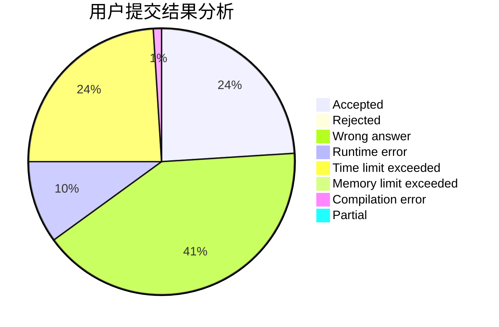
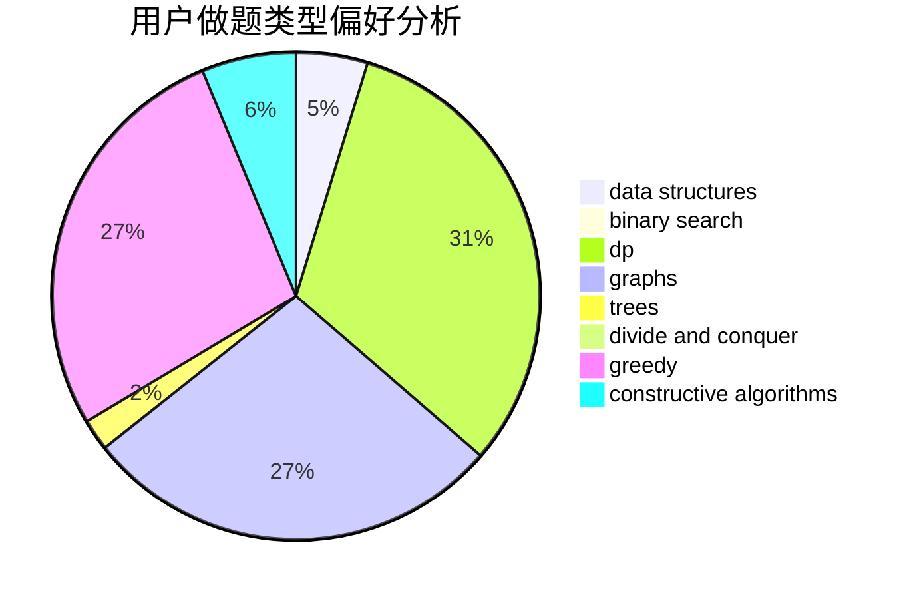
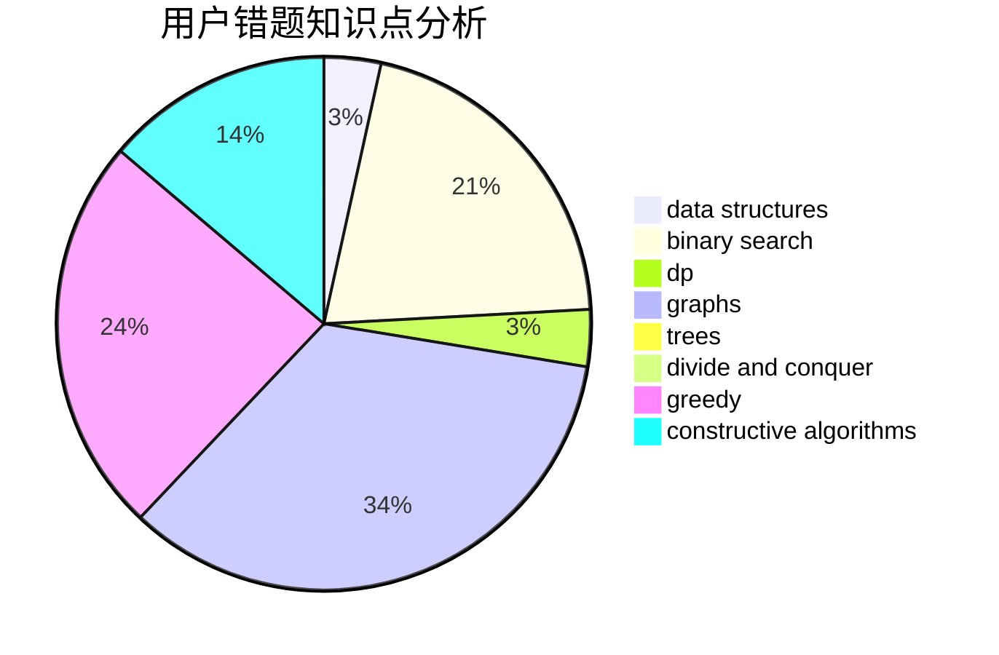

# ccutyear
<!-- tabs:start -->
#### **用户提交结果分析**

#### **用户做题类型偏好分析**

#### **用户错题知识点分析**

<!-- tabs:end -->
# 推荐题目
[String Reversal](http://codeforces.com/problemset/problem/1430/E)		data structures,
                        greedy,
                        strings		  
[New Language](http://codeforces.com/problemset/problem/568/C)		2-sat,
                        greedy		  
[Incorrect Flow](http://codeforces.com/problemset/problem/708/D)		flows		  
[Phillip and Trains](http://codeforces.com/problemset/problem/585/B)		dfs and similar,
                        graphs,
                        shortest paths		  
[Bears and Juice](https://codeforces.com/contest/674/problem/F)		dp,
                        math,
                        meet-in-the-middle		  
[And](http://codeforces.com/problemset/problem/1013/B)		greedy		  
[Distinguish zero state and plus state without errors](http://codeforces.com/problemset/problem/1002/C2)		nan		  
[Superhero's Job](http://codeforces.com/problemset/problem/542/D)		dfs and similar,
                        dp,
                        hashing,
                        math,
                        number theory		  
[Platforms Jumping](http://codeforces.com/problemset/problem/1256/C)		greedy		  
[Suits](http://codeforces.com/problemset/problem/1271/A)		brute force,
                        greedy,
                        math		  
<!-- tabs:start -->
#### **data structures**
[String Reversal](http://codeforces.com/problemset/problem/1430/E)		data structures,
                        greedy,
                        strings		  
[New Language](http://codeforces.com/problemset/problem/1179/D)		data structures,
                        dp,
                        trees		  
[Incorrect Flow](http://codeforces.com/problemset/problem/855/B)		brute force,
                        data structures,
                        dp		  
[Phillip and Trains](http://codeforces.com/problemset/problem/455/E)		data structures		  
[Bears and Juice](http://codeforces.com/problemset/problem/1163/F)		data structures,
                        graphs,
                        shortest paths		  
[And](http://codeforces.com/problemset/problem/587/F)		data structures,
                        strings		  
[Distinguish zero state and plus state without errors](http://codeforces.com/problemset/problem/1488/F)		*special problem,
                        *special problem,
                        binary search,
                        data structures		  
[Superhero's Job](http://codeforces.com/problemset/problem/1492/C)		binary search,
                        data structures,
                        dp,
                        greedy,
                        two pointers		  
[Platforms Jumping](http://codeforces.com/problemset/problem/1490/G)		binary search,
                        data structures,
                        math		  
[Suits](http://codeforces.com/problemset/problem/1479/D)		binary search,
                        bitmasks,
                        brute force,
                        data structures,
                        probabilities,
                        trees		  
#### **binary search**
[String Reversal](http://codeforces.com/problemset/problem/1216/E2)		binary search,
                        math		  
[New Language](http://codeforces.com/problemset/problem/348/A)		binary search,
                        math,
                        sortings		  
[Incorrect Flow](http://codeforces.com/problemset/problem/1470/C)		binary search,
                        brute force,
                        constructive algorithms,
                        interactive		  
[Phillip and Trains](http://codeforces.com/problemset/problem/553/B)		binary search,
                        combinatorics,
                        constructive algorithms,
                        greedy,
                        implementation,
                        math		  
[Bears and Juice](http://codeforces.com/problemset/problem/1488/F)		*special problem,
                        *special problem,
                        binary search,
                        data structures		  
[And](http://codeforces.com/problemset/problem/1492/C)		binary search,
                        data structures,
                        dp,
                        greedy,
                        two pointers		  
[Distinguish zero state and plus state without errors](http://codeforces.com/problemset/problem/1463/D)		binary search,
                        constructive algorithms,
                        greedy,
                        two pointers		  
[Superhero's Job](http://codeforces.com/problemset/problem/1490/G)		binary search,
                        data structures,
                        math		  
[Platforms Jumping](http://codeforces.com/problemset/problem/1479/D)		binary search,
                        bitmasks,
                        brute force,
                        data structures,
                        probabilities,
                        trees		  
[Suits](http://codeforces.com/problemset/problem/1436/E)		binary search,
                        data structures,
                        two pointers		  
#### **dp**
[String Reversal](https://codeforces.com/contest/674/problem/F)		dp,
                        math,
                        meet-in-the-middle		  
[New Language](http://codeforces.com/problemset/problem/542/D)		dfs and similar,
                        dp,
                        hashing,
                        math,
                        number theory		  
[Incorrect Flow](http://codeforces.com/problemset/problem/1179/D)		data structures,
                        dp,
                        trees		  
[Phillip and Trains](http://codeforces.com/problemset/problem/864/E)		dp,
                        sortings		  
[Bears and Juice](http://codeforces.com/problemset/problem/855/B)		brute force,
                        data structures,
                        dp		  
[And](http://codeforces.com/problemset/problem/1067/D)		dp,
                        greedy,
                        math,
                        probabilities		  
[Distinguish zero state and plus state without errors](http://codeforces.com/problemset/problem/354/C)		brute force,
                        dp,
                        number theory		  
[Superhero's Job](http://codeforces.com/problemset/problem/506/E)		combinatorics,
                        dp,
                        matrices,
                        strings		  
[Platforms Jumping](http://codeforces.com/problemset/problem/319/C)		dp,
                        geometry		  
[Suits](http://codeforces.com/problemset/problem/1462/B)		dp,
                        implementation,
                        strings		  
#### **graph**
[String Reversal](http://codeforces.com/problemset/problem/585/B)		dfs and similar,
                        graphs,
                        shortest paths		  
[New Language](http://codeforces.com/problemset/problem/225/D)		bitmasks,
                        dfs and similar,
                        graphs,
                        implementation		  
[Incorrect Flow](http://codeforces.com/problemset/problem/1010/D)		dfs and similar,
                        graphs,
                        implementation,
                        trees		  
[Phillip and Trains](http://codeforces.com/problemset/problem/27/D)		2-sat,
                        dfs and similar,
                        dsu,
                        graphs		  
[Bears and Juice](http://codeforces.com/problemset/problem/1149/E)		games,
                        graphs		  
[And](http://codeforces.com/problemset/problem/212/A)		flows,
                        graphs		  
[Distinguish zero state and plus state without errors](http://codeforces.com/problemset/problem/1163/F)		data structures,
                        graphs,
                        shortest paths		  
[Superhero's Job](http://codeforces.com/problemset/problem/1487/C)		brute force,
                        constructive algorithms,
                        dfs and similar,
                        graphs,
                        greedy,
                        implementation,
                        math		  
[Platforms Jumping](http://codeforces.com/problemset/problem/1437/C)		dp,
                        flows,
                        graph matchings,
                        greedy,
                        math,
                        sortings		  
[Suits](http://codeforces.com/problemset/problem/1470/D)		constructive algorithms,
                        dfs and similar,
                        graph matchings,
                        graphs,
                        greedy		  
#### **trees**
[String Reversal](http://codeforces.com/problemset/problem/1010/D)		dfs and similar,
                        graphs,
                        implementation,
                        trees		  
[New Language](http://codeforces.com/problemset/problem/1179/D)		data structures,
                        dp,
                        trees		  
[Incorrect Flow](http://codeforces.com/problemset/problem/573/C)		constructive algorithms,
                        dfs and similar,
                        trees		  
[Phillip and Trains](http://codeforces.com/problemset/problem/1143/C)		dfs and similar,
                        trees		  
[Bears and Juice](http://codeforces.com/problemset/problem/516/D)		dfs and similar,
                        dp,
                        dsu,
                        trees,
                        two pointers		  
[And](http://codeforces.com/problemset/problem/1479/D)		binary search,
                        bitmasks,
                        brute force,
                        data structures,
                        probabilities,
                        trees		  
[Distinguish zero state and plus state without errors](http://codeforces.com/problemset/problem/1511/C)		brute force,
                        data structures,
                        implementation,
                        trees		  
[Superhero's Job](http://codeforces.com/problemset/problem/1499/F)		combinatorics,
                        dfs and similar,
                        dp,
                        trees		  
[Platforms Jumping](http://codeforces.com/problemset/problem/1491/E)		brute force,
                        dfs and similar,
                        divide and conquer,
                        number theory,
                        trees		  
[Suits](http://codeforces.com/problemset/problem/1466/D)		data structures,
                        greedy,
                        sortings,
                        trees		  
#### **divide and conquer**
[String Reversal](http://codeforces.com/problemset/problem/1461/D)		binary search,
                        brute force,
                        data structures,
                        divide and conquer,
                        implementation,
                        sortings		  
[New Language](http://codeforces.com/problemset/problem/1466/G)		combinatorics,
                        divide and conquer,
                        hashing,
                        math,
                        string suffix structures,
                        strings		  
[Incorrect Flow](http://codeforces.com/problemset/problem/1490/D)		dfs and similar,
                        divide and conquer,
                        implementation		  
[Phillip and Trains](https://codeforces.com/contest/1483/problem/C)		data structures,
                        divide and conquer,
                        dp		  
[Bears and Juice](http://codeforces.com/problemset/problem/1491/E)		brute force,
                        dfs and similar,
                        divide and conquer,
                        number theory,
                        trees		  
[And](http://codeforces.com/problemset/problem/1303/G)		data structures,
                        divide and conquer,
                        geometry,
                        trees		  
[Distinguish zero state and plus state without errors](http://codeforces.com/problemset/problem/1494/D)		constructive algorithms,
                        data structures,
                        dfs and similar,
                        divide and conquer,
                        dsu,
                        greedy,
                        sortings,
                        trees		  
[Superhero's Job](http://codeforces.com/problemset/problem/1482/E)		data structures,
                        divide and conquer,
                        dp		  
[Platforms Jumping](http://codeforces.com/problemset/problem/566/C)		dfs and similar,
                        divide and conquer,
                        trees		  
[Suits](http://codeforces.com/problemset/problem/1428/F)		binary search,
                        data structures,
                        divide and conquer,
                        dp,
                        two pointers		  
#### **greedy**
[String Reversal](http://codeforces.com/problemset/problem/1430/E)		data structures,
                        greedy,
                        strings		  
[New Language](http://codeforces.com/problemset/problem/568/C)		2-sat,
                        greedy		  
[Incorrect Flow](http://codeforces.com/problemset/problem/1013/B)		greedy		  
[Phillip and Trains](http://codeforces.com/problemset/problem/1256/C)		greedy		  
[Bears and Juice](http://codeforces.com/problemset/problem/1271/A)		brute force,
                        greedy,
                        math		  
[And](http://codeforces.com/problemset/problem/45/D)		greedy,
                        meet-in-the-middle,
                        sortings		  
[Distinguish zero state and plus state without errors](http://codeforces.com/problemset/problem/1067/D)		dp,
                        greedy,
                        math,
                        probabilities		  
[Superhero's Job](http://codeforces.com/problemset/problem/734/B)		brute force,
                        greedy,
                        implementation,
                        math		  
[Platforms Jumping](http://codeforces.com/problemset/problem/553/B)		binary search,
                        combinatorics,
                        constructive algorithms,
                        greedy,
                        implementation,
                        math		  
[Suits](http://codeforces.com/problemset/problem/1389/A)		constructive algorithms,
                        greedy,
                        math,
                        number theory		  
#### **constructive algorithms**
[String Reversal](http://codeforces.com/problemset/problem/573/C)		constructive algorithms,
                        dfs and similar,
                        trees		  
[New Language](http://codeforces.com/problemset/problem/746/C)		constructive algorithms,
                        implementation,
                        math		  
[Incorrect Flow](http://codeforces.com/problemset/problem/369/B)		constructive algorithms,
                        implementation,
                        math		  
[Phillip and Trains](http://codeforces.com/problemset/problem/1470/C)		binary search,
                        brute force,
                        constructive algorithms,
                        interactive		  
[Bears and Juice](http://codeforces.com/problemset/problem/553/B)		binary search,
                        combinatorics,
                        constructive algorithms,
                        greedy,
                        implementation,
                        math		  
[And](http://codeforces.com/problemset/problem/1389/A)		constructive algorithms,
                        greedy,
                        math,
                        number theory		  
[Distinguish zero state and plus state without errors](https://codeforces.com/contest/1262/problem/C)		constructive algorithms		  
[Superhero's Job](http://codeforces.com/problemset/problem/1493/A)		constructive algorithms,
                        greedy		  
[Platforms Jumping](http://codeforces.com/problemset/problem/1463/D)		binary search,
                        constructive algorithms,
                        greedy,
                        two pointers		  
[Suits](https://codeforces.com/contest/1456/problem/B)		bitmasks,
                        brute force,
                        constructive algorithms		  
#### **sortings**
[String Reversal](http://codeforces.com/problemset/problem/714/B)		implementation,
                        sortings		  
[New Language](http://codeforces.com/problemset/problem/864/E)		dp,
                        sortings		  
[Incorrect Flow](http://codeforces.com/problemset/problem/45/D)		greedy,
                        meet-in-the-middle,
                        sortings		  
[Phillip and Trains](https://codeforces.com/contest/434/problem/A)		implementation,
                        math,
                        sortings		  
[Bears and Juice](http://codeforces.com/problemset/problem/348/A)		binary search,
                        math,
                        sortings		  
[And](https://codeforces.com/contest/1496/problem/C)		geometry,
                        greedy,
                        math,
                        sortings		  
[Distinguish zero state and plus state without errors](http://codeforces.com/problemset/problem/1495/A)		geometry,
                        greedy,
                        math,
                        sortings		  
[Superhero's Job](http://codeforces.com/problemset/problem/1497/A)		brute force,
                        data structures,
                        greedy,
                        sortings		  
[Platforms Jumping](http://codeforces.com/problemset/problem/1427/A)		math,
                        sortings		  
[Suits](http://codeforces.com/problemset/problem/1461/D)		binary search,
                        brute force,
                        data structures,
                        divide and conquer,
                        implementation,
                        sortings		  
<!-- tabs:end -->
