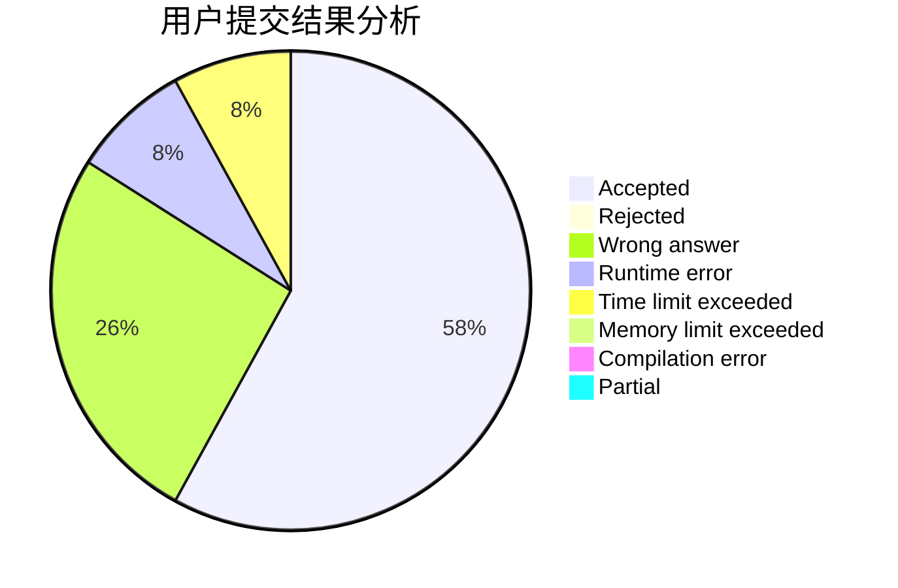
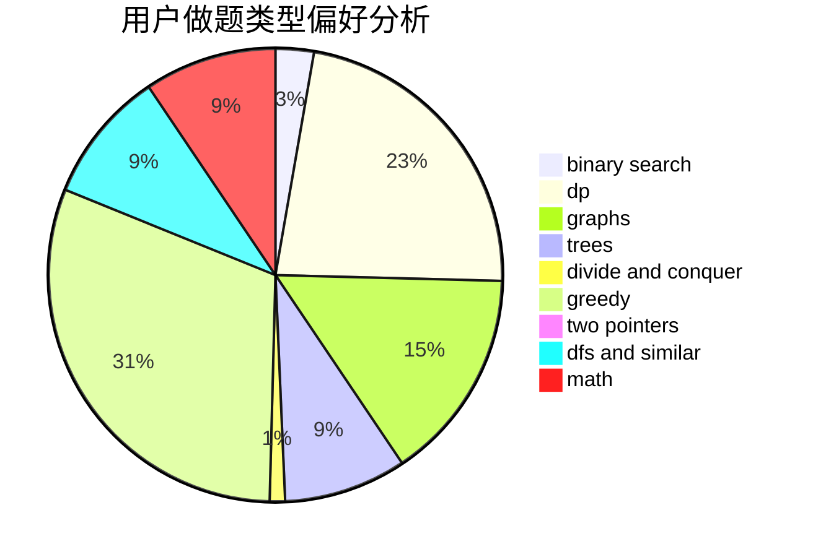

# AoLiGei

<!-- tabs:start -->

#### **用户提交结果分析**

#### **用户做题类型偏好分析**

<!-- tabs:end -->
# 推荐题目
[1015D](https://codeforces.com/contest/1015/problem/D)
[371C](https://codeforces.com/contest/371/problem/C)
[370A](https://codeforces.com/contest/370/problem/A)
[36C](https://codeforces.com/contest/36/problem/C)
[376A](https://codeforces.com/contest/376/problem/A)
[371D](https://codeforces.com/contest/371/problem/D)
[1131A](https://codeforces.com/contest/1131/problem/A)
[376B](https://codeforces.com/contest/376/problem/B)
[1062D](https://codeforces.com/contest/1062/problem/D)
[1455G](https://codeforces.com/contest/1455/problem/G)
