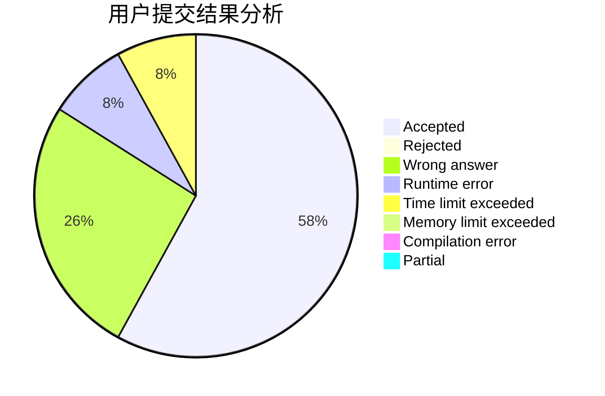
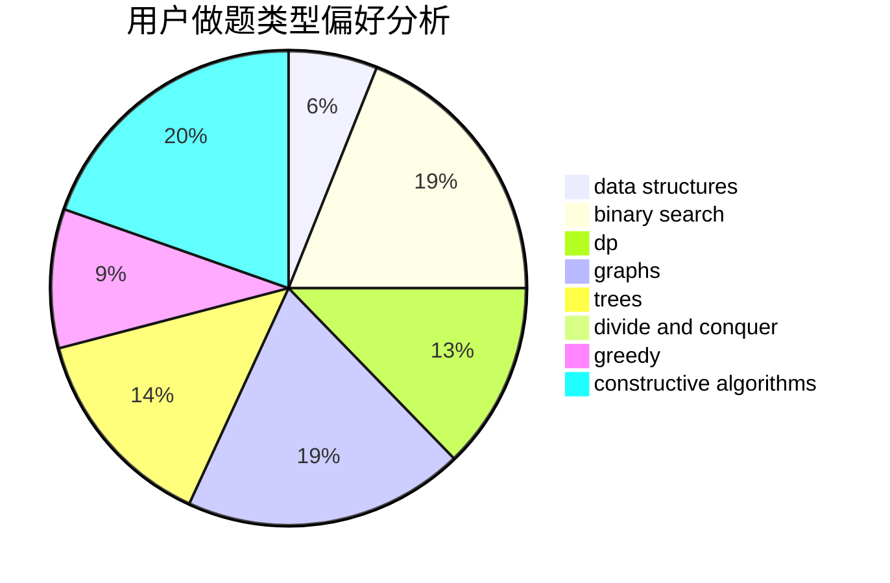
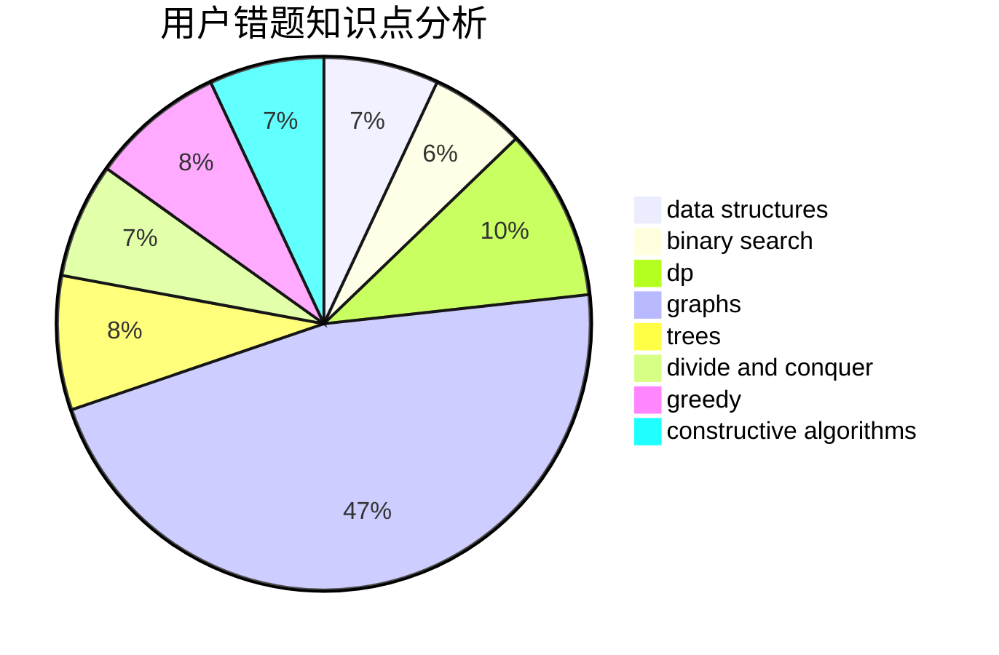

# AoLiGei

<!-- tabs:start -->

#### **用户提交结果分析**

#### **用户做题类型偏好分析**

#### **用户错题知识点分析**

<!-- tabs:end -->
# 推荐题目
[1015C](https://codeforces.com/contest/1015/problem/C)		sortings		  
[345A](https://codeforces.com/contest/345/problem/A)		*special problem,
                        probabilities		  
[343E](https://codeforces.com/contest/343/problem/E)		brute force,
                        dfs and similar,
                        divide and conquer,
                        flows,
                        graphs,
                        greedy,
                        trees		  
[343B](https://codeforces.com/contest/343/problem/B)		data structures,
                        greedy,
                        implementation		  
[349B](https://codeforces.com/contest/349/problem/B)		data structures,
                        dp,
                        greedy,
                        implementation		  
[346A](https://codeforces.com/contest/346/problem/A)		games,
                        math,
                        number theory		  
[1129A2](https://codeforces.com/contest/1129A/problem/2)		brute force,
                        greedy		  
[34A](https://codeforces.com/contest/34/problem/A)		implementation		  
[1062A](https://codeforces.com/contest/1062/problem/A)		greedy,
                        implementation		  
[1446D2](https://codeforces.com/contest/1446D/problem/2)		data structures,
                        greedy,
                        two pointers		  
