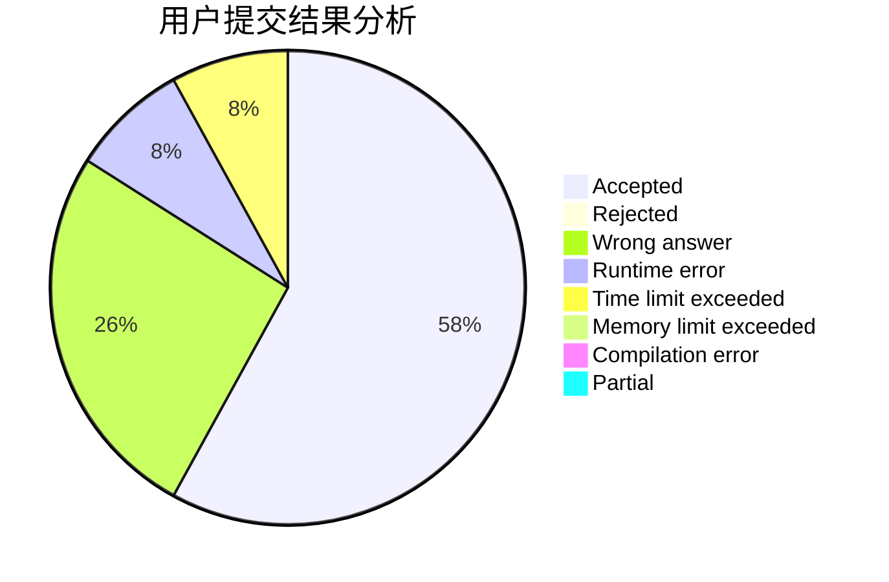
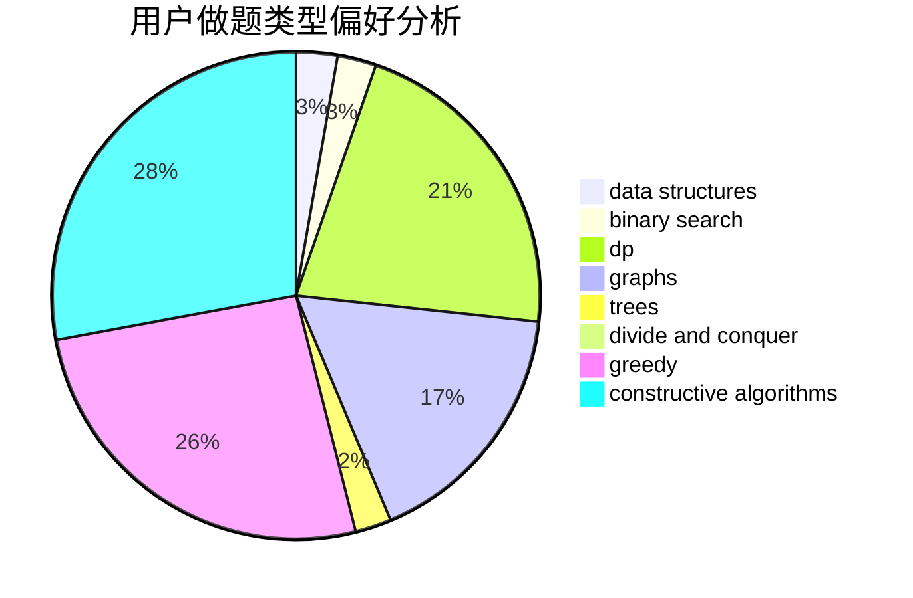
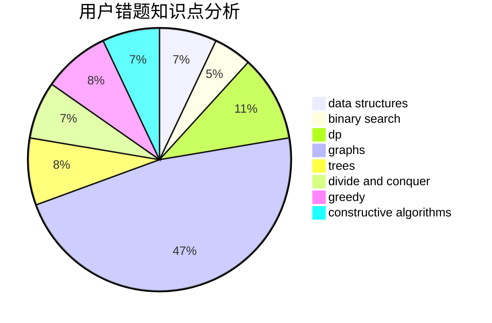

# AoLiGei

<!-- tabs:start -->

#### **用户提交结果分析**

#### **用户做题类型偏好分析**

#### **用户错题知识点分析**

<!-- tabs:end -->
# 推荐题目
[1015D](https://codeforces.com/contest/1015/problem/D)		constructive algorithms,
                        greedy		  
[371C](https://codeforces.com/contest/371/problem/C)		binary search,
                        brute force		  
[370A](https://codeforces.com/contest/370/problem/A)		graphs,
                        math,
                        shortest paths		  
[36C](https://codeforces.com/contest/36/problem/C)		geometry,
                        implementation		  
[376A](https://codeforces.com/contest/376/problem/A)		implementation,
                        math		  
[371D](https://codeforces.com/contest/371/problem/D)		data structures,
                        dsu,
                        implementation,
                        trees		  
[1131A](https://codeforces.com/contest/1131/problem/A)		math		  
[376B](https://codeforces.com/contest/376/problem/B)		implementation		  
[1062D](https://codeforces.com/contest/1062/problem/D)		dfs and similar,
                        graphs,
                        implementation,
                        math		  
[1455G](https://codeforces.com/contest/1455/problem/G)		data structures,
                        dp		  
