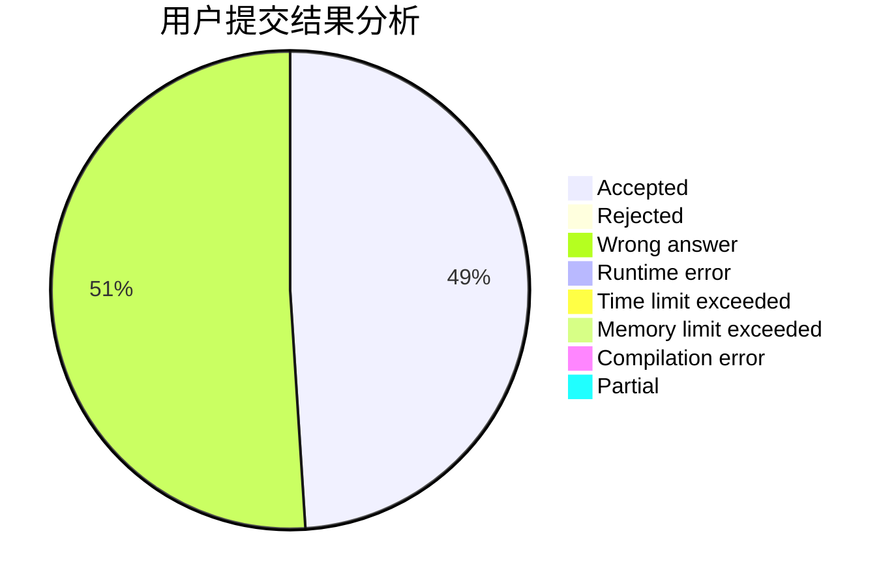
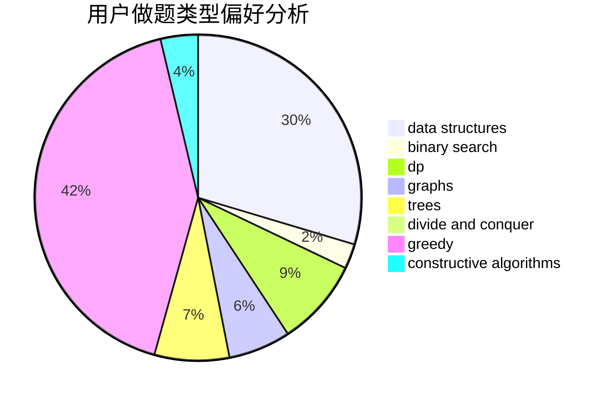

# cdbbla

<!-- tabs:start -->

#### **用户提交结果分析**

#### **用户做题类型偏好分析**

#### **用户错题知识点分析**

<!-- tabs:end -->
# 推荐题目
[1484C](https://codeforces.com/contest/1484/problem/C)		dsu,graphs,sortings,trees		  
[409G](https://codeforces.com/contest/409/problem/G)		*special problem,
                        geometry		  
[1042E](https://codeforces.com/contest/1042/problem/E)		dp,
                        math,
                        probabilities		  
[11951](https://codeforces.com/contest/1195/problem/1)		dsu,graphs,sortings,trees		  
[158C](https://codeforces.com/contest/158/problem/C)		*special problem,
                        data structures,
                        implementation		  
[1084D](https://codeforces.com/contest/1084/problem/D)		dsu,graphs,sortings,trees		  
[809A](https://codeforces.com/contest/809/problem/A)		implementation,
                        math,
                        sortings		  
[145A](https://codeforces.com/contest/145/problem/A)		greedy,
                        implementation		  
[1372C](https://codeforces.com/contest/1372/problem/C)		constructive algorithms,
                        math		  
[739B](https://codeforces.com/contest/739/problem/B)		binary search,
                        data structures,
                        dfs and similar,
                        graphs,
                        trees		  
