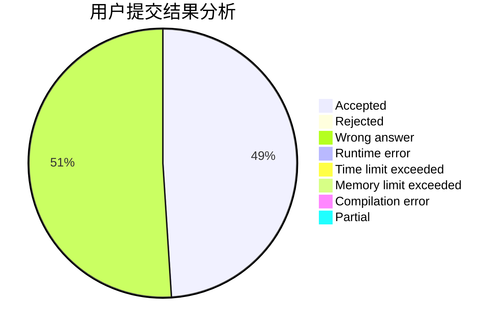
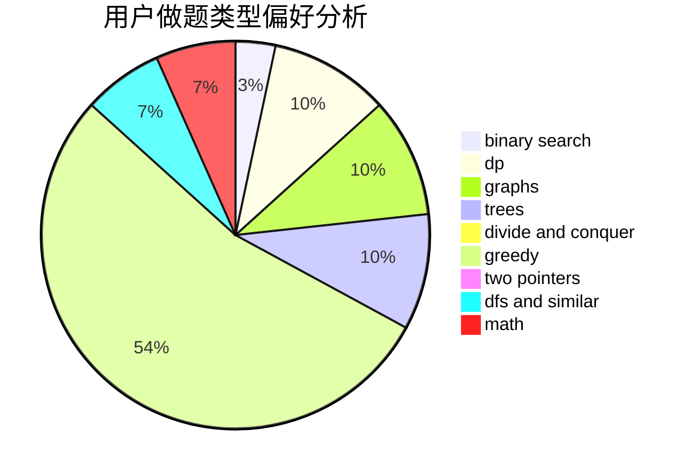

# cdbbla

<!-- tabs:start -->

#### **用户提交结果分析**

#### **用户做题类型偏好分析**

<!-- tabs:end -->
# 推荐题目
[1484C](https://codeforces.com/contest/1484/problem/C)
[409G](https://codeforces.com/contest/409/problem/G)
[1042E](https://codeforces.com/contest/1042/problem/E)
[11951](https://codeforces.com/contest/1195/problem/1)
[158C](https://codeforces.com/contest/158/problem/C)
[1084D](https://codeforces.com/contest/1084/problem/D)
[809A](https://codeforces.com/contest/809/problem/A)
[145A](https://codeforces.com/contest/145/problem/A)
[1372C](https://codeforces.com/contest/1372/problem/C)
[739B](https://codeforces.com/contest/739/problem/B)
