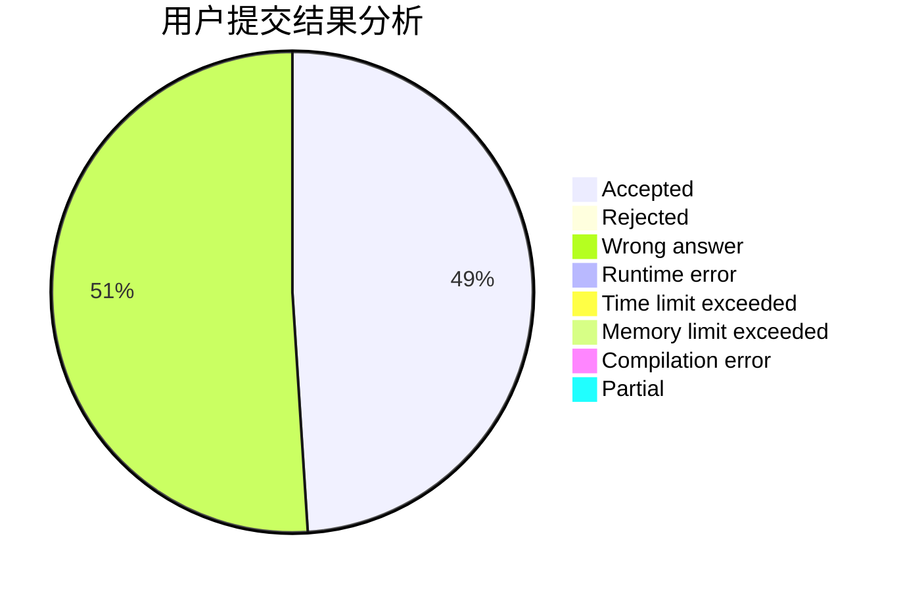
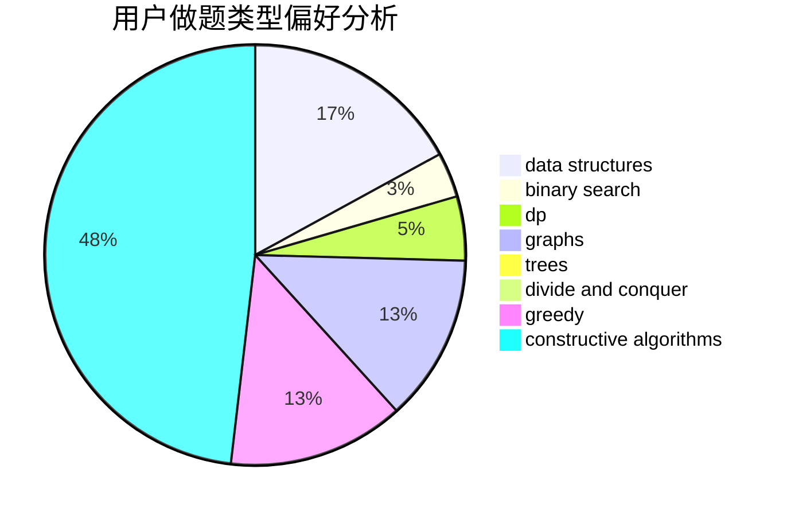
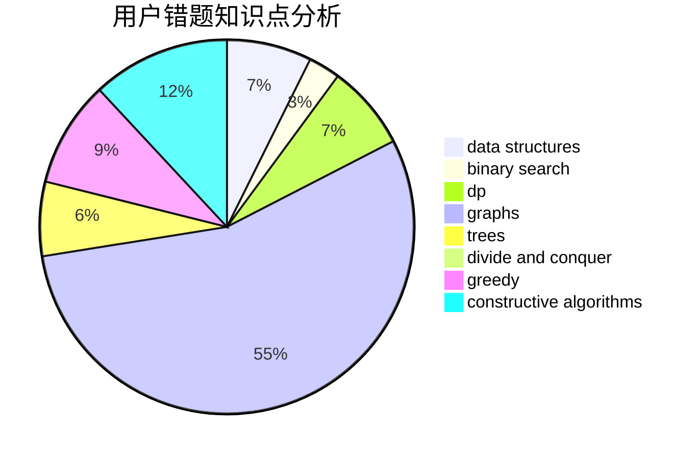

# cdbbla

<!-- tabs:start -->

#### **用户提交结果分析**

#### **用户做题类型偏好分析**

#### **用户错题知识点分析**

<!-- tabs:end -->
# 推荐题目
[1475F](https://codeforces.com/contest/1475/problem/F)		2-sat,
                        brute force,
                        constructive algorithms		  
[37B](https://codeforces.com/contest/37/problem/B)		greedy,
                        implementation		  
[1042B](https://codeforces.com/contest/1042/problem/B)		bitmasks,
                        brute force,
                        dp,
                        implementation		  
[1189D2](https://codeforces.com/contest/1189D/problem/2)		dsu,graphs,sortings,trees		  
[1506F](https://codeforces.com/contest/1506/problem/F)		constructive algorithms,
                        graphs,
                        math,
                        shortest paths,
                        sortings		  
[1083F](https://codeforces.com/contest/1083/problem/F)		data structures		  
[793G](https://codeforces.com/contest/793/problem/G)		data structures,
                        divide and conquer,
                        flows,
                        graph matchings		  
[1451A](https://codeforces.com/contest/1451/problem/A)		greedy,
                        math		  
[1365E](https://codeforces.com/contest/1365/problem/E)		brute force,
                        constructive algorithms		  
[721D](https://codeforces.com/contest/721/problem/D)		constructive algorithms,
                        data structures,
                        greedy,
                        math		  
