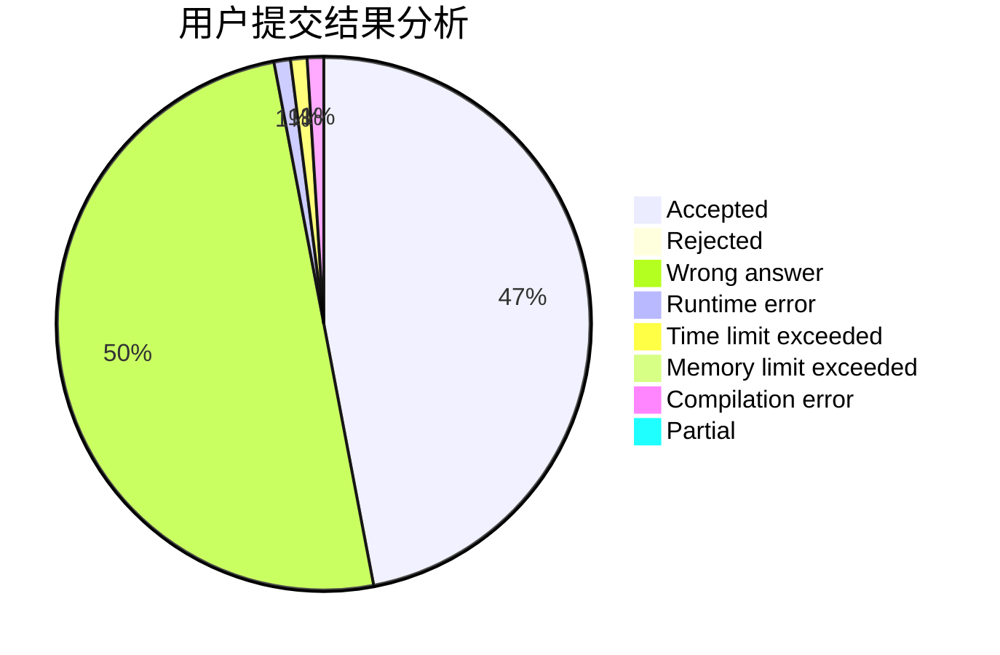
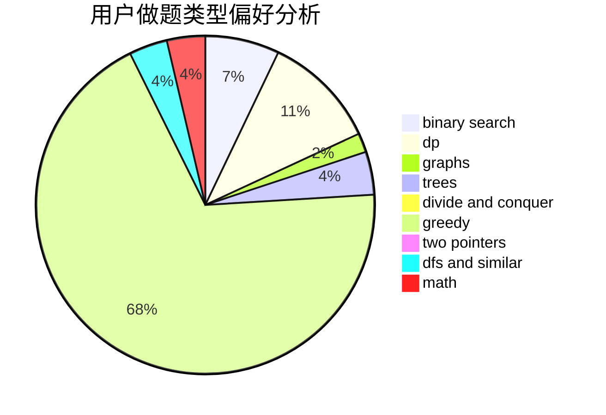

# ce_amtic

<!-- tabs:start -->

#### **用户提交结果分析**

#### **用户做题类型偏好分析**

<!-- tabs:end -->
# 推荐题目
[1312B](https://codeforces.com/contest/1312/problem/B)
[376A](https://codeforces.com/contest/376/problem/A)
[976F](https://codeforces.com/contest/976/problem/F)
[39J](https://codeforces.com/contest/39/problem/J)
[592B](https://codeforces.com/contest/592/problem/B)
[1194E](https://codeforces.com/contest/1194/problem/E)
[101D](https://codeforces.com/contest/101/problem/D)
[514D](https://codeforces.com/contest/514/problem/D)
[306C](https://codeforces.com/contest/306/problem/C)
[755D](https://codeforces.com/contest/755/problem/D)
