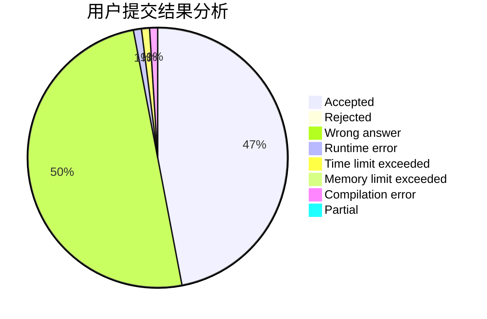
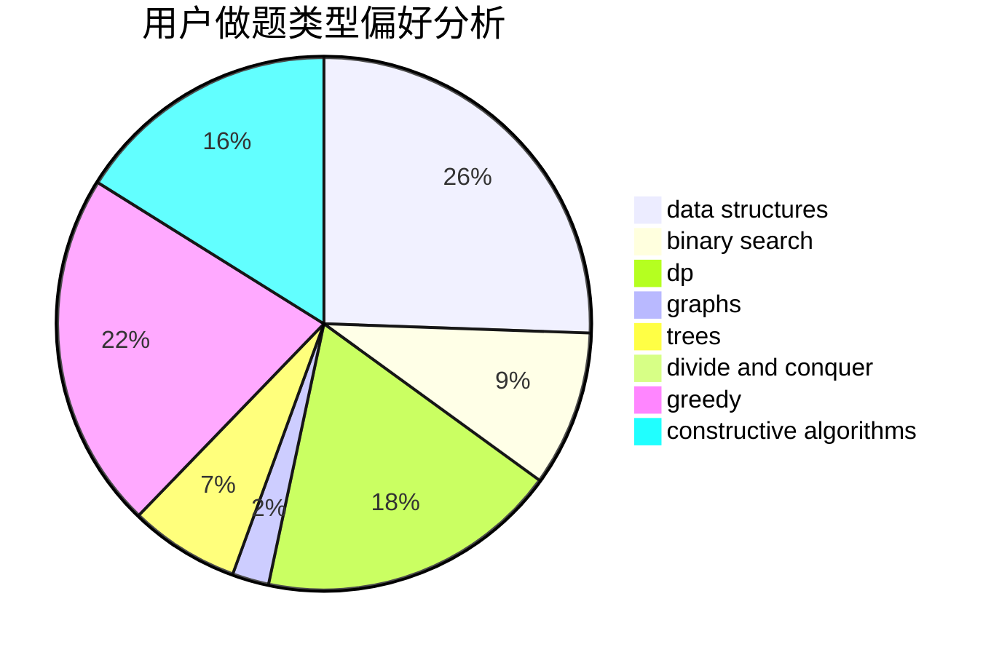
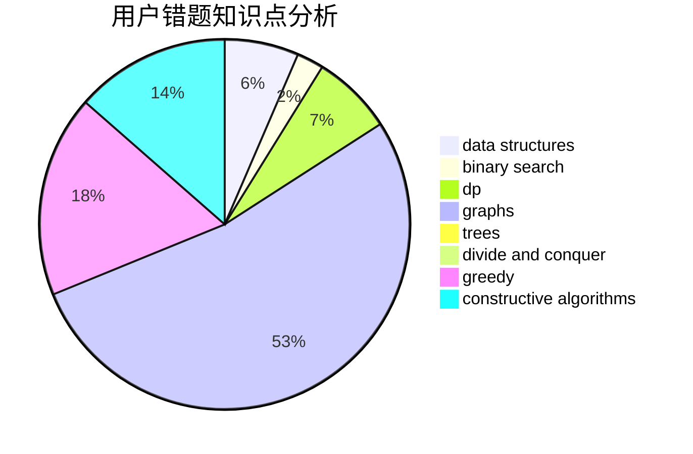

# ce_amtic

<!-- tabs:start -->

#### **用户提交结果分析**

#### **用户做题类型偏好分析**

#### **用户错题知识点分析**

<!-- tabs:end -->
# 推荐题目
[1312B](https://codeforces.com/contest/1312/problem/B)		constructive algorithms,
                        sortings		  
[376A](https://codeforces.com/contest/376/problem/A)		implementation,
                        math		  
[976F](https://codeforces.com/contest/976/problem/F)		flows,
                        graphs		  
[39J](https://codeforces.com/contest/39/problem/J)		hashing,
                        implementation,
                        strings		  
[592B](https://codeforces.com/contest/592/problem/B)		math		  
[1194E](https://codeforces.com/contest/1194/problem/E)		bitmasks,
                        brute force,
                        data structures,
                        geometry,
                        sortings		  
[101D](https://codeforces.com/contest/101/problem/D)		dp,
                        greedy,
                        probabilities,
                        sortings,
                        trees		  
[514D](https://codeforces.com/contest/514/problem/D)		binary search,
                        data structures,
                        two pointers		  
[306C](https://codeforces.com/contest/306/problem/C)		combinatorics,
                        number theory		  
[755D](https://codeforces.com/contest/755/problem/D)		data structures		  
