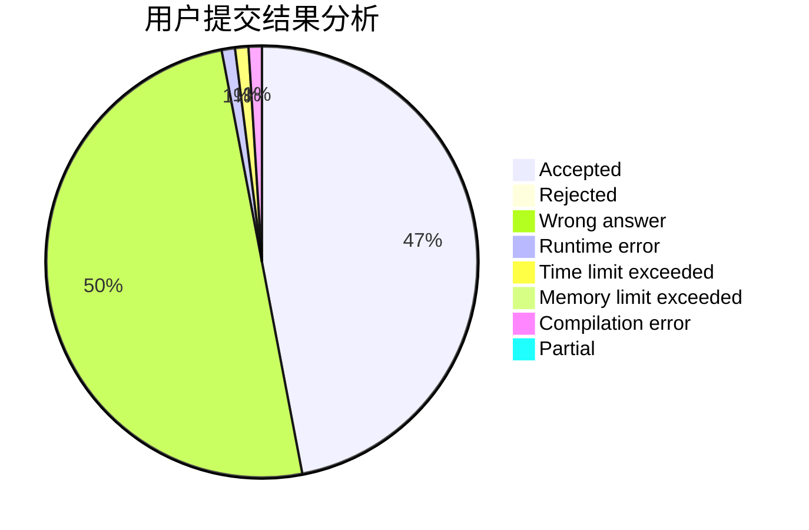
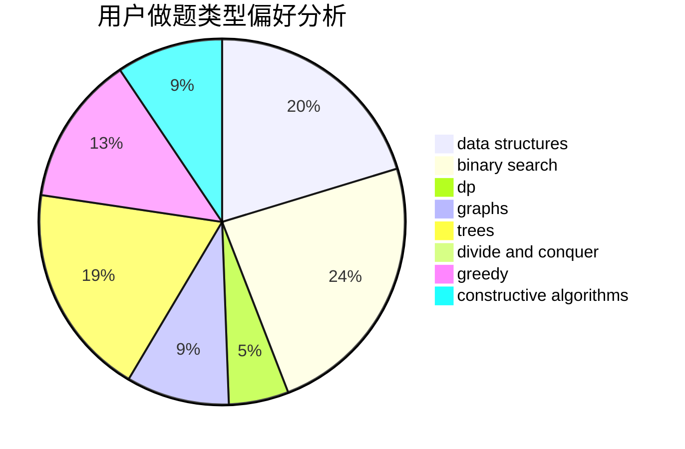
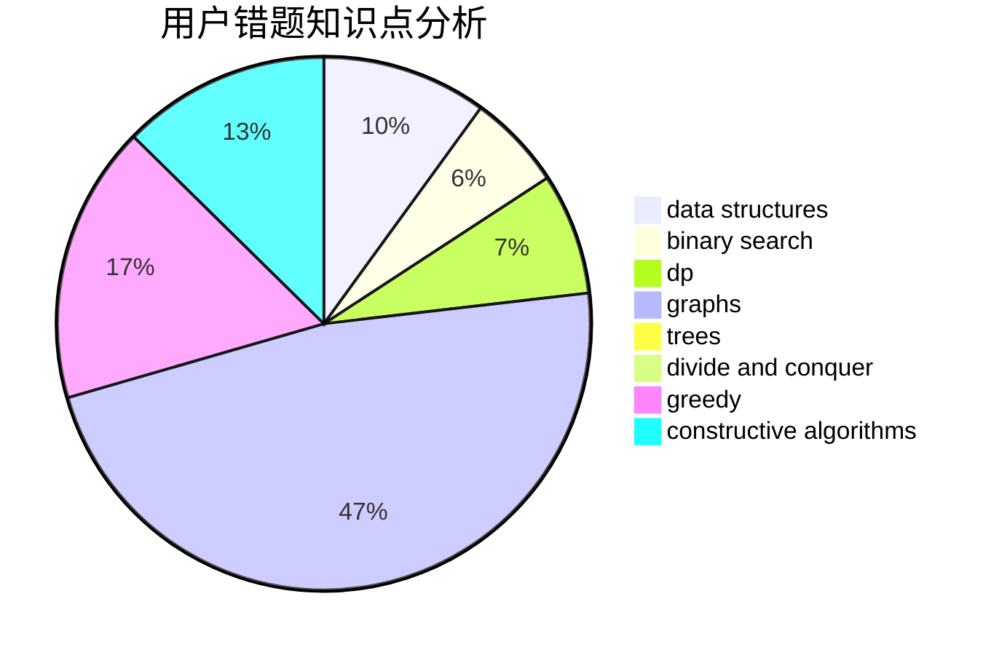

# ce_amtic

<!-- tabs:start -->

#### **用户提交结果分析**

#### **用户做题类型偏好分析**

#### **用户错题知识点分析**

<!-- tabs:end -->
# 推荐题目
[1303D](https://codeforces.com/contest/1303/problem/D)		bitmasks,
                        greedy		  
[349B](https://codeforces.com/contest/349/problem/B)		data structures,
                        dp,
                        greedy,
                        implementation		  
[954I](https://codeforces.com/contest/954/problem/I)		fft,
                        math		  
[36C](https://codeforces.com/contest/36/problem/C)		geometry,
                        implementation		  
[571E](https://codeforces.com/contest/571/problem/E)		math		  
[1189C](https://codeforces.com/contest/1189/problem/C)		data structures,
                        dp,
                        implementation,
                        math		  
[1019D](https://codeforces.com/contest/1019/problem/D)		binary search,
                        geometry,
                        sortings		  
[494C](https://codeforces.com/contest/494/problem/C)		dp,
                        probabilities		  
[291E](https://codeforces.com/contest/291/problem/E)		*special problem,
                        dfs and similar,
                        hashing,
                        strings		  
[734E](https://codeforces.com/contest/734/problem/E)		dfs and similar,
                        dp,
                        trees		  
