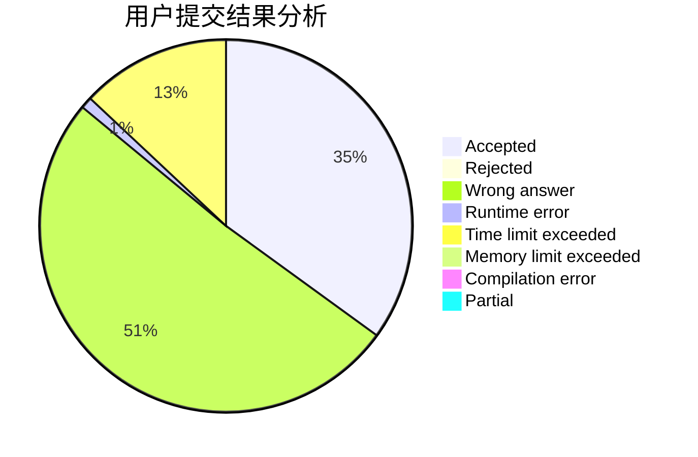
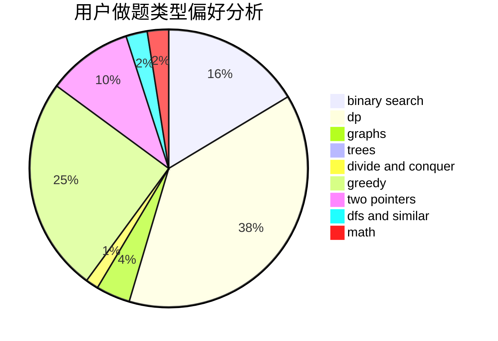

# ch_hui

<!-- tabs:start -->

#### **用户提交结果分析**

#### **用户做题类型偏好分析**

<!-- tabs:end -->
# 推荐题目
[557B](https://codeforces.com/contest/557/problem/B)
[115B](https://codeforces.com/contest/115/problem/B)
[1110E](https://codeforces.com/contest/1110/problem/E)
[1245C](https://codeforces.com/contest/1245/problem/C)
[1102B](https://codeforces.com/contest/1102/problem/B)
[140A](https://codeforces.com/contest/140/problem/A)
[691D](https://codeforces.com/contest/691/problem/D)
[955A](https://codeforces.com/contest/955/problem/A)
[659F](https://codeforces.com/contest/659/problem/F)
[351E](https://codeforces.com/contest/351/problem/E)
