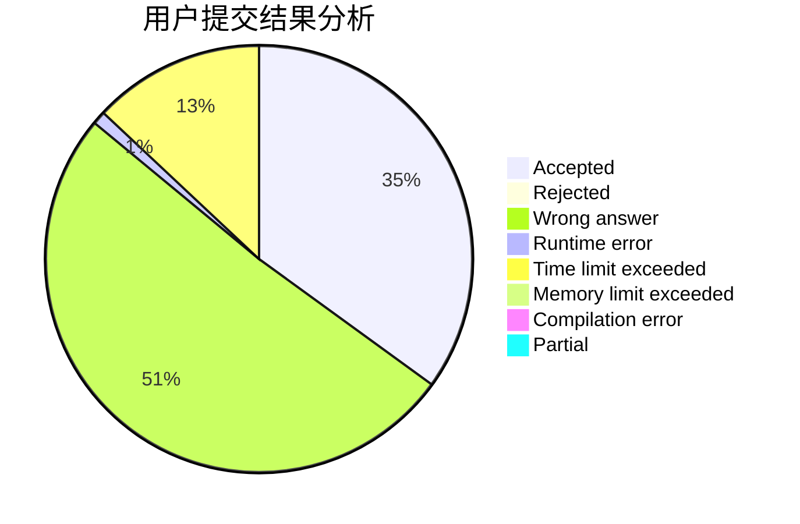
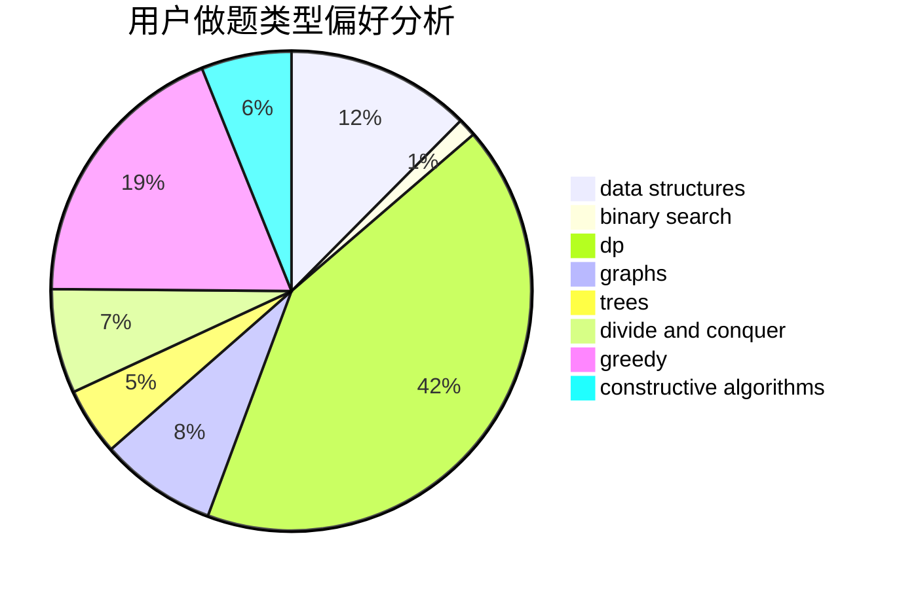

# ch_hui

<!-- tabs:start -->

#### **用户提交结果分析**

#### **用户做题类型偏好分析**

#### **用户错题知识点分析**

<!-- tabs:end -->
# 推荐题目
[534F](https://codeforces.com/contest/534/problem/F)		bitmasks,
                        dp,
                        hashing,
                        meet-in-the-middle		  
[1157F](https://codeforces.com/contest/1157/problem/F)		constructive algorithms,
                        dp,
                        greedy,
                        two pointers		  
[1110B](https://codeforces.com/contest/1110/problem/B)		greedy,
                        sortings		  
[123E](https://codeforces.com/contest/123/problem/E)		dfs and similar,
                        dp,
                        probabilities,
                        trees		  
[1101F](https://codeforces.com/contest/1101/problem/F)		binary search,
                        dp		  
[1400B](https://codeforces.com/contest/1400/problem/B)		brute force,
                        greedy,
                        math		  
[669D](https://codeforces.com/contest/669/problem/D)		dsu,graphs,sortings,trees		  
[933A](https://codeforces.com/contest/933/problem/A)		dp		  
[62A](https://codeforces.com/contest/62/problem/A)		greedy,
                        math		  
[321A](https://codeforces.com/contest/321/problem/A)		binary search,
                        implementation,
                        math		  
