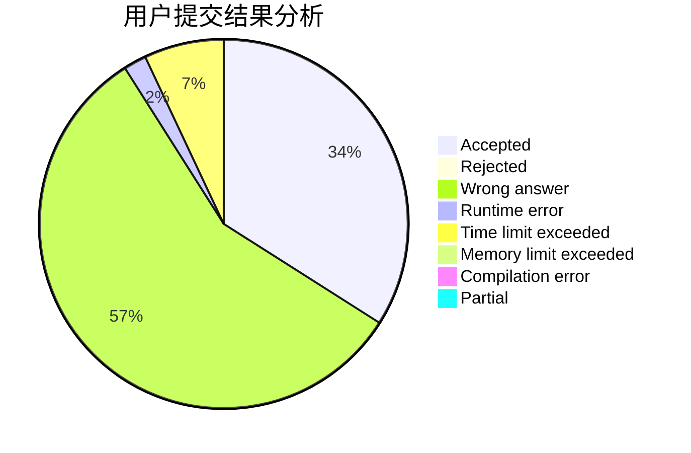
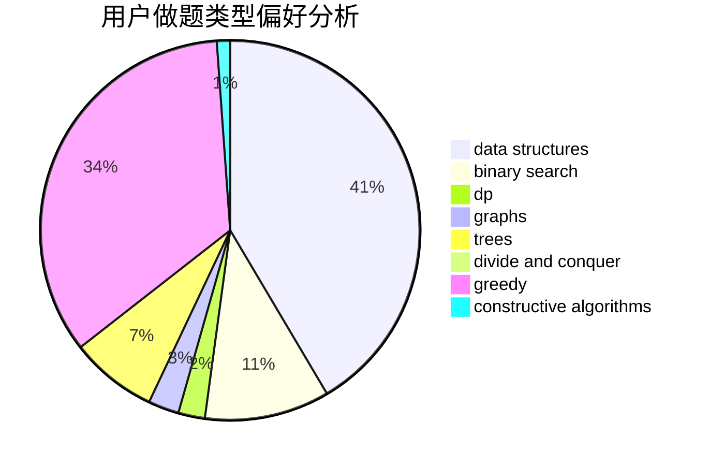
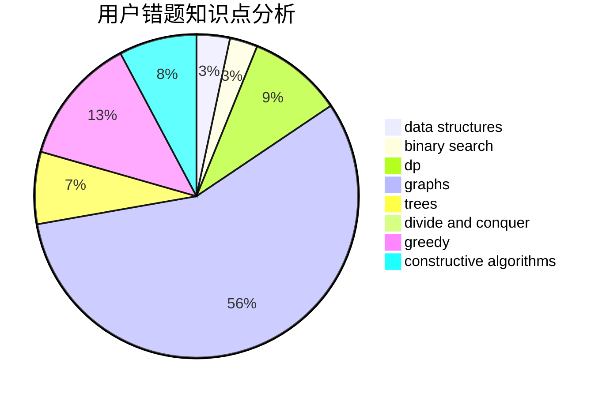

# chabuduodele
<!-- tabs:start -->
#### **用户提交结果分析**

#### **用户做题类型偏好分析**

#### **用户错题知识点分析**

<!-- tabs:end -->
# 推荐题目
[Save Energy!](http://codeforces.com/problemset/problem/936/A)		binary search,
                        implementation,
                        math		  
[The Check of the Point](http://codeforces.com/problemset/problem/683/A)		*special problem,
                        geometry		  
[Tree Diameter](http://codeforces.com/problemset/problem/1146/C)		bitmasks,
                        graphs,
                        interactive		  
[Guess two numbers](https://codeforces.com/contest/1008/problem/E)		binary search,
                        interactive		  
[Alex and Julian](http://codeforces.com/problemset/problem/1220/D)		bitmasks,
                        math,
                        number theory		  
[Toy Train (Simplified)](http://codeforces.com/problemset/problem/1129/A1)		brute force,
                        greedy		  
[Okabe and Future Gadget Laboratory](http://codeforces.com/problemset/problem/821/A)		implementation		  
[Ciel and Flipboard](http://codeforces.com/problemset/problem/321/D)		dp,
                        greedy,
                        math		  
[Meta-universe](http://codeforces.com/problemset/problem/475/F)		data structures		  
[Fafa and Array](http://codeforces.com/problemset/problem/935/F)		data structures,
                        greedy		  
<!-- tabs:start -->
#### **data structures**
[Save Energy!](http://codeforces.com/problemset/problem/475/F)		data structures		  
[The Check of the Point](http://codeforces.com/problemset/problem/935/F)		data structures,
                        greedy		  
[Tree Diameter](http://codeforces.com/problemset/problem/633/H)		data structures,
                        implementation		  
[Guess two numbers](http://codeforces.com/problemset/problem/1283/C)		constructive algorithms,
                        data structures,
                        math		  
[Alex and Julian](http://codeforces.com/problemset/problem/319/E)		data structures		  
[Toy Train (Simplified)](http://codeforces.com/problemset/problem/13/E)		data structures,
                        dsu		  
[Okabe and Future Gadget Laboratory](http://codeforces.com/problemset/problem/1492/C)		binary search,
                        data structures,
                        dp,
                        greedy,
                        two pointers		  
[Ciel and Flipboard](http://codeforces.com/problemset/problem/1490/G)		binary search,
                        data structures,
                        math		  
[Meta-universe](http://codeforces.com/problemset/problem/1479/D)		binary search,
                        bitmasks,
                        brute force,
                        data structures,
                        probabilities,
                        trees		  
[Fafa and Array](http://codeforces.com/problemset/problem/1497/A)		brute force,
                        data structures,
                        greedy,
                        sortings		  
#### **binary search**
[Save Energy!](http://codeforces.com/problemset/problem/936/A)		binary search,
                        implementation,
                        math		  
[The Check of the Point](https://codeforces.com/contest/1008/problem/E)		binary search,
                        interactive		  
[Tree Diameter](http://codeforces.com/problemset/problem/853/D)		binary search,
                        dp,
                        greedy		  
[Guess two numbers](https://codeforces.com/contest/1424/problem/J)		binary search,
                        math,
                        number theory,
                        two pointers		  
[Alex and Julian](http://codeforces.com/problemset/problem/1492/C)		binary search,
                        data structures,
                        dp,
                        greedy,
                        two pointers		  
[Toy Train (Simplified)](http://codeforces.com/problemset/problem/1463/D)		binary search,
                        constructive algorithms,
                        greedy,
                        two pointers		  
[Okabe and Future Gadget Laboratory](http://codeforces.com/problemset/problem/1490/G)		binary search,
                        data structures,
                        math		  
[Ciel and Flipboard](http://codeforces.com/problemset/problem/1479/D)		binary search,
                        bitmasks,
                        brute force,
                        data structures,
                        probabilities,
                        trees		  
[Meta-universe](http://codeforces.com/problemset/problem/1436/E)		binary search,
                        data structures,
                        two pointers		  
[Fafa and Array](http://codeforces.com/problemset/problem/1461/D)		binary search,
                        brute force,
                        data structures,
                        divide and conquer,
                        implementation,
                        sortings		  
#### **dp**
[Save Energy!](http://codeforces.com/problemset/problem/321/D)		dp,
                        greedy,
                        math		  
[The Check of the Point](http://codeforces.com/problemset/problem/543/D)		dp,
                        trees		  
[Tree Diameter](http://codeforces.com/problemset/problem/486/D)		dfs and similar,
                        dp,
                        math,
                        trees		  
[Guess two numbers](https://codeforces.com/contest/1229/problem/F)		dp		  
[Alex and Julian](http://codeforces.com/problemset/problem/853/D)		binary search,
                        dp,
                        greedy		  
[Toy Train (Simplified)](http://codeforces.com/problemset/problem/140/E)		combinatorics,
                        dp		  
[Okabe and Future Gadget Laboratory](http://codeforces.com/problemset/problem/1295/C)		dp,
                        greedy,
                        strings		  
[Ciel and Flipboard](https://codeforces.com/contest/438/problem/C)		dp,
                        geometry		  
[Meta-universe](http://codeforces.com/problemset/problem/145/C)		combinatorics,
                        dp,
                        math		  
[Fafa and Array](http://codeforces.com/problemset/problem/382/E)		combinatorics,
                        dp		  
#### **graph**
[Save Energy!](http://codeforces.com/problemset/problem/1146/C)		bitmasks,
                        graphs,
                        interactive		  
[The Check of the Point](http://codeforces.com/problemset/problem/1450/E)		constructive algorithms,
                        dfs and similar,
                        graphs,
                        shortest paths		  
[Tree Diameter](http://codeforces.com/problemset/problem/1487/C)		brute force,
                        constructive algorithms,
                        dfs and similar,
                        graphs,
                        greedy,
                        implementation,
                        math		  
[Guess two numbers](http://codeforces.com/problemset/problem/1437/C)		dp,
                        flows,
                        graph matchings,
                        greedy,
                        math,
                        sortings		  
[Alex and Julian](http://codeforces.com/problemset/problem/1470/D)		constructive algorithms,
                        dfs and similar,
                        graph matchings,
                        graphs,
                        greedy		  
[Toy Train (Simplified)](http://codeforces.com/problemset/problem/1476/C)		dp,
                        graphs,
                        greedy		  
[Okabe and Future Gadget Laboratory](http://codeforces.com/problemset/problem/1304/D)		constructive algorithms,
                        graphs,
                        greedy,
                        two pointers		  
[Ciel and Flipboard](http://codeforces.com/problemset/problem/1475/C)		combinatorics,
                        graphs,
                        math		  
[Meta-universe](http://codeforces.com/problemset/problem/553/E)		dp,
                        fft,
                        graphs,
                        math,
                        probabilities		  
[Fafa and Array](http://codeforces.com/problemset/problem/1495/C)		constructive algorithms,
                        graphs		  
#### **trees**
[Save Energy!](http://codeforces.com/problemset/problem/543/D)		dp,
                        trees		  
[The Check of the Point](http://codeforces.com/problemset/problem/486/D)		dfs and similar,
                        dp,
                        math,
                        trees		  
[Tree Diameter](http://codeforces.com/problemset/problem/724/F)		combinatorics,
                        dp,
                        trees		  
[Guess two numbers](http://codeforces.com/problemset/problem/1479/D)		binary search,
                        bitmasks,
                        brute force,
                        data structures,
                        probabilities,
                        trees		  
[Alex and Julian](http://codeforces.com/problemset/problem/1511/C)		brute force,
                        data structures,
                        implementation,
                        trees		  
[Toy Train (Simplified)](http://codeforces.com/problemset/problem/1499/F)		combinatorics,
                        dfs and similar,
                        dp,
                        trees		  
[Okabe and Future Gadget Laboratory](http://codeforces.com/problemset/problem/1491/E)		brute force,
                        dfs and similar,
                        divide and conquer,
                        number theory,
                        trees		  
[Ciel and Flipboard](http://codeforces.com/problemset/problem/1466/D)		data structures,
                        greedy,
                        sortings,
                        trees		  
[Meta-universe](http://codeforces.com/problemset/problem/1495/D)		combinatorics,
                        dfs and similar,
                        graphs,
                        math,
                        shortest paths,
                        trees		  
[Fafa and Array](http://codeforces.com/problemset/problem/1303/G)		data structures,
                        divide and conquer,
                        geometry,
                        trees		  
#### **divide and conquer**
[Save Energy!](http://codeforces.com/problemset/problem/1461/D)		binary search,
                        brute force,
                        data structures,
                        divide and conquer,
                        implementation,
                        sortings		  
[The Check of the Point](http://codeforces.com/problemset/problem/1466/G)		combinatorics,
                        divide and conquer,
                        hashing,
                        math,
                        string suffix structures,
                        strings		  
[Tree Diameter](http://codeforces.com/problemset/problem/1490/D)		dfs and similar,
                        divide and conquer,
                        implementation		  
[Guess two numbers](https://codeforces.com/contest/1483/problem/C)		data structures,
                        divide and conquer,
                        dp		  
[Alex and Julian](http://codeforces.com/problemset/problem/1491/E)		brute force,
                        dfs and similar,
                        divide and conquer,
                        number theory,
                        trees		  
[Toy Train (Simplified)](http://codeforces.com/problemset/problem/1303/G)		data structures,
                        divide and conquer,
                        geometry,
                        trees		  
[Okabe and Future Gadget Laboratory](http://codeforces.com/problemset/problem/1494/D)		constructive algorithms,
                        data structures,
                        dfs and similar,
                        divide and conquer,
                        dsu,
                        greedy,
                        sortings,
                        trees		  
[Ciel and Flipboard](http://codeforces.com/problemset/problem/1482/E)		data structures,
                        divide and conquer,
                        dp		  
[Meta-universe](http://codeforces.com/problemset/problem/566/C)		dfs and similar,
                        divide and conquer,
                        trees		  
[Fafa and Array](http://codeforces.com/problemset/problem/1428/F)		binary search,
                        data structures,
                        divide and conquer,
                        dp,
                        two pointers		  
#### **greedy**
[Save Energy!](http://codeforces.com/problemset/problem/1129/A1)		brute force,
                        greedy		  
[The Check of the Point](http://codeforces.com/problemset/problem/321/D)		dp,
                        greedy,
                        math		  
[Tree Diameter](http://codeforces.com/problemset/problem/935/F)		data structures,
                        greedy		  
[Guess two numbers](http://codeforces.com/problemset/problem/853/D)		binary search,
                        dp,
                        greedy		  
[Alex and Julian](http://codeforces.com/problemset/problem/1295/C)		dp,
                        greedy,
                        strings		  
[Toy Train (Simplified)](https://codeforces.com/contest/1464/problem/C)		bitmasks,
                        greedy,
                        math,
                        strings		  
[Okabe and Future Gadget Laboratory](http://codeforces.com/problemset/problem/266/C)		constructive algorithms,
                        greedy,
                        math		  
[Ciel and Flipboard](http://codeforces.com/problemset/problem/1453/D)		brute force,
                        constructive algorithms,
                        greedy,
                        math,
                        probabilities		  
[Meta-universe](http://codeforces.com/problemset/problem/1401/B)		constructive algorithms,
                        greedy,
                        math		  
[Fafa and Array](http://codeforces.com/problemset/problem/1478/A)		brute force,
                        greedy		  
#### **constructive algorithms**
[Save Energy!](http://codeforces.com/problemset/problem/1168/E)		constructive algorithms,
                        math		  
[The Check of the Point](http://codeforces.com/problemset/problem/1283/C)		constructive algorithms,
                        data structures,
                        math		  
[Tree Diameter](http://codeforces.com/problemset/problem/266/C)		constructive algorithms,
                        greedy,
                        math		  
[Guess two numbers](http://codeforces.com/problemset/problem/1450/E)		constructive algorithms,
                        dfs and similar,
                        graphs,
                        shortest paths		  
[Alex and Julian](http://codeforces.com/problemset/problem/1453/D)		brute force,
                        constructive algorithms,
                        greedy,
                        math,
                        probabilities		  
[Toy Train (Simplified)](http://codeforces.com/problemset/problem/1401/B)		constructive algorithms,
                        greedy,
                        math		  
[Okabe and Future Gadget Laboratory](http://codeforces.com/problemset/problem/1446/A)		constructive algorithms,
                        greedy,
                        sortings		  
[Ciel and Flipboard](http://codeforces.com/problemset/problem/1493/A)		constructive algorithms,
                        greedy		  
[Meta-universe](http://codeforces.com/problemset/problem/1463/D)		binary search,
                        constructive algorithms,
                        greedy,
                        two pointers		  
[Fafa and Array](https://codeforces.com/contest/1456/problem/B)		bitmasks,
                        brute force,
                        constructive algorithms		  
#### **sortings**
[Save Energy!](http://codeforces.com/problemset/problem/1446/A)		constructive algorithms,
                        greedy,
                        sortings		  
[The Check of the Point](https://codeforces.com/contest/1496/problem/C)		geometry,
                        greedy,
                        math,
                        sortings		  
[Tree Diameter](http://codeforces.com/problemset/problem/1495/A)		geometry,
                        greedy,
                        math,
                        sortings		  
[Guess two numbers](http://codeforces.com/problemset/problem/1497/A)		brute force,
                        data structures,
                        greedy,
                        sortings		  
[Alex and Julian](http://codeforces.com/problemset/problem/1427/A)		math,
                        sortings		  
[Toy Train (Simplified)](http://codeforces.com/problemset/problem/1461/D)		binary search,
                        brute force,
                        data structures,
                        divide and conquer,
                        implementation,
                        sortings		  
[Okabe and Future Gadget Laboratory](http://codeforces.com/problemset/problem/1437/C)		dp,
                        flows,
                        graph matchings,
                        greedy,
                        math,
                        sortings		  
[Ciel and Flipboard](http://codeforces.com/problemset/problem/1473/A)		greedy,
                        implementation,
                        math,
                        sortings		  
[Meta-universe](http://codeforces.com/problemset/problem/1486/B)		binary search,
                        geometry,
                        shortest paths,
                        sortings		  
[Fafa and Array](http://codeforces.com/problemset/problem/1480/B)		greedy,
                        implementation,
                        sortings		  
<!-- tabs:end -->
