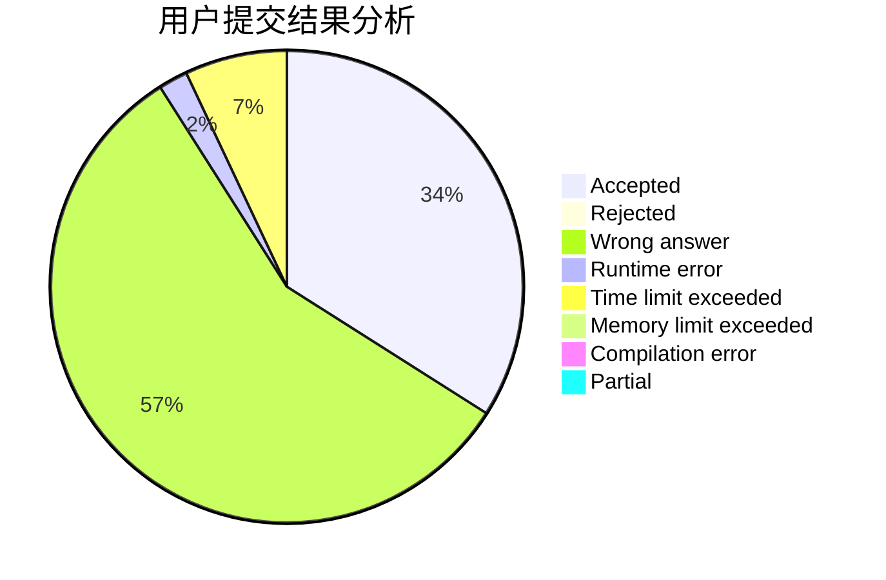
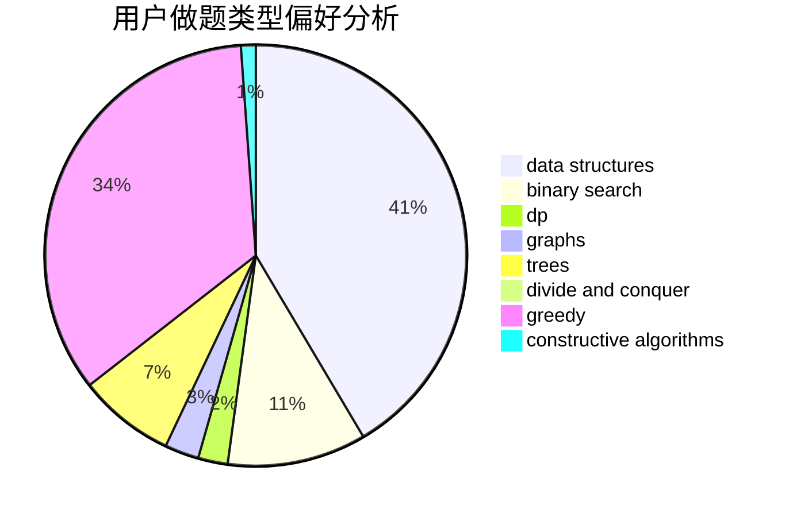
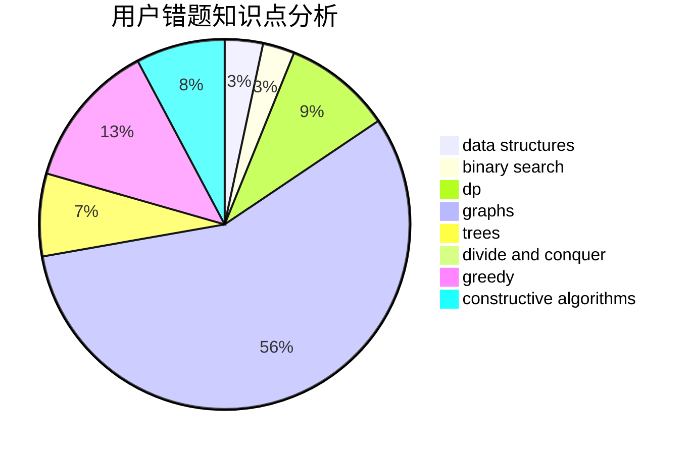

# chabuduodele

<!-- tabs:start -->

#### **用户提交结果分析**

#### **用户做题类型偏好分析**

#### **用户错题知识点分析**

<!-- tabs:end -->
# 推荐题目
[1220D](https://codeforces.com/contest/1220/problem/D)		bitmasks,
                        math,
                        number theory		  
[683A](https://codeforces.com/contest/683/problem/A)		*special problem,
                        geometry		  
[1008E](https://codeforces.com/contest/1008/problem/E)		dsu,graphs,sortings,trees		  
[1168E](https://codeforces.com/contest/1168/problem/E)		constructive algorithms,
                        math		  
[543D](https://codeforces.com/contest/543/problem/D)		dp,
                        trees		  
[936A](https://codeforces.com/contest/936/problem/A)		binary search,
                        implementation,
                        math		  
[935F](https://codeforces.com/contest/935/problem/F)		data structures,
                        greedy		  
[486D](https://codeforces.com/contest/486/problem/D)		dfs and similar,
                        dp,
                        math,
                        trees		  
[1129A1](https://codeforces.com/contest/1129A/problem/1)		brute force,
                        greedy		  
[475F](https://codeforces.com/contest/475/problem/F)		data structures		  
