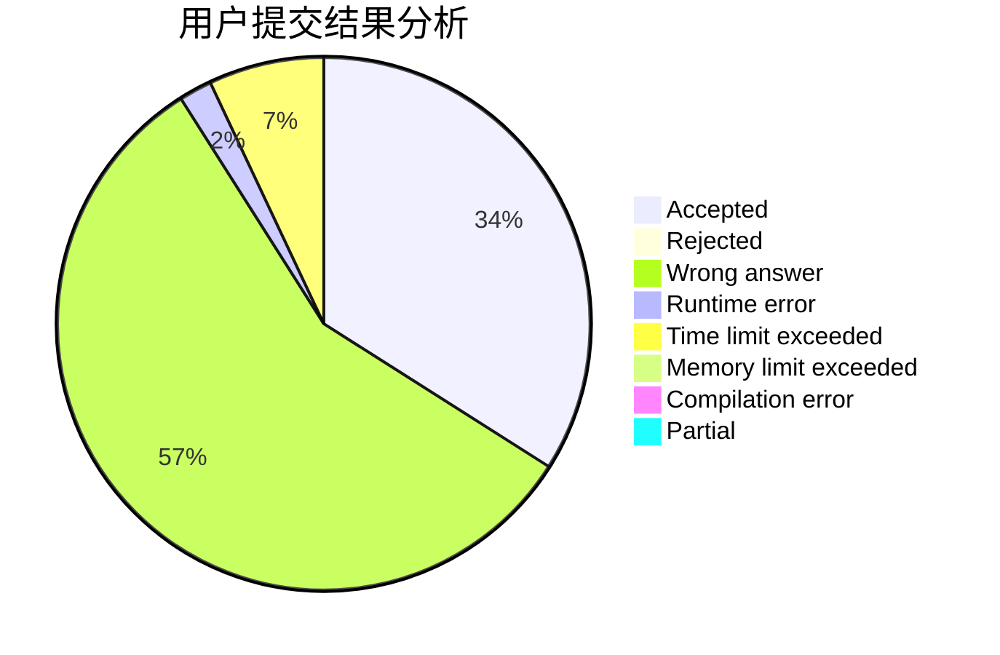
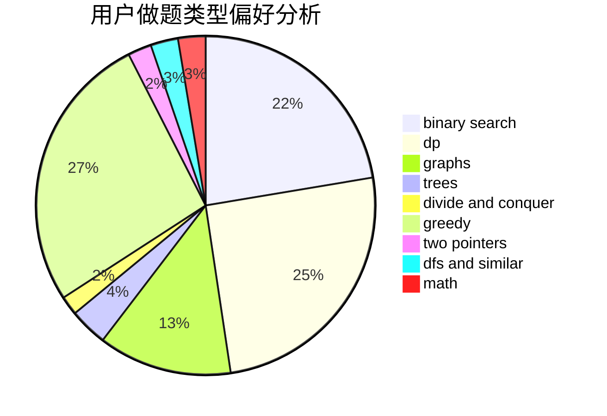

# chabuduodele

<!-- tabs:start -->

#### **用户提交结果分析**

#### **用户做题类型偏好分析**

<!-- tabs:end -->
# 推荐题目
[1228D](https://codeforces.com/contest/1228/problem/D)
[707B](https://codeforces.com/contest/707/problem/B)
[1009C](https://codeforces.com/contest/1009/problem/C)
[1173A](https://codeforces.com/contest/1173/problem/A)
[567F](https://codeforces.com/contest/567/problem/F)
[9581](https://codeforces.com/contest/958/problem/1)
[957E](https://codeforces.com/contest/957/problem/E)
[507D](https://codeforces.com/contest/507/problem/D)
[1130E](https://codeforces.com/contest/1130/problem/E)
[494D](https://codeforces.com/contest/494/problem/D)
