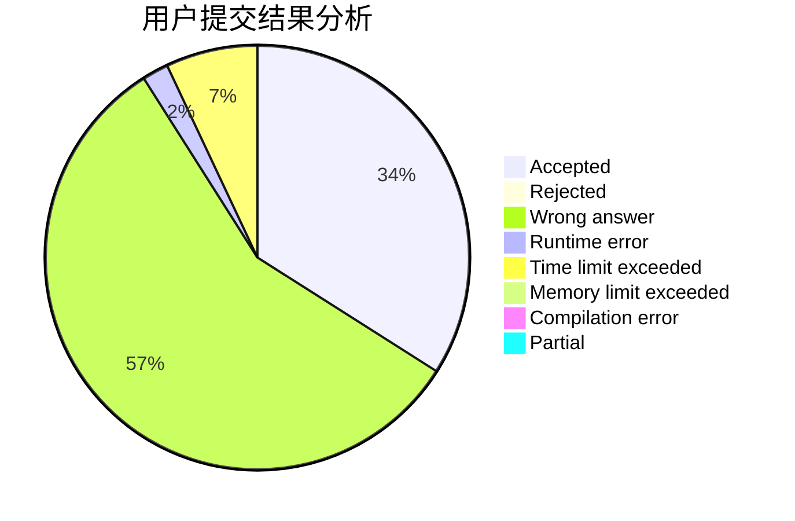
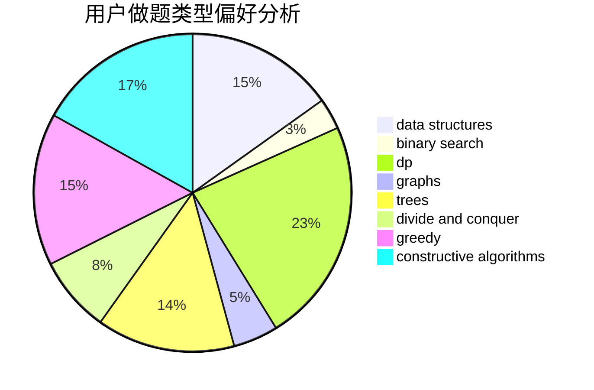
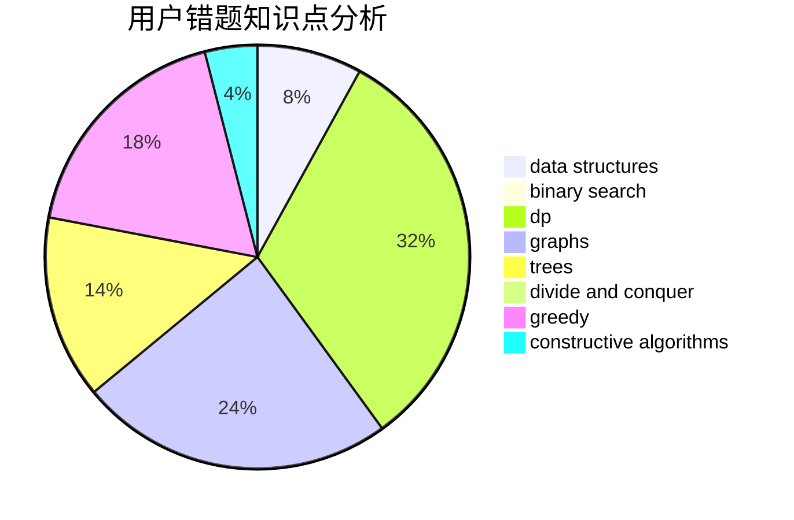

# chabuduodele

<!-- tabs:start -->

#### **用户提交结果分析**

#### **用户做题类型偏好分析**

#### **用户错题知识点分析**

<!-- tabs:end -->
# 推荐题目
[1228D](https://codeforces.com/contest/1228/problem/D)		brute force,
                        constructive algorithms,
                        graphs,
                        hashing,
                        implementation		  
[707B](https://codeforces.com/contest/707/problem/B)		graphs		  
[1009C](https://codeforces.com/contest/1009/problem/C)		greedy,
                        math		  
[1173A](https://codeforces.com/contest/1173/problem/A)		greedy		  
[567F](https://codeforces.com/contest/567/problem/F)		dp		  
[9581](https://codeforces.com/contest/958/problem/1)		dsu,graphs,sortings,trees		  
[957E](https://codeforces.com/contest/957/problem/E)		dsu,graphs,sortings,trees		  
[507D](https://codeforces.com/contest/507/problem/D)		dp,
                        implementation		  
[1130E](https://codeforces.com/contest/1130/problem/E)		dsu,graphs,sortings,trees		  
[494D](https://codeforces.com/contest/494/problem/D)		data structures,
                        dfs and similar,
                        dp,
                        trees		  
