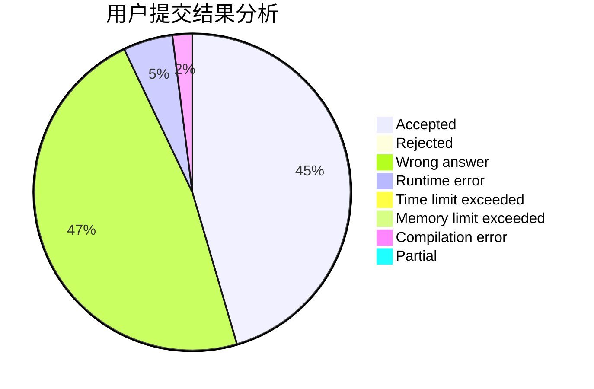
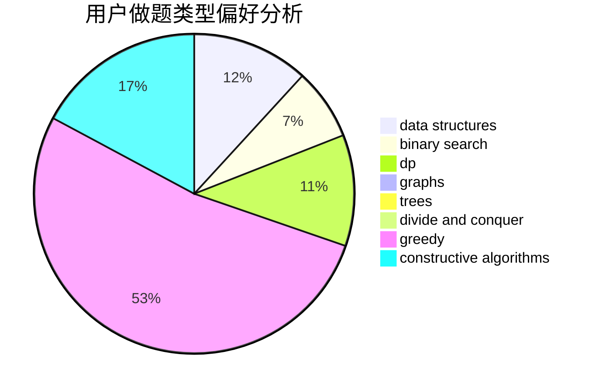
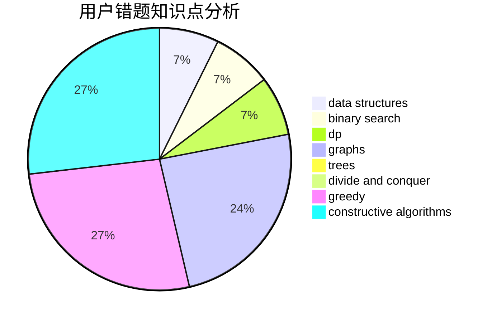

# chaiyihan

<!-- tabs:start -->

#### **用户提交结果分析**

#### **用户做题类型偏好分析**

#### **用户错题知识点分析**

<!-- tabs:end -->
# 推荐题目
[1189C](https://codeforces.com/contest/1189/problem/C)		data structures,
                        dp,
                        implementation,
                        math		  
[455E](https://codeforces.com/contest/455/problem/E)		data structures		  
[833D](https://codeforces.com/contest/833/problem/D)		data structures,
                        divide and conquer,
                        implementation,
                        trees		  
[839B](https://codeforces.com/contest/839/problem/B)		brute force,
                        greedy,
                        implementation		  
[1070H](https://codeforces.com/contest/1070/problem/H)		brute force,
                        implementation		  
[312B](https://codeforces.com/contest/312/problem/B)		math,
                        probabilities		  
[1178D](https://codeforces.com/contest/1178/problem/D)		constructive algorithms,
                        greedy,
                        math,
                        number theory		  
[1153F](https://codeforces.com/contest/1153/problem/F)		combinatorics,
                        dp,
                        math,
                        probabilities		  
[799E](https://codeforces.com/contest/799/problem/E)		data structures,
                        greedy,
                        two pointers		  
[1443B](https://codeforces.com/contest/1443/problem/B)		dp,
                        greedy,
                        math,
                        sortings		  
