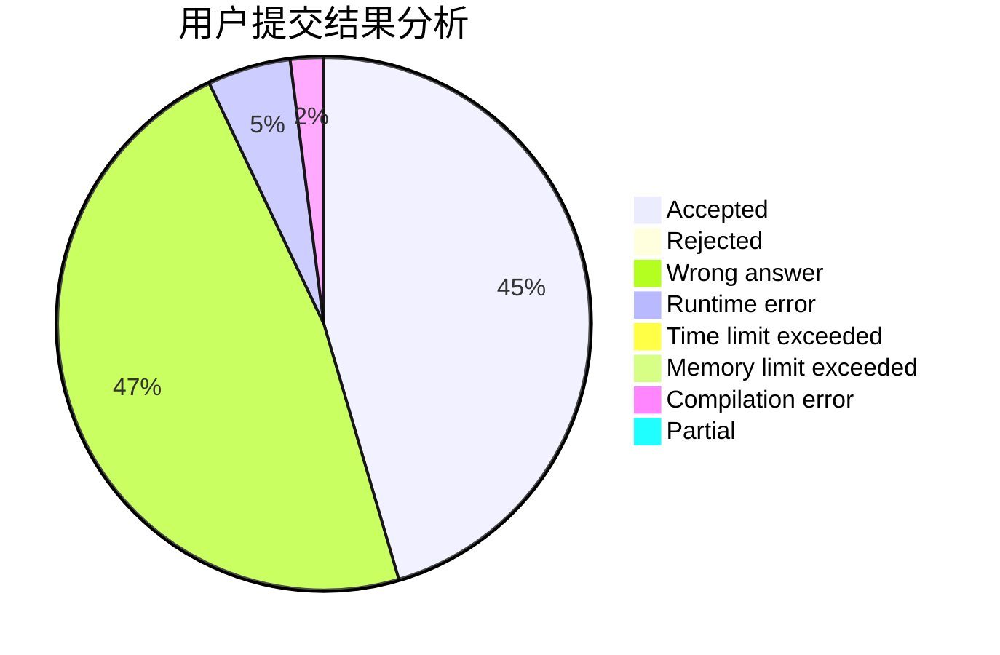
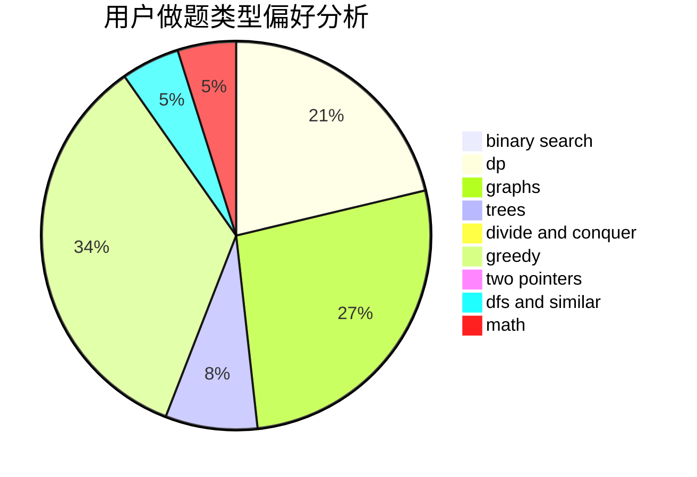

# chaiyihan

<!-- tabs:start -->

#### **用户提交结果分析**

#### **用户做题类型偏好分析**

<!-- tabs:end -->
# 推荐题目
[1194E](https://codeforces.com/contest/1194/problem/E)
[477A](https://codeforces.com/contest/477/problem/A)
[851D](https://codeforces.com/contest/851/problem/D)
[858C](https://codeforces.com/contest/858/problem/C)
[1070K](https://codeforces.com/contest/1070/problem/K)
[337A](https://codeforces.com/contest/337/problem/A)
[1180C](https://codeforces.com/contest/1180/problem/C)
[1155F](https://codeforces.com/contest/1155/problem/F)
[813E](https://codeforces.com/contest/813/problem/E)
[1452G](https://codeforces.com/contest/1452/problem/G)
