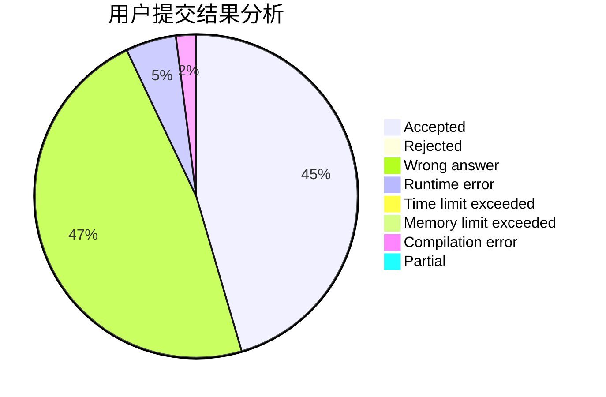
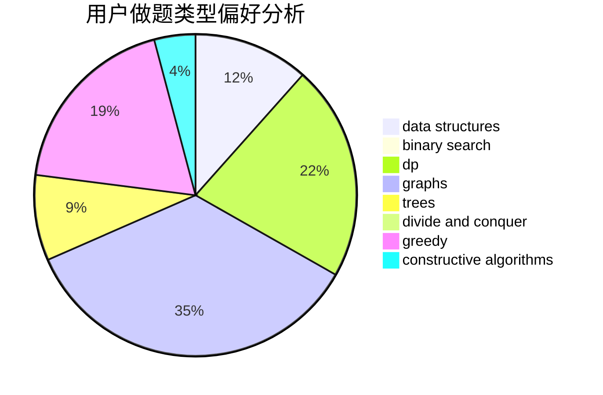
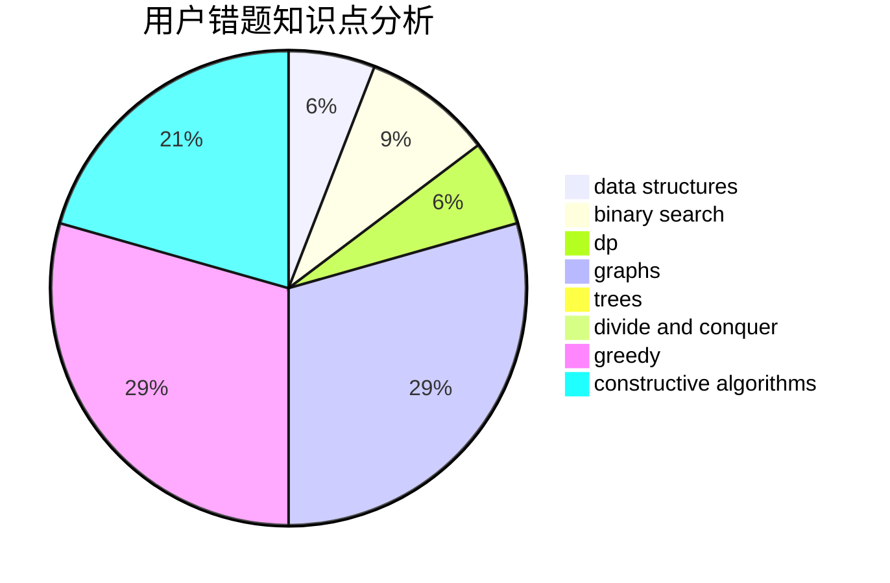

# chaiyihan

<!-- tabs:start -->

#### **用户提交结果分析**

#### **用户做题类型偏好分析**

#### **用户错题知识点分析**

<!-- tabs:end -->
# 推荐题目
[1194E](https://codeforces.com/contest/1194/problem/E)		bitmasks,
                        brute force,
                        data structures,
                        geometry,
                        sortings		  
[477A](https://codeforces.com/contest/477/problem/A)		dsu,graphs,sortings,trees		  
[851D](https://codeforces.com/contest/851/problem/D)		dsu,graphs,sortings,trees		  
[858C](https://codeforces.com/contest/858/problem/C)		dp,
                        greedy,
                        implementation		  
[1070K](https://codeforces.com/contest/1070/problem/K)		implementation		  
[337A](https://codeforces.com/contest/337/problem/A)		greedy		  
[1180C](https://codeforces.com/contest/1180/problem/C)		dsu,graphs,sortings,trees		  
[1155F](https://codeforces.com/contest/1155/problem/F)		brute force,
                        dp,
                        graphs		  
[813E](https://codeforces.com/contest/813/problem/E)		binary search,
                        data structures		  
[1452G](https://codeforces.com/contest/1452/problem/G)		data structures,
                        dfs and similar,
                        greedy,
                        trees		  
