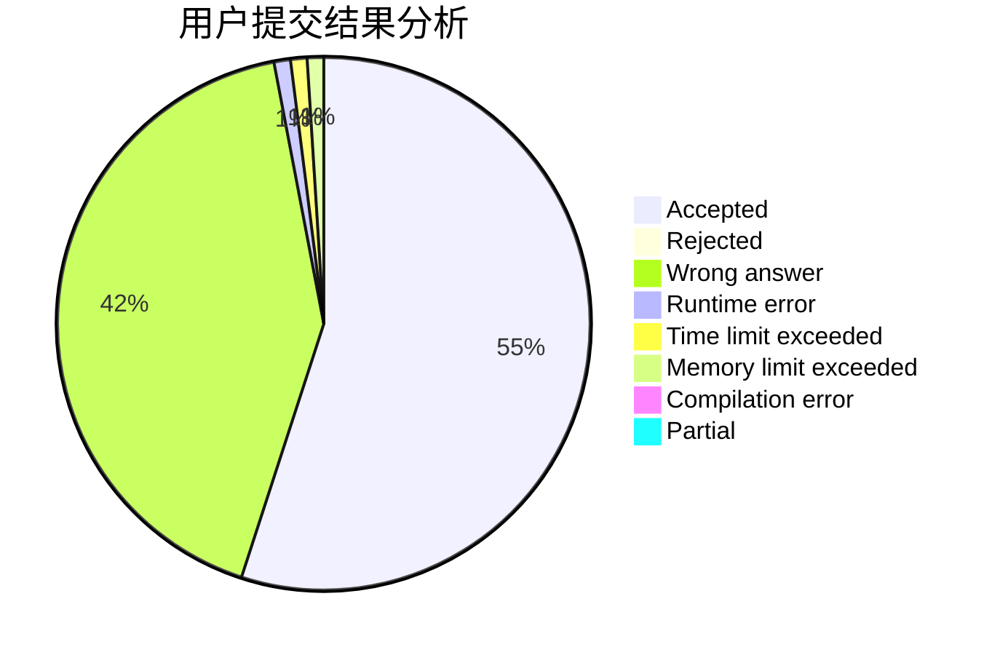
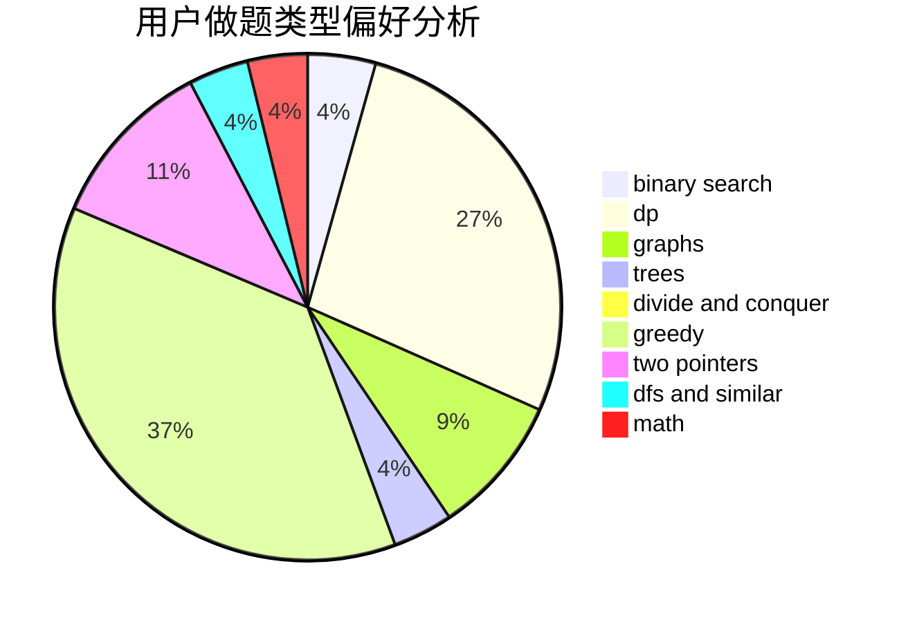

# changez

<!-- tabs:start -->

#### **用户提交结果分析**

#### **用户做题类型偏好分析**

<!-- tabs:end -->
# 推荐题目
[1327E](https://codeforces.com/contest/1327/problem/E)
[1255A](https://codeforces.com/contest/1255/problem/A)
[1223A](https://codeforces.com/contest/1223/problem/A)
[923C](https://codeforces.com/contest/923/problem/C)
[801D](https://codeforces.com/contest/801/problem/D)
[1042E](https://codeforces.com/contest/1042/problem/E)
[712E](https://codeforces.com/contest/712/problem/E)
[1366E](https://codeforces.com/contest/1366/problem/E)
[7E](https://codeforces.com/contest/7/problem/E)
[1242E](https://codeforces.com/contest/1242/problem/E)
