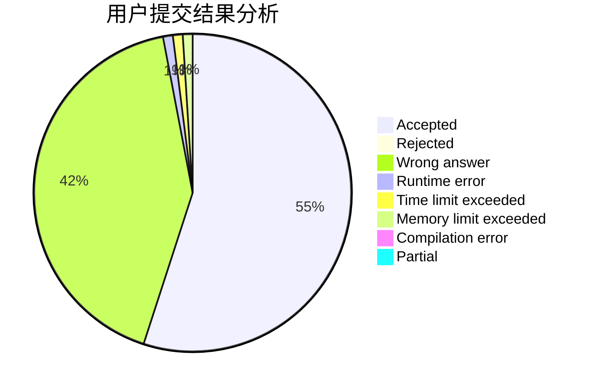
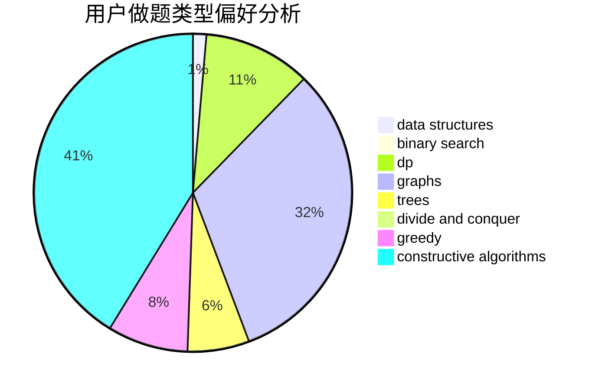

# changez
<!-- tabs:start -->
#### **用户提交结果分析**

#### **用户做题类型偏好分析**

#### **用户错题知识点分析**

<!-- tabs:end -->
# 推荐题目
[New Year and Boolean Bridges](http://codeforces.com/problemset/problem/908/H)		nan		  
[Show Must Go On](http://codeforces.com/problemset/problem/1250/I)		binary search,
                        brute force,
                        greedy,
                        shortest paths		  
[LCS Again](http://codeforces.com/problemset/problem/578/D)		dp,
                        greedy		  
[Swords](http://codeforces.com/problemset/problem/1216/D)		math		  
[Andryusha and Socks](https://codeforces.com/contest/782/problem/A)		implementation		  
[Representative Sampling](http://codeforces.com/problemset/problem/178/F2)		dp,
                        sortings,
                        strings		  
[Celex Update](http://codeforces.com/problemset/problem/1358/C)		math		  
[Special Task](http://codeforces.com/problemset/problem/316/A2)		math		  
[Pavel and barbecue](http://codeforces.com/problemset/problem/756/A)		constructive algorithms,
                        dfs and similar		  
[Year of University Entrance](http://codeforces.com/problemset/problem/769/A)		*special problem,
                        implementation,
                        sortings		  
<!-- tabs:start -->
#### **data structures**
[New Year and Boolean Bridges](http://codeforces.com/problemset/problem/1320/E)		data structures,
                        dfs and similar,
                        dp,
                        shortest paths,
                        trees		  
[Show Must Go On](http://codeforces.com/problemset/problem/1237/G)		data structures,
                        dp,
                        greedy		  
[LCS Again](http://codeforces.com/problemset/problem/930/D)		data structures,
                        games,
                        implementation		  
[Swords](http://codeforces.com/problemset/problem/932/F)		data structures,
                        dp,
                        geometry		  
[Andryusha and Socks](http://codeforces.com/problemset/problem/1492/C)		binary search,
                        data structures,
                        dp,
                        greedy,
                        two pointers		  
[Representative Sampling](http://codeforces.com/problemset/problem/1490/G)		binary search,
                        data structures,
                        math		  
[Celex Update](http://codeforces.com/problemset/problem/1479/D)		binary search,
                        bitmasks,
                        brute force,
                        data structures,
                        probabilities,
                        trees		  
[Special Task](http://codeforces.com/problemset/problem/1497/A)		brute force,
                        data structures,
                        greedy,
                        sortings		  
[Pavel and barbecue](http://codeforces.com/problemset/problem/1491/C)		brute force,
                        data structures,
                        dp,
                        greedy,
                        implementation		  
[Year of University Entrance](http://codeforces.com/problemset/problem/1492/B)		data structures,
                        greedy,
                        math		  
#### **binary search**
[New Year and Boolean Bridges](http://codeforces.com/problemset/problem/1250/I)		binary search,
                        brute force,
                        greedy,
                        shortest paths		  
[Show Must Go On](http://codeforces.com/problemset/problem/778/A)		binary search,
                        greedy,
                        strings		  
[LCS Again](http://codeforces.com/problemset/problem/1158/A)		binary search,
                        constructive algorithms,
                        greedy,
                        implementation,
                        math,
                        sortings,
                        two pointers		  
[Swords](http://codeforces.com/problemset/problem/1201/C)		binary search,
                        greedy,
                        math,
                        sortings		  
[Andryusha and Socks](http://codeforces.com/problemset/problem/1492/C)		binary search,
                        data structures,
                        dp,
                        greedy,
                        two pointers		  
[Representative Sampling](http://codeforces.com/problemset/problem/1463/D)		binary search,
                        constructive algorithms,
                        greedy,
                        two pointers		  
[Celex Update](http://codeforces.com/problemset/problem/1490/G)		binary search,
                        data structures,
                        math		  
[Special Task](http://codeforces.com/problemset/problem/1479/D)		binary search,
                        bitmasks,
                        brute force,
                        data structures,
                        probabilities,
                        trees		  
[Pavel and barbecue](http://codeforces.com/problemset/problem/1436/E)		binary search,
                        data structures,
                        two pointers		  
[Year of University Entrance](http://codeforces.com/problemset/problem/1461/D)		binary search,
                        brute force,
                        data structures,
                        divide and conquer,
                        implementation,
                        sortings		  
#### **dp**
[New Year and Boolean Bridges](http://codeforces.com/problemset/problem/578/D)		dp,
                        greedy		  
[Show Must Go On](http://codeforces.com/problemset/problem/178/F2)		dp,
                        sortings,
                        strings		  
[LCS Again](http://codeforces.com/problemset/problem/1320/E)		data structures,
                        dfs and similar,
                        dp,
                        shortest paths,
                        trees		  
[Swords](http://codeforces.com/problemset/problem/1237/G)		data structures,
                        dp,
                        greedy		  
[Andryusha and Socks](http://codeforces.com/problemset/problem/251/C)		dp,
                        greedy,
                        number theory		  
[Representative Sampling](http://codeforces.com/problemset/problem/1042/B)		bitmasks,
                        brute force,
                        dp,
                        implementation		  
[Celex Update](http://codeforces.com/problemset/problem/1245/C)		dp		  
[Special Task](http://codeforces.com/problemset/problem/598/E)		brute force,
                        dp		  
[Pavel and barbecue](https://codeforces.com/contest/418/problem/B)		bitmasks,
                        dp,
                        greedy,
                        sortings		  
[Year of University Entrance](http://codeforces.com/problemset/problem/839/C)		dfs and similar,
                        dp,
                        graphs,
                        probabilities,
                        trees		  
#### **graph**
[New Year and Boolean Bridges](http://codeforces.com/problemset/problem/1250/N)		dfs and similar,
                        graphs,
                        greedy		  
[Show Must Go On](http://codeforces.com/problemset/problem/574/B)		brute force,
                        dfs and similar,
                        graphs,
                        hashing		  
[LCS Again](http://codeforces.com/problemset/problem/839/C)		dfs and similar,
                        dp,
                        graphs,
                        probabilities,
                        trees		  
[Swords](http://codeforces.com/problemset/problem/868/E)		dp,
                        graphs,
                        trees		  
[Andryusha and Socks](http://codeforces.com/problemset/problem/1487/C)		brute force,
                        constructive algorithms,
                        dfs and similar,
                        graphs,
                        greedy,
                        implementation,
                        math		  
[Representative Sampling](http://codeforces.com/problemset/problem/1437/C)		dp,
                        flows,
                        graph matchings,
                        greedy,
                        math,
                        sortings		  
[Celex Update](http://codeforces.com/problemset/problem/1470/D)		constructive algorithms,
                        dfs and similar,
                        graph matchings,
                        graphs,
                        greedy		  
[Special Task](http://codeforces.com/problemset/problem/1476/C)		dp,
                        graphs,
                        greedy		  
[Pavel and barbecue](http://codeforces.com/problemset/problem/1304/D)		constructive algorithms,
                        graphs,
                        greedy,
                        two pointers		  
[Year of University Entrance](http://codeforces.com/problemset/problem/1475/C)		combinatorics,
                        graphs,
                        math		  
#### **trees**
[New Year and Boolean Bridges](http://codeforces.com/problemset/problem/1320/E)		data structures,
                        dfs and similar,
                        dp,
                        shortest paths,
                        trees		  
[Show Must Go On](http://codeforces.com/problemset/problem/696/B)		dfs and similar,
                        math,
                        probabilities,
                        trees		  
[LCS Again](http://codeforces.com/problemset/problem/839/C)		dfs and similar,
                        dp,
                        graphs,
                        probabilities,
                        trees		  
[Swords](http://codeforces.com/problemset/problem/868/E)		dp,
                        graphs,
                        trees		  
[Andryusha and Socks](http://codeforces.com/problemset/problem/1479/D)		binary search,
                        bitmasks,
                        brute force,
                        data structures,
                        probabilities,
                        trees		  
[Representative Sampling](http://codeforces.com/problemset/problem/1511/C)		brute force,
                        data structures,
                        implementation,
                        trees		  
[Celex Update](http://codeforces.com/problemset/problem/1499/F)		combinatorics,
                        dfs and similar,
                        dp,
                        trees		  
[Special Task](http://codeforces.com/problemset/problem/1491/E)		brute force,
                        dfs and similar,
                        divide and conquer,
                        number theory,
                        trees		  
[Pavel and barbecue](http://codeforces.com/problemset/problem/1466/D)		data structures,
                        greedy,
                        sortings,
                        trees		  
[Year of University Entrance](http://codeforces.com/problemset/problem/1495/D)		combinatorics,
                        dfs and similar,
                        graphs,
                        math,
                        shortest paths,
                        trees		  
#### **divide and conquer**
[New Year and Boolean Bridges](http://codeforces.com/problemset/problem/1461/D)		binary search,
                        brute force,
                        data structures,
                        divide and conquer,
                        implementation,
                        sortings		  
[Show Must Go On](http://codeforces.com/problemset/problem/1466/G)		combinatorics,
                        divide and conquer,
                        hashing,
                        math,
                        string suffix structures,
                        strings		  
[LCS Again](http://codeforces.com/problemset/problem/1490/D)		dfs and similar,
                        divide and conquer,
                        implementation		  
[Swords](https://codeforces.com/contest/1483/problem/C)		data structures,
                        divide and conquer,
                        dp		  
[Andryusha and Socks](http://codeforces.com/problemset/problem/1491/E)		brute force,
                        dfs and similar,
                        divide and conquer,
                        number theory,
                        trees		  
[Representative Sampling](http://codeforces.com/problemset/problem/1303/G)		data structures,
                        divide and conquer,
                        geometry,
                        trees		  
[Celex Update](http://codeforces.com/problemset/problem/1494/D)		constructive algorithms,
                        data structures,
                        dfs and similar,
                        divide and conquer,
                        dsu,
                        greedy,
                        sortings,
                        trees		  
[Special Task](http://codeforces.com/problemset/problem/1482/E)		data structures,
                        divide and conquer,
                        dp		  
[Pavel and barbecue](http://codeforces.com/problemset/problem/566/C)		dfs and similar,
                        divide and conquer,
                        trees		  
[Year of University Entrance](http://codeforces.com/problemset/problem/1428/F)		binary search,
                        data structures,
                        divide and conquer,
                        dp,
                        two pointers		  
#### **greedy**
[New Year and Boolean Bridges](http://codeforces.com/problemset/problem/1250/I)		binary search,
                        brute force,
                        greedy,
                        shortest paths		  
[Show Must Go On](http://codeforces.com/problemset/problem/578/D)		dp,
                        greedy		  
[LCS Again](http://codeforces.com/problemset/problem/1237/G)		data structures,
                        dp,
                        greedy		  
[Swords](http://codeforces.com/problemset/problem/251/C)		dp,
                        greedy,
                        number theory		  
[Andryusha and Socks](http://codeforces.com/problemset/problem/628/C)		greedy,
                        strings		  
[Representative Sampling](http://codeforces.com/problemset/problem/1250/N)		dfs and similar,
                        graphs,
                        greedy		  
[Celex Update](http://codeforces.com/problemset/problem/778/A)		binary search,
                        greedy,
                        strings		  
[Special Task](https://codeforces.com/contest/418/problem/B)		bitmasks,
                        dp,
                        greedy,
                        sortings		  
[Pavel and barbecue](http://codeforces.com/problemset/problem/1083/B)		greedy,
                        strings		  
[Year of University Entrance](http://codeforces.com/problemset/problem/1371/C)		greedy,
                        implementation,
                        math		  
#### **constructive algorithms**
[New Year and Boolean Bridges](http://codeforces.com/problemset/problem/756/A)		constructive algorithms,
                        dfs and similar		  
[Show Must Go On](http://codeforces.com/problemset/problem/1205/F)		constructive algorithms,
                        math		  
[LCS Again](http://codeforces.com/problemset/problem/1451/E1)		bitmasks,
                        constructive algorithms,
                        interactive,
                        math		  
[Swords](http://codeforces.com/problemset/problem/1158/A)		binary search,
                        constructive algorithms,
                        greedy,
                        implementation,
                        math,
                        sortings,
                        two pointers		  
[Andryusha and Socks](http://codeforces.com/problemset/problem/1493/A)		constructive algorithms,
                        greedy		  
[Representative Sampling](http://codeforces.com/problemset/problem/1463/D)		binary search,
                        constructive algorithms,
                        greedy,
                        two pointers		  
[Celex Update](https://codeforces.com/contest/1456/problem/B)		bitmasks,
                        brute force,
                        constructive algorithms		  
[Special Task](http://codeforces.com/problemset/problem/1492/D)		bitmasks,
                        constructive algorithms,
                        greedy,
                        math		  
[Pavel and barbecue](https://codeforces.com/contest/1504/problem/D)		constructive algorithms,
                        games,
                        interactive		  
[Year of University Entrance](https://codeforces.com/contest/1483/problem/A)		brute force,
                        constructive algorithms,
                        greedy,
                        implementation		  
#### **sortings**
[New Year and Boolean Bridges](http://codeforces.com/problemset/problem/178/F2)		dp,
                        sortings,
                        strings		  
[Show Must Go On](http://codeforces.com/problemset/problem/769/A)		*special problem,
                        implementation,
                        sortings		  
[LCS Again](https://codeforces.com/contest/418/problem/B)		bitmasks,
                        dp,
                        greedy,
                        sortings		  
[Swords](http://codeforces.com/problemset/problem/1158/A)		binary search,
                        constructive algorithms,
                        greedy,
                        implementation,
                        math,
                        sortings,
                        two pointers		  
[Andryusha and Socks](http://codeforces.com/problemset/problem/1201/C)		binary search,
                        greedy,
                        math,
                        sortings		  
[Representative Sampling](https://codeforces.com/contest/1496/problem/C)		geometry,
                        greedy,
                        math,
                        sortings		  
[Celex Update](http://codeforces.com/problemset/problem/1495/A)		geometry,
                        greedy,
                        math,
                        sortings		  
[Special Task](http://codeforces.com/problemset/problem/1497/A)		brute force,
                        data structures,
                        greedy,
                        sortings		  
[Pavel and barbecue](http://codeforces.com/problemset/problem/1427/A)		math,
                        sortings		  
[Year of University Entrance](http://codeforces.com/problemset/problem/1461/D)		binary search,
                        brute force,
                        data structures,
                        divide and conquer,
                        implementation,
                        sortings		  
<!-- tabs:end -->
