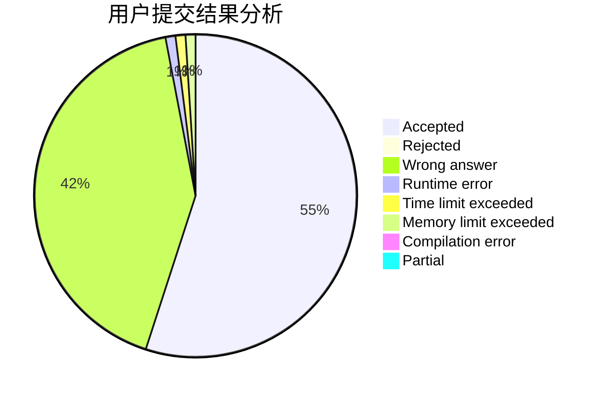
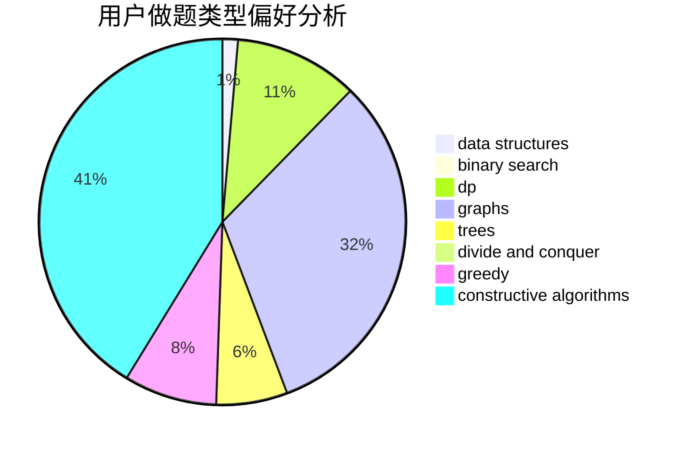

# changez

<!-- tabs:start -->

#### **用户提交结果分析**

#### **用户做题类型偏好分析**

#### **用户错题知识点分析**

<!-- tabs:end -->
# 推荐题目
[1320E](https://codeforces.com/contest/1320/problem/E)		data structures,
                        dfs and similar,
                        dp,
                        shortest paths,
                        trees		  
[1250I](https://codeforces.com/contest/1250/problem/I)		binary search,
                        brute force,
                        greedy,
                        shortest paths		  
[1216D](https://codeforces.com/contest/1216/problem/D)		math		  
[908H](https://codeforces.com/contest/908/problem/H)		nan		  
[784D](https://codeforces.com/contest/784/problem/D)		*special problem,
                        implementation		  
[1042B](https://codeforces.com/contest/1042/problem/B)		bitmasks,
                        brute force,
                        dp,
                        implementation		  
[696B](https://codeforces.com/contest/696/problem/B)		dfs and similar,
                        math,
                        probabilities,
                        trees		  
[1358C](https://codeforces.com/contest/1358/problem/C)		math		  
[782A](https://codeforces.com/contest/782/problem/A)		dsu,graphs,sortings,trees		  
[1237G](https://codeforces.com/contest/1237/problem/G)		data structures,
                        dp,
                        greedy		  
