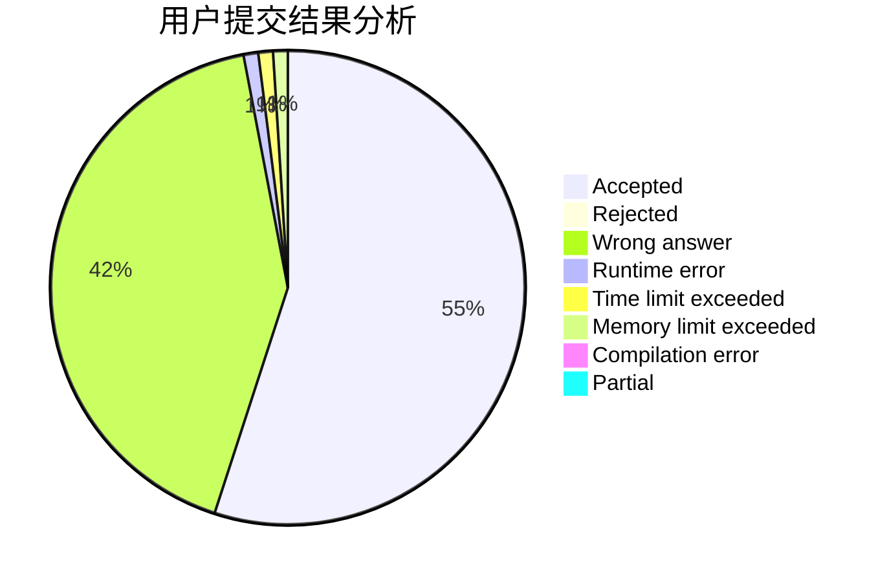
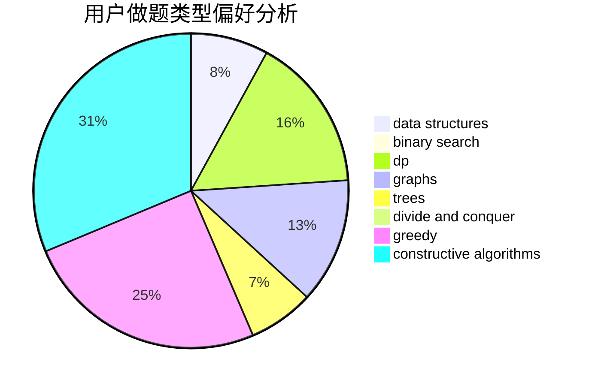

# changez

<!-- tabs:start -->

#### **用户提交结果分析**

#### **用户做题类型偏好分析**

#### **用户错题知识点分析**

<!-- tabs:end -->
# 推荐题目
[1327E](https://codeforces.com/contest/1327/problem/E)		combinatorics,
                        dp,
                        math		  
[1255A](https://codeforces.com/contest/1255/problem/A)		math		  
[1223A](https://codeforces.com/contest/1223/problem/A)		math		  
[923C](https://codeforces.com/contest/923/problem/C)		data structures,
                        greedy,
                        strings,
                        trees		  
[801D](https://codeforces.com/contest/801/problem/D)		dsu,graphs,sortings,trees		  
[1042E](https://codeforces.com/contest/1042/problem/E)		dp,
                        math,
                        probabilities		  
[712E](https://codeforces.com/contest/712/problem/E)		data structures,
                        math,
                        probabilities		  
[1366E](https://codeforces.com/contest/1366/problem/E)		binary search,
                        brute force,
                        combinatorics,
                        constructive algorithms,
                        dp,
                        two pointers		  
[7E](https://codeforces.com/contest/7/problem/E)		dp,
                        expression parsing,
                        implementation		  
[1242E](https://codeforces.com/contest/1242/problem/E)		constructive algorithms,
                        graphs		  
