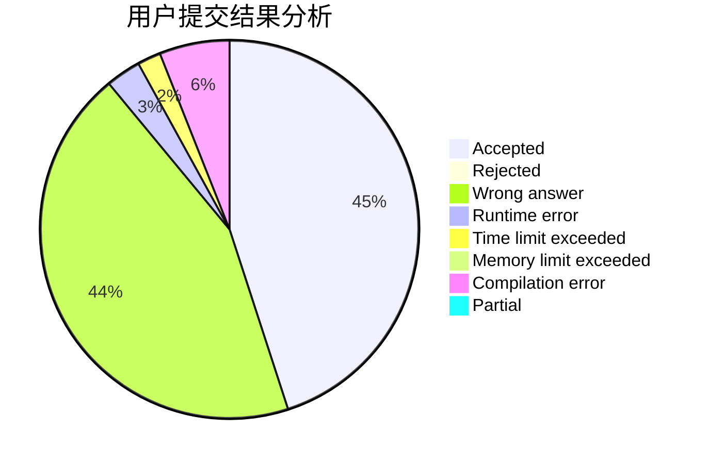
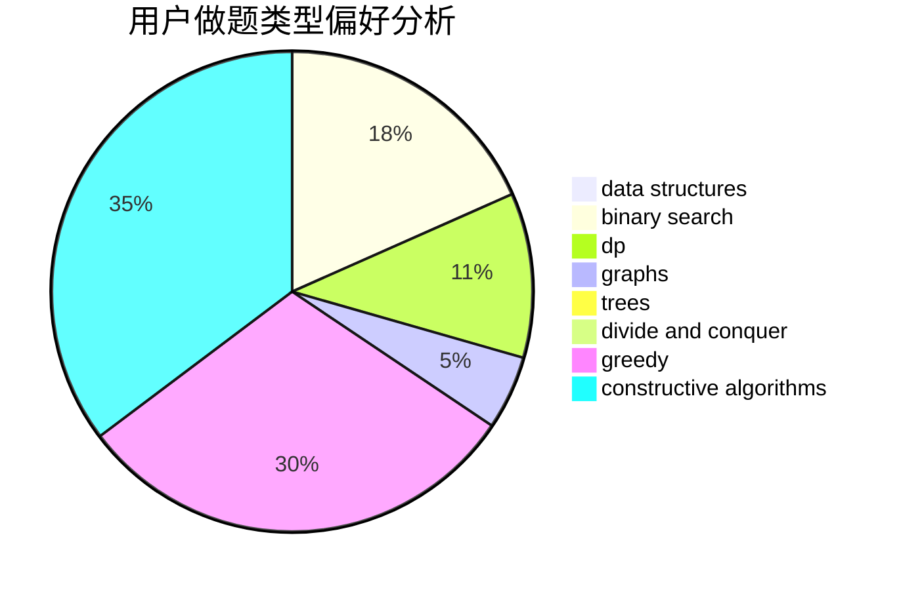
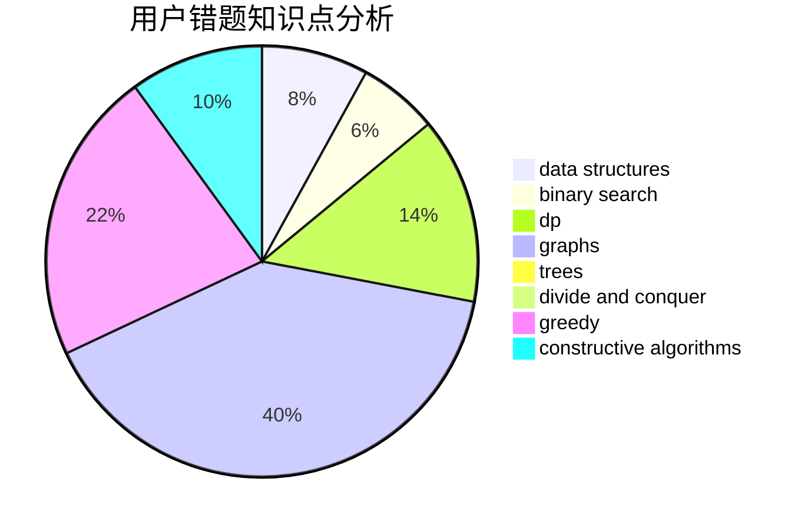

# changle_cyx

<!-- tabs:start -->

#### **用户提交结果分析**

#### **用户做题类型偏好分析**

#### **用户错题知识点分析**

<!-- tabs:end -->
# 推荐题目
[1363D](https://codeforces.com/contest/1363/problem/D)		binary search,
                        implementation,
                        interactive,
                        math		  
[1427B](https://codeforces.com/contest/1427/problem/B)		greedy,
                        implementation,
                        sortings		  
[1092E](https://codeforces.com/contest/1092/problem/E)		constructive algorithms,
                        dfs and similar,
                        greedy,
                        trees		  
[809E](https://codeforces.com/contest/809/problem/E)		divide and conquer,
                        math,
                        number theory,
                        trees		  
[946B](https://codeforces.com/contest/946/problem/B)		math,
                        number theory		  
[165C](https://codeforces.com/contest/165/problem/C)		binary search,
                        brute force,
                        dp,
                        math,
                        strings,
                        two pointers		  
[389A](https://codeforces.com/contest/389/problem/A)		greedy,
                        math		  
[730H](https://codeforces.com/contest/730/problem/H)		constructive algorithms,
                        implementation		  
[737C](https://codeforces.com/contest/737/problem/C)		dsu,graphs,sortings,trees		  
[1102E](https://codeforces.com/contest/1102/problem/E)		combinatorics,
                        sortings		  
