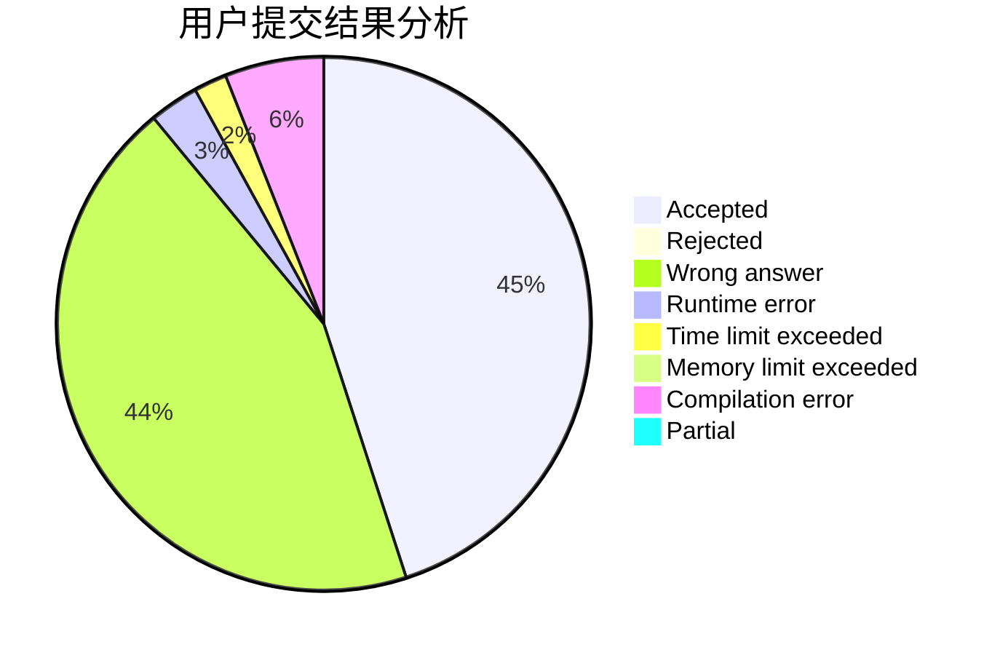
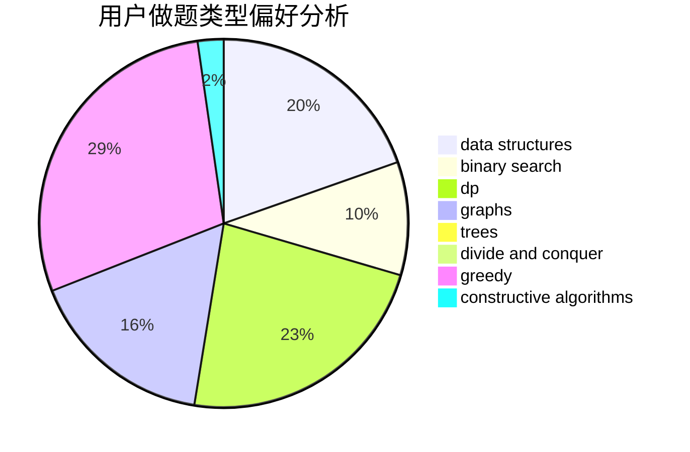
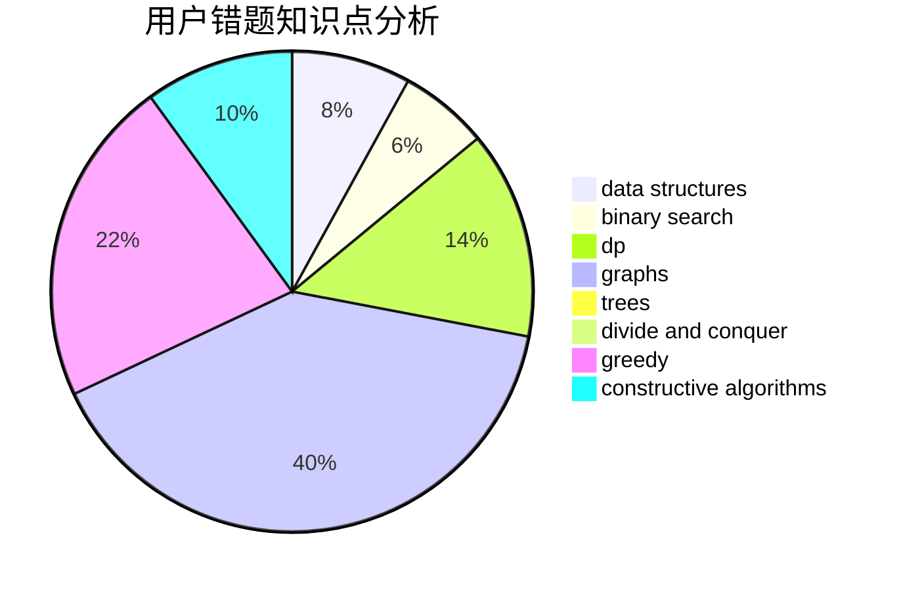

# changle_cyx

<!-- tabs:start -->

#### **用户提交结果分析**

#### **用户做题类型偏好分析**

#### **用户错题知识点分析**

<!-- tabs:end -->
# 推荐题目
[1370C](https://codeforces.com/contest/1370/problem/C)		games,
                        math,
                        number theory		  
[1435E](https://codeforces.com/contest/1435/problem/E)		dsu,graphs,sortings,trees		  
[1093B](https://codeforces.com/contest/1093/problem/B)		constructive algorithms,
                        greedy,
                        sortings,
                        strings		  
[827D](https://codeforces.com/contest/827/problem/D)		data structures,
                        dfs and similar,
                        graphs,
                        trees		  
[962F](https://codeforces.com/contest/962/problem/F)		dfs and similar,
                        graphs,
                        trees		  
[18E](https://codeforces.com/contest/18/problem/E)		dp		  
[418C](https://codeforces.com/contest/418/problem/C)		dsu,graphs,sortings,trees		  
[748C](https://codeforces.com/contest/748/problem/C)		constructive algorithms,
                        math		  
[759A](https://codeforces.com/contest/759/problem/A)		dsu,graphs,sortings,trees		  
[1103B](https://codeforces.com/contest/1103/problem/B)		binary search,
                        constructive algorithms,
                        interactive		  
