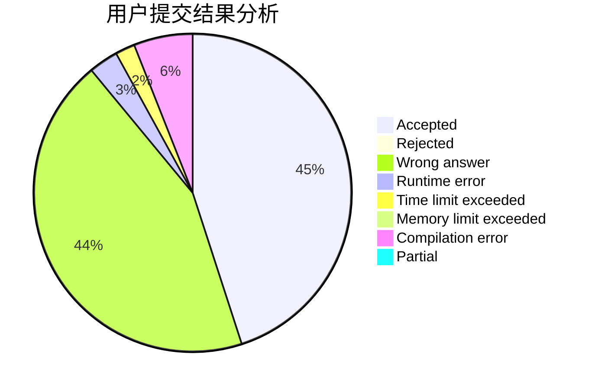
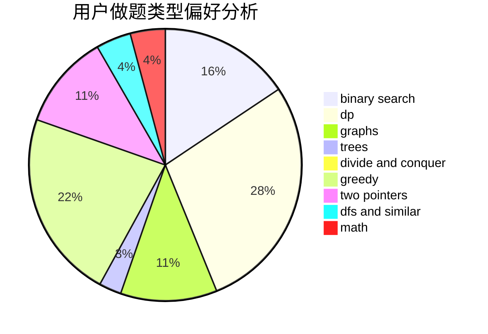

# changle_cyx

<!-- tabs:start -->

#### **用户提交结果分析**

#### **用户做题类型偏好分析**

<!-- tabs:end -->
# 推荐题目
[1370C](https://codeforces.com/contest/1370/problem/C)
[1435E](https://codeforces.com/contest/1435/problem/E)
[1093B](https://codeforces.com/contest/1093/problem/B)
[827D](https://codeforces.com/contest/827/problem/D)
[962F](https://codeforces.com/contest/962/problem/F)
[18E](https://codeforces.com/contest/18/problem/E)
[418C](https://codeforces.com/contest/418/problem/C)
[748C](https://codeforces.com/contest/748/problem/C)
[759A](https://codeforces.com/contest/759/problem/A)
[1103B](https://codeforces.com/contest/1103/problem/B)
